# Bazel first-class: implementation workplan (2026-10-03)

**Base:** `origin/main` @ `23b441852` (the tree this plan's line numbers were checked against), plus the plan and evidence commits on `docs/bazel-first-class-plan`.

## 1. Header

**Purpose.** This turns [`BAZEL_FIRST_CLASS_PLAN_2026_10_02.md`](BAZEL_FIRST_CLASS_PLAN_2026_10_02.md) (the audit-level plan: what and why) into PR-sized work items: files, change, proof command, dependencies, size and acceptance. An engineer or an agent can take an item and execute it without further design. Where the evidence is not enough to specify an item exactly, the item says so, and its first sub-step is an investigation with one stated question.

**Inputs.** These were read in full and are cited by short code:

| Code | Source |
|---|---|
| Plan *n.m*, Part *n* | `docs/BAZEL_FIRST_CLASS_PLAN_2026_10_02.md` |
| CT-N*k*, SP-N*k*, WH-N*k*, DC-N*k*, HN-N*k*, SC-§*k*, BZ-N*k* (and K*k* for re-confirmed known items) | the seven audit reports `docs/bazel-audit-2026-10-02/01`–`07` |
| S1 … S5 | the spikes in `docs/bazel-audit-2026-10-02/spikes/` |
| SR | `docs/bazel-audit-2026-10-02/script-review.md` |

**Where a spike changed the plan, this workplan follows the spike, and the item says so:**

- **S1:** keep and extend `tools/junit/JUnitMain` (option B), not `contrib_rules_jvm`. "`shard_count = 4` works on a PCT target" is replaced by class-granular sharding (decision D2).
- **S2:** the done criterion "every test passes with `--noenable_runfiles` on Linux" is replaced by S2's three-part criterion: official libraries only (guard G15); Windows CI without `--enable_runfiles`; an optional Linux manifest lane, deferred.
- **S2:** `serve` and `app` become plain executables with a `ServerRunfiles` resolver. No bash launcher and no `hermetic_launcher`.
- **S3:** the C toolchain is `toolchains_llvm` plus a sysroot on macOS and Linux. Windows keeps MSVC, made explicit (D5). zig is rejected.
- **S4:** Chromium is pinned with `http_archive` of Chrome-for-Testing `chrome-headless-shell` zips. `rules_playwright` is rejected. Linux system libraries come from a pinned CI image (D4).
- **S5:** `rules_python` 2.3.4, CPython 3.12. The stress generators are taught their fixes (seed lists and the view-root rule) and reproduce 59, 60 and 64 byte for byte. `92-services.pure` is split into source and output.

**Standing rules, applied in every item:**

1. **Fix causes, not symptoms.** Delete scripts and workarounds; never wrap them. No new shell, no new host dependency.
2. **Generators change, generated files don't.** A hand fix becomes a generator rule. Reach byte-identical output before adding the diff test. When a generated file's bytes *must* change, the generator is changed deliberately and the file is regenerated by `bazel run`. The item says so.
3. **Small PRs, each green on its own,** each with its proof command.
4. **Guard files are load-bearing (AGENTS.md).** A ratchet constant, pin or allowlist entry moves only with a dated justification comment that names this workplan's item ID. That includes `SkipCensusTest` rows, `GuardCoverage` floors, the PCT ceilings and `core-layers.txt`.
5. **The warehouse stays a GraalVM native image that links at build time** (`--link-at-build-time`, `warehouse/BUILD.bazel:107-116`). No item weakens that.
6. **User decisions already made:**
   - `experiments/` is kept and stays bazelignored.
   - Nothing is deleted before the script review is decided: every script deletion depends on P7-01.
   - Python is first class through `rules_python`.
   - The 59/60 generators are taught their fixes; the files are never edited to match.

**How to use this document.**

- Take items in the topological order of §3. Within a milestone (§7), items on different tracks can proceed in parallel.
- **Heavy lanes.** The desk is 10 cores and 32 GB. **At most two heavy Bazel, JVM or Docker jobs may run at once.** Every proof that needs one is marked **Heavy:** with the lane it uses:

  | Mark | What runs | Measured or declared cost |
  |---|---|---|
  | `H-core` | `//core:core_tests` (or the per-package split) | `enormous`, `resources:memory:1536` |
  | `H-spec` | `//spec:spec_tests`, `corpus_duckdb`, `corpus_h2` (5 GB), `corpus_warehouse` | 1.5–5 GB each |
  | `H-pct` | `//pct:pct_duckdb` / `pct_postgres` (9 GB), `pct_h2` (4.6 GB) | **counts as both slots when 9 GB** |
  | `H-pe` | `//parser-equivalence:parser_parity` | 3 GB, about 12 min (S1 E1) |
  | `H-stress` | `//core:stress_suites` (2 GB) or the `gen_stress` action (one core, 380–455 s CPU, S5) | |
  | `H-native` | building `//warehouse:server_native` (1.3–1.5 GB RSS, about 2–3 min, S3) and the tests that need it | |
  | `H-browser` | a `browser_test` (Chromium, about 90 s each, S4) | |
  | `H-docker` | a Linux container run (S3/S4 method) | |
  | `CI` | proof runs on GitHub CI only; no local heavy run | |

- Every local proof on the shared desk adds the spikes' `--local_resources=cpu=3 --jobs=3`.
- Commands are written from the repository root. Labels are literal.

**Size key** (the plan's): **S** ≤ ½ day; **M** 1–3 days; **L** about a week. Each item also gives a day figure, used for the totals in §7.

---

## 2. Decisions needed from the user

> **All decisions recorded by the user on 2026-10-03.** Each section below ends with its **Decided** line. Summary:
>
> | # | Decided |
> |---|---|
> | D1 | (b): a local-SDK repository rule with a pinned sha256 |
> | D2 | (b): one target per PCT suite class, with a `test_suite` keeping today's name; no `shard_by` runner mode |
> | D3 | The 11 rows as the "Decided" column below. Row 6 (keywords): **keep and repair**. Row 9 (untangle): **wire `move_classes.py` as a `bazel run` tool and delete its dead `pom.xml` handling; no class moves in this effort.** The untangle stays governed by `docs/EXECUTION_PLAN_2026_09_26.md` (D24). |
> | D3b | Delete or replace as listed |
> | D4 | (b): the pinned Debian 12 image, defined in Bazel (`rules_oci` plus `rules_distroless`) |
> | D5 | (a): MSVC declared, and checked at configure time |
> | D6 | (b): delete the composite lanes once per-suite ceilings exist |
> | D7 | (b), then (a) as a recorded exception |
> | D8 | (a): in the default run, plus P2-05 |
> | D9 | (b): a generated measurement plus a hand-owned, dated ceiling |
> | D10 | **(c): no mirror; single URLs.** Revisit if a pin breaks. The deliberately pinned versions are listed under D10. |
> | D11 | Not now |
> | D12 | Python 3.12 |
> | D13 | Seed lists in the modules; explicit view-filter names; `queries.pure` as prototyped |
> | D14 | (a) if P2-06 shows no exec-configuration double compile, else (b) |
> | D15 | Two locks, exact versions, one revision test |
> | D16 | `docs/history/<original path>` |

Each decision lists its options, a recommendation, and the items it blocks. An item that depends on a decision cannot start until the decision is recorded. Record a decision in the item's PR description, and in `script-review.md`'s Decision column for D3.

### D1. The macOS SDK source for the hermetic C toolchain (S3)

| Option | What it means | For | Against |
|---|---|---|---|
| (a) Private or internal mirror of a pruned `MacOSX15.x.sdk.tar.gz` | `http_archive` with sha256 | fully fetched; CI-friendly | the SDK licence forbids public redistribution; this public repository cannot host it; needs infrastructure |
| (b) **Local-SDK repository rule** | a Starlark repository rule copies the installed CLT's SDK (minus `Ruby.framework` and `usr/share/man`) into a repository and **checks its sha256** | legal; declared and checked; no Apple compiler or linker used | still requires the CLT to be installed (for the SDK files only); the sha256 changes with each CLT SDK update, so the pin is per SDK version |
| (c) toolchains_llvm's default `xcrun --show-sdk-path` sysroot | hermetic compiler and linker; SDK files read from the host | zero setup | the SDK is unchecked host input |
| (d) A community mirror | as (a) | — | the same legal question as (a) |

- **Recommendation: (b)**, with (a) as an override (`--repo_env` pointing at an internal mirror) for anyone who has one. It is the only option that is both legal for a public repository and checked.
- **Blocks:** P1-10, P6-18 (macOS half), P5-03 (the macOS `--config=hermetic-cc`).

**Decided (2026-10-03):** (b).

### D2. PCT sharding: `shard_by = "class"` or one target per class (S1)

| Option | For | Against |
|---|---|---|
| (a) `junit_test(shard_by = "class", shard_count = N)` | one label per lane; prototyped (S1 E7) | shards cache together; ships a runner mode |
| (b) **One target per PCT suite class**, with a `test_suite` keeping today's name (`pct_duckdb`, `pct_postgres`) | each suite caches on its own; needs no runner mode; matches the existing manual per-suite targets (`pct/BUILD.bazel:110,176`) | five or six labels per lane |

- Either option measures something different from today's composite JVM until per-suite counters exist (SP-N9). So both depend on P3-09's per-suite ceilings.
- **Recommendation: (b).** Do not ship the `shard_by` runner mode unless (a) is chosen: no dead code. S1's overrun guard ships either way.
- **Blocks:** P3-09. P1-01's `shard_by` parameter is included only if (a) is chosen.

**Decided (2026-10-03):** (b).

### D3. The script review: the 11 uncertain rows, plus the whole sheet

The user decides every row of `script-review.md` (187 rows); P7-01 records them. The 11 rows SR marked uncertain, with this workplan's recommendation and the items each blocks:

| # | Row | Options | Recommendation | Blocks |
|---|---|---|---|---|
| 1 | `scripts/corpus/run.py` | repair the one launcher (a `py_binary` with `//tools/engine-runner:testable` as runfiles data), or write plan 3.9's engine-side run in Java and retire it | **Repair (Python):** one fix revives 19 dependants, and Python is first class | P3-25, P7-03 |
| 2 | `scripts/corpus/probe_*.py` (16) | repair and wire, or keep as history and rewrite each `repro/*/README.md` as a `bazel run //tools/engine-runner:testable -- …` line | **Repair and wire** (after row 1): they are the recipes behind 14 kept repros | P7-03, P7-08 |
| 3 | `dense_mapping.py`, `dense_store.py` | fixpoint-by-generator (plan 2.1(d)), or freeze 59 and 60 | **Already decided by the user** (taught their fixes). S5 reached byte-identity. Record it. | P2-01 |
| 4 | `scripts/corpus/differential.py` | wire it as the data producer of `CorpusDifferentialTest`, or retire both | **Wire it:** cheap on P2-01's toolchain, and it un-skips a real differential | P3-18 |
| 5 | `scripts/projects/check.py` | an interim Python gate now, or wait for `legend_library` (P3-23) | **Interim gate** (a `py_test` after row 1), retired when P3-23 lands: 45 of 56 projects are compiled by nothing today | P3-23, P7-03 |
| 6 | `scripts/parser/keywords.py` (+ `tiers.py`) | repair (`.g4` from `@legend_engine_src`, generated `vocab.tsv`), or keep as history | **History,** unless "keyword coverage of our `.pure` sources" is still a tracked metric | P2-18 |
| 7 | `scripts/corpus/scoreboard.py` | wire its `--gate` as a `py_test`, or retire | **Wire,** if green at HEAD (P2-04 checks first) | P2-04 |
| 8 | `tools/native-axes.py` | repair (read `@legend_*_src`), or keep as history | **Repair:** a present-tense program doc cites it | P7-03 |
| 9 | `tools/untangle/move_classes.py` | wire while the untangle is live, or history | **Ask:** is the untangle finished? Wire if not | P7-02 |
| 10 | `docs/type-audit-2026-08/harness/Probe.java` | a fresh `java_binary` "model + query → types/SQL/rows" over `//core`, or history only | **History** now; a fresh probe binary is a separate feature request | P7-04 |
| 11 | `experiments/postgres-dialect/semantics_probe.sh` | kept (user); later promote to a test over `@embedded_postgres`? | **Keep in place;** revisit with the Postgres work, outside this plan | — |

**D3b. Wired files this plan deletes that are not rows of the sheet.** The sheet reviews only unwired files. Please confirm these too:

- `datacube/demo/install-browser.mjs` and `//datacube:install_browser` (P4-09);
- `datacube/demo/make-dist.mjs` and `//datacube:make_dist` (P4-11);
- `query/test/strict-reporter.mjs`, a byte-identical duplicate (HN-N15; P1-23);
- `datacube/bench/model/*.py` (8 files; wired only as data of `portability`): `py_binary` with a pinned `duckdb`, or history (P4-15);
- the duplicate fixture tree `scripts/parser/{fixtures,negative}/`, vendored byte-identical in `parser-equivalence/src/test/resources/sibling-corpus/` (SR): history with `scripts/parser` (P7-04);
- `docs/gate-additions.patch` (SC-§2): history (P7-15).

**Blocks:** P7-02, P7-03, P7-04, P7-05, P2-04, P2-18, P3-18, P3-23, P3-25, P4-09, P4-11, P4-15, P7-15.

**Decided (2026-10-03):** every recommendation in the table, except: row 6 **keep and repair** (keyword coverage is still tracked); row 9 **wire the tool, no moves** (the untangle is a compiler-architecture program under `docs/EXECUTION_PLAN_2026_09_26.md`; this effort only keeps its codemod runnable, and P2-08's layering golden makes each untangle step visible). D3b: as listed.

### D4. Linux system libraries for the pinned Chromium (S4)

| Option | For | Against |
|---|---|---|
| (a) A pinned CI image (Debian 12 plus the 17 packages S4 lists), built from a Dockerfile, referenced by digest | simplest; S4-tested | the Dockerfile's `RUN apt-get` is new shell, and the image is built outside Bazel |
| (b) **The same pinned image, defined in Bazel**: `rules_oci` plus `rules_distroless` from a pinned `snapshot.debian.org` date, pushed with `bazel run`, referenced by digest | no shell in the repository; every package pinned in a lock file; local `docker run` repro | about 1.5 more days than (a) |
| (c) Hermetic `.deb`s inside the test (`LD_LIBRARY_PATH` in `browser_test`) | runs on any Linux host | needs host glibc ≥ 2.36; per-architecture work; 30 pins to roll. S4: "not needed now" |

Sub-choices:

- Debian 12 (tested) or Ubuntu 24.04. **Recommendation:** Debian 12, as tested.
- `fonts-liberation` now or later. **Recommendation:** later, when a screenshot test needs it.

**Recommendation: (b).** It meets the "no new shell" rule and is the plan's "pinned container" in Bazel form.

**Blocks:** P5-02, and the Linux half of P4-10.

**Decided (2026-10-03):** (b), Debian 12, `fonts-liberation` later.

### D5. Windows MSVC as an explicit, declared prerequisite (S3)

| Option | For | Against |
|---|---|---|
| (a) **Declare it, and check it at configure time:** a repository rule fails with a clear message when `cl.exe`/vswhere is missing, instead of failing deep inside native-image | honest; 0.25 day | MSVC stays a host dependency, the one remaining host C dependency |
| (b) clang-cl plus an xwin CRT/SDK | hermetic | Microsoft licence click per developer; GraalVM supports MSVC only; L, and needs a Windows machine |
| (c) Drop the Windows native image | removes the dependency | undoes PR #14 |

**Recommendation: (a).** List it in `README.md` as the one declared host toolchain.

**Blocks:** P1-11.

**Decided (2026-10-03):** (a).

### D6. Keep the composite `pct_duckdb` / `pct_postgres` lanes?

| Option | For | Against |
|---|---|---|
| (a) Keep the composite (one JVM, cumulative counters, today's pins) | no re-measurement | `--test_filter`, sharding and the per-suite targets all measure something else (SP-N9); keeps the jq low-memory split in CI (`.github/workflows/gates-run.yml:46-52`) |
| (b) **Delete the composite** once per-suite ceilings exist; the label survives as a `test_suite` over the per-suite targets | each suite measured alone; the macOS 7 GB split disappears naturally (each suite is 4 GB) | a one-time re-measurement of the ceilings, each moved with a dated justification |

**Recommendation: (b)** (plan 3.3).

**Blocks:** P3-09, P5-01, P5-03.

**Decided (2026-10-03):** (b).

### D7. `libxml2.so.2` on Linux build hosts (S3)

LLVM's prebuilt `ld.lld` links it dynamically.

| Option | For | Against |
|---|---|---|
| (a) Accept and document it; put it in the CI image | works now | a new host dependency (it does replace gcc and zlib-dev) |
| (b) **First look for an LLVM archive whose `lld` has no libxml2** (Chromium's clang package, or another release), through `toolchains_llvm`'s `urls`/`sha256` override; fall back to (a) only if none exists | honours "no new host dependency" | about 0.5 day of investigation |

**Recommendation: (b), then (a) as an explicitly recorded exception.**

**Blocks:** P1-09 (final form), P5-02 (image contents).

**Decided (2026-10-03):** (b), then (a) as a recorded exception.

### D8. The stress diff tests in the default `bazel test //...` (S5 Q1)

| Option | For | Against |
|---|---|---|
| (a) **Yes, in the default run** (R1: `bazel test //...` is the full gate) | nothing is gated outside `//...` | after a corpus edit, the next `//...` waits on a 380–455 s single-core action (26 min under load); cached otherwise |
| (b) Tag them; CI selects the tag | fast edit loop | a second policy carrier |

**Recommendation: (a), plus P2-05** (deduplicate build.py's triple evaluation; S5 estimates a 2–3× win).

**Blocks:** P2-01 (tags), P5-01.

**Decided (2026-10-03):** (a), plus P2-05.

### D9. Ratchet and policy files: generated, or hand-owned with a dated justification?

Plan 2.8 and 2.9 say ratchet numbers "move from Java constants into the generated reports", and `core-layers.txt` becomes a `write_source_files` golden. AGENTS.md says these are load-bearing guard files that move only with a dated justification. A generated file updated by `bazel run //:update_generated` would move silently. The two rules conflict for *policy* values; they do not conflict for *measurements*.

| Option | For | Against |
|---|---|---|
| (a) Plan as written: generated reports, the test asserts shrink-only | one update path | `update_generated` can accept a regression with no justification; breaks AGENTS.md |
| (b) **Split measurement from policy:** each measurement becomes a generated, diff-tested report (evidence, R3); each ceiling, floor, allowlist or allowed-edge set stays hand-owned with a dated justification, in Java or a ledger file, checked against the report by the test. Counts derivable from an already-generated file (`EngineHandlersTest` 404/836/168, CT-N17) are computed, not pinned. | keeps AGENTS.md intact and removes hand-copied numbers | two files per ratchet family |

**Recommendation: (b).**

**Blocks:** P2-12, P2-15, P2-16, P3-30.

**Decided (2026-10-03):** (b).

### D10. Mirror host for pinned downloads (plan 1.5; S3)

What gets mirrored:

- the `legend-engine`/`legend-pure` GitHub source archives (checksum churn, BZ-N21);
- the DuckDB extension;
- the Chromium sysroots;
- the Chromium archives (they already have a second host).

| Option | For | Against |
|---|---|---|
| (a) **Release assets on this repository** (a `bazel-mirror` release, one asset per pin) as the second URL, with `integrity=` | free; stable bytes | a manual upload per bump; Bump (P2-10) prints the upload command |
| (b) A remote downloader config (`--experimental_downloader_config`) pointing at an internal mirror | central | infrastructure |
| (c) None | — | archive churn stays a risk |

**Recommendation: (a).**

**Blocks:** P1-27 (and the mirror half of P0-12).

**Decided (2026-10-03):** **(c), single URLs.** The user's reasoning: dependencies are kept current as the project goes. A mirror protects pinned bytes, not upgrades; the residual risk is a sha256 break when GitHub regenerates a tag archive, which is fixed by re-pinning. P1-27 shrinks to `https` plus `integrity=`; no release assets.

What must **not** float, and why (each moves only as a deliberate change with its own proof):

| Pin | Version | Reason |
|---|---|---|
| legend-engine / legend-pure | 4.145.0 / 5.99.0 | the spec; bumped through `//tools/bump`, with ratchets re-pinned with reasons |
| DuckDB (core) | 1.4.4.0 | user decision: core upgrades in its own leg |
| DuckDB (warehouse) + postgres extension | 1.5.5.1 / v1.5.5 | the extension must match the library exactly |
| H2 | 2.1.214 (core), 2.4.240 (gate 7) | rosters and goldens are minted per version |
| Postgres (tests) | 16 | the oldest the dialect targets |
| JDK | bytecode 21, runtime 25 | goldens depend on JDK 25's messages |
| GraalVM | 25.0.2 | paired with the JDK 25 runtime |
| Linux sysroot | Debian bullseye (glibc 2.31) | sets the oldest Linux the native binary runs on |
| Python | 3.12 | the stress generator's output is byte-checked |
| Playwright / Chromium | 1.63.0 / r1243 | move together, held by `//tools/browser:revision_test` |

### D11. Windows browser CI in scope? (S4 Q2)

- **Recommendation: not now.** The browser lane is Linux only today, and DuckDB-WASM in Chromium does not vary by OS.
- The win64 archive stays pinned, so a later run is one `bazel test`.
- **Blocks:** the Windows half of P4-10.

**Decided (2026-10-03):** not now.

### D12. The repository's Python version (S5 Q5)

- **Recommendation: 3.12** (S5 used CPython 3.12.13, matching the host that minted the files).
- A move to 3.13 is a generator change, proven by the diff tests.
- **Blocks:** P1-07.

**Decided (2026-10-03):** 3.12.

### D13. Stress-generator details (S5 Q2–Q4)

- **The view-root filter name:** derived `dense_<RootFirstWord>NotNull` (prototyped), or explicit beside `SEED_TABLES`. **Recommendation:** explicit beside `SEED_TABLES`. A hand-chosen name is data, not a guessed rule. Byte-identical either way.
- **The seed lists:** in the modules (prototyped) or in data files. **Recommendation:** in the modules.
- **`queries.pure`:** in `scripts/corpus/` (prototyped). It must stay out of the stress `*.pure` glob. **Recommendation:** as prototyped.
- **Blocks:** P2-01.

**Decided (2026-10-03):** as recommended.

### D14. Saved-query fixtures: how they are generated (plan 2.2)

The four records carry wall-clock timestamps (`createdAt`, `lastUpdatedAt`, `lastOpenAt`). A diff test needs them normalised. Normalising changes the committed bytes once, through the generator.

| Option | For | Against |
|---|---|---|
| (a) **`js_run_binary` around a repaired `make.mjs`** (SR row: "2, repair then wire"), with timestamps normalised to a fixed epoch | the review's recommendation; JS is the fixture's consumer | must avoid compiling core a second time in the exec configuration (P2-06 investigates first) |
| (b) A `java_run` generator that starts `LegendHttpServer` in process | no child process; compiled once | retires `make.mjs` (a review decision) |

**Recommendation: (a)** if P2-06's investigation shows the deploy jar can be used in the target configuration; otherwise (b).

**Blocks:** P2-06.

**Decided (2026-10-03):** as recommended.

### D15. One Playwright or two locks (plan 1.5; S4 Q6)

- **Recommendation:** keep the two locks, pin **exact** versions in both (datacube has `^1.63.0`), and let `//tools/browser:revision_test` hold them to one revision (S4 E6: both resolve to one package repository today).
- `site/verify.mjs`'s reach into `../datacube/node_modules` is replaced by a `//tools/browser:playwright` re-export.
- **Blocks:** P1-26, P4-05.

**Decided (2026-10-03):** as recommended.

### D16. Where "keep as history" files go (SR option 3)

- **Recommendation:** `docs/history/<original path>`, exempt from G9 and allowlisted in G2. Not a second bazelignored attic: `experiments/` is the only one, by decision.
- **Blocks:** P7-04, P7-09.

---

**Decided (2026-10-03):** as recommended.

## 3. Dependency graph and topological order

### 3.1 Graph (clusters and the edges that matter)

Decisions are hexagons. Heavy-lane clusters are noted.

```mermaid
flowchart TD
  subgraph P0[Phase 0: stop silent failures]
    P0_01[P0-01 bazelignore runs] --> P0_02[P0-02 //:generated suite]
    P0_04[P0-04 locks enforced] --> P0_05[P0-05 Bump repins all]
    P0_04 --> P0_08[P0-08 Postgres driver]
    P0_10[P0-10 JVM locale/tmpdir pins]
    P0_12[P0-12 https + no_match_error]
  end
  subgraph P1[Phase 1: foundations]
    P1_01[P1-01 runner B] --> P1_02[P1-02 identity diff CI]
    P1_01 --> P1_21[P1-21 junit_test memory_mb]
    P1_03[P1-03 runfiles helper] --> P1_04[P1-04 Upstream via rlocationpath]
    P1_03 --> P1_05[P1-05 Repo users]
    P1_03 --> P1_06[P1-06 EmbeddedPostgres resolver]
    P1_07[P1-07 rules_python] --> P1_08[P1-08 pyarrow check]
    P1_09[P1-09 cc Linux] --> P1_10[P1-10 cc macOS]
    P1_17[P1-17 gunzip java_run] --> P1_16[P1-16 ServerRunfiles]
    P1_14[P1-14 pinned Chromium]
    P1_19[P1-19 tools/platforms]
    P1_23[P1-23 node_test] --> P1_24[P1-24 JS runfiles, no chdir]
    P1_25[P1-25 strict_visibility]
  end
  D1{{D1 SDK}} --> P1_10
  D5{{D5 MSVC}} --> P1_11[P1-11 MSVC preflight]
  P0_10 --> P1_01
  P0_04 --> P1_25
  P0_12 --> P1_19
  subgraph P2[Phase 2: generators]
    P2_01[P2-01 stress actions H-stress] --> P2_02[P2-02 one layout .bzl] --> P2_03[P2-03 wiring]
    P2_01 --> P2_04[P2-04 py_test gates]
    P2_01 --> P2_05[P2-05 dedupe build.py]
    P2_09[P2-09 reachability metadata H-native]
    P2_10[P2-10 pins from MODULE]
    P2_13[P2-13..17 goldens]
  end
  P1_07 --> P2_01
  D9{{D9 ratchets}} --> P2_13
  subgraph P3[Phase 3: test graph]
    P3_01[P3-01 prerun to actions H-spec]
    P3_03[P3-03/04 gate-1 coupling H-core] --> P3_05[P3-05 core split H-core] --> P3_06[P3-06 test lib split]
    P3_08[P3-08 ChannelB sort] --> P3_09[P3-09 PCT per-suite H-pct]
    P3_27[P3-27 guard file lists] --> P3_32[P3-32 close runfiles: Windows manifest]
  end
  P1_01 --> P3_01
  P1_21 --> P3_05
  D2{{D2 sharding}} --> P3_09
  D6{{D6 composite}} --> P3_09
  P3_01 --> P2_13
  P1_05 --> P3_32
  P1_24 --> P3_32
  subgraph P4[Phase 4: browser, app, packaging]
    P4_01[P4-01 harness.mjs] --> P4_02[P4-02..08 harnesses H-browser] --> P4_09[P4-09 delete install_browser]
    P4_12[P4-12 launcher-free serve/app H-native] --> P4_13[P4-13 warehouse dist]
    P4_11[P4-11 dist]
  end
  P1_14 --> P4_01
  P1_16 --> P4_12
  P1_17 --> P4_12
  subgraph P5[Phase 5: CI = labels]
    P5_01[P5-01 //gates suites] --> P5_03[P5-03 workflows: bazel only]
    P5_02[P5-02 pinned CI image] --> P5_03
  end
  D4{{D4 libs}} --> P5_02
  P3_09 --> P5_01
  P4_09 --> P5_03
  P1_08 --> P5_03
  subgraph P6[Phase 6: guards]
    P6_00[P6-00 repo inventory] --> G[G1..G19]
  end
  P5_03 --> G
  subgraph P7[Phase 7: cleanup, throughout]
    P7_01[P7-01 record script decisions] --> P7_x[P7-02..05 apply]
  end
  D3{{D3 script review}} --> P7_01
```



### 3.2 Topological order (every item)

This order respects every *Depends on* field in §4 and §5. Items on one line have no dependencies between them and can run in parallel, subject to the heavy-lane cap. Decisions are listed where they first gate something.

1. **Ask all decisions D1–D16** (user time; they do not block step 2).
2. P0-01, P0-03, P0-04, P0-06, P0-07, P0-09, P0-10, P0-11, P0-12, P0-13
3. P0-02, P0-05, P0-08
4. P1-01, P1-03, P1-07 (D12), P1-09, P1-13, P1-14, P1-15, P1-17, P1-18, P1-19, P1-20, P1-22, P1-23, P1-26, P1-28, P6-00, P6-14, P6-17
5. P1-02, P1-04, P1-05, P1-06, P1-08, P1-10 (D1), P1-11 (D5), P1-12, P1-16, P1-21, P1-24, P1-25, P1-27 (D10), P7-10, P7-12
6. P6-10, P6-11, P6-16, P6-19, P2-01 (D13), P2-07, P2-08, P2-11, P2-17, P3-02, P3-03, P3-11, P3-15, P3-24, P3-26, P3-31, P7-06, P7-11
7. P2-02, P2-04 (D3), P2-05, P2-06 (D14), P2-10, P2-12 (D9), P2-13, P2-19, P3-01, P3-04, P3-07, P3-08, P3-10, P3-12, P3-14, P3-16, P3-17, P3-19, P3-20, P3-21, P3-27, P3-28, P3-29, P4-14, P4-16
8. P2-03, P2-09, P2-14, P2-16 (D9), P2-18 (D3), P3-05, P3-09 (D2, D6), P3-13, P3-18 (D3), P3-22, P3-23, P3-25, P3-30, P4-01, P4-11 (D3b), P4-12, P4-15
9. P2-15, P3-06, P3-32, P4-02, P4-03, P4-04, P4-05 (D15), P4-06, P4-07, P4-08, P4-13, P6-05, P6-07, P6-12, P6-13
10. P4-09 (D3b), P5-01, P5-02 (D4, D7), P5-05, P6-04, P6-06, P6-18, P7-01 (D3), P7-14
11. P4-10 (D11), P5-03, P6-01, P6-03, P6-15, P7-02, P7-03, P7-04 (D16), P7-05, P7-07, P7-09, P7-15
12. P5-04, P5-06, P5-07, P6-08, P7-08, P7-13
13. P6-02, P6-09

---

## 4. Work items, by phase

### Phase 0: stop silent failures and wrong answers

#### P0-01 · `runs/` and `node_modules` are bazelignored; the comment tells the truth

| Field | Content |
|---|---|
| ID | P0-01 |
| Why | Plan 0.1; BZ-N3. Worktrees under `runs/` are packages of the main checkout's `//...`. S5 risk 6: scratch copies under `runs/` broke `//...` analysis. SC-§4.7: the comment is wrong. |
| Change | `.bazelignore`: add `runs`, `datacube/node_modules` and `query/node_modules` (the two `npm_link_all_packages` roots). Rewrite the comment: "experiments: kept by decision (2026-10-02), separate prototype workspaces and probes, not part of this build; runs: agent worktrees and scratch; node_modules: pnpm's editor install, which rules_js does not use". |
| Proof | `bazel query //runs/...` fails with "no targets found beneath 'runs'". `bazel build --nobuild //...` analyses the same target count as before, minus any `runs/` packages. |
| Depends on | — |
| Size | S (0.25 d) |
| Risk/rollback | None known. Revert the one file. |
| Done when | Both proof commands behave as stated, from the main checkout with a worktree present under `runs/`. |

#### P0-02 · One `//:generated` suite; CI fails loudly

| Field | Content |
|---|---|
| ID | P0-02 |
| Why | Plan 0.3; SC-§2 ("GENERATED expansion fails silently"); BZ-N17; HN K11 (`set -u` only). At HEAD the query is `bazel query … 2>/dev/null` inside a process substitution, `.github/workflows/gates-run.yml:156`. The browser step has `set -u` only (`:166`). |
| Change | <ul><li>Root `BUILD.bazel`: `test_suite(name = "generated", tests = ["//core:update_generated_tests", "//datacube:update_generated_tests", "//docs:update_generated_tests", "//parser-equivalence:update_generated_tests"])`. These are the suites bazel_lib's `write_source_files` creates. Later items add their own suites here: P2-01, P2-06, P2-07.</li><li>`gates-run.yml`: lane `checks` names `//:generated` instead of `GENERATED`. Delete the `for t in $LANE_TARGETS … bazel query` block (`:152-160`).</li><li>Every `run:` block starts `set -euo pipefail`, including the browser loop at `:166`.</li></ul> |
| Proof | `bazel test //:generated` passes. A local negative check: misspell one suite label, and `bazel test //:generated` fails at analysis. CI: the `checks` lane log shows the 4 suites expanded. |
| Depends on | — |
| Size | S (0.5 d) |
| Risk/rollback | A suite name may differ from bazel_lib's convention. The first build shows it. |
| Done when | No `bazel query` remains in `gates-run.yml`'s test step, and a broken suite turns CI red. |

#### P0-03 · Interim CI coverage: the 9 orphaned tests, `//site:verify`, `bazel build //...`, the `7p` key

| Field | Content |
|---|---|
| ID | P0-03 |
| Why | Plan 0.2. Part 0: still in no lane: `//json:tests`, `//query:{build,load,saved_queries,typecheck}_test`, `//query-store:{local,share}_test`, `//pure-protocol:twins_test`. `//site:verify` is never selected (HN-N1). Non-test targets are never built in CI (BZ-N1). SC-§2: `7p` is missing from the valid keys (`gates-run.yml:78`, `gate.yml:33`). |
| Change | <ul><li>`gates-run.yml`: a new lane `{"key":"misc","targets":"//json:tests //pure-protocol:twins_test //query:tests //query-store:local_test //query-store:share_test"}`. `//query-store:lite_test` is already in `app`; `//query:tests` is the suite at `query/BUILD.bazel:198`.</li><li>A new lane `{"key":"build","targets":"…"}` running `bazel build --config=ci //...`. The test step uses `bazel build` when the key is `build`; this is a one-word branch, deleted in P5-03.</li><li>The browser query at `:171` becomes `//datacube:* + //query:* + //site:*`.</li><li>Add `7p`, `misc` and `build` to the key lists at `gates-run.yml:78` and `gate.yml:33`.</li></ul>This is interim: P5-03 deletes all of it. |
| Proof | `CI`: the new lanes' logs list the 9 tests and `//site:verify`, all on three platforms except browser, which is Linux. Locally: `bazel test //json:tests //pure-protocol:twins_test //query:tests //query-store:local_test //query-store:share_test` passes. |
| Depends on | — |
| Size | S (0.5 d) |
| Risk/rollback | `bazel build //...` on Windows builds the native image with MSVC: already the `native` lane's job, so no new risk. Revert the lanes. |
| Done when | Every non-manual test is in some lane, and `//site:verify` runs in the browser lane. |

#### P0-04 · Lock files are enforced

| Field | Content |
|---|---|
| ID | P0-04 |
| Why | Plan 0.4; BZ-N2, BZ-N16. All 8 pools set `fail_if_repin_required = False` (`MODULE.bazel:80, 91, 102, 124, 216, 250, 262, 277`), and CI uses the default `--lockfile_mode=update`. |
| Change | <ul><li>`fail_if_repin_required = True` on all 8 `maven.install`s.</li><li>`.bazelrc`: `common:ci --lockfile_mode=error`.</li><li>If any pool turns out stale, repin it in the same PR (`REPIN=1 bazel run @maven_<pool>//:pin`), and state which pool and why in the PR text.</li></ul> |
| Proof | `bazel mod deps --lockfile_mode=error` passes. `bazel build --nobuild //...` passes. Negative check: bump one artifact version in `MODULE.bazel` on a scratch branch; `bazel build --nobuild //tools/deps:all` fails, saying a repin is required. |
| Depends on | — |
| Size | S (0.5 d) |
| Risk/rollback | A stale lock surfaces now (that is the point). Rollback is one flag per pool. |
| Done when | Editing an artifact without a repin fails the build locally and in CI. |

#### P0-05 · Bump repins every pool derived from the release

| Field | Content |
|---|---|
| ID | P0-05 |
| Why | Plan 0.4; SP-N5; BZ-N2. `tools/bump/Bump.java:131-132` repins only `@maven_upstream`. `@maven_runner` (`MODULE.bazel:227-250`) is also keyed on `LEGEND_ENGINE_RELEASE`. |
| Change | `Bump.java`: repin `@maven_upstream` and `@maven_runner`. The list of release-derived pools is one constant in `Bump.java`, with a comment naming the `MODULE.bazel` blocks; P1-25 later moves it into the shared pool list. The release.bzl and `$BAZEL_REAL` half of the traceability row is P2-10. |
| Proof | `bazel build //tools/bump`. A dry review: `bazel run //tools/bump -- --help` (no network) prints both pools. A real bump is not run in this PR. |
| Depends on | P0-04 |
| Size | S (0.5 d) |
| Risk/rollback | Bump runs from `BUILD_WORKSPACE_DIRECTORY` with network (a release tool, outside tests). Revert the file. |
| Done when | After a bump, both locks match `MODULE.bazel`, and P0-04 would fail otherwise. |

#### P0-06 · `run-stress.mjs:157`: the undefined `offered`

| Field | Content |
|---|---|
| ID | P0-06 |
| Why | Plan 0.5; HN-N7. At HEAD, `datacube/demo/run-stress.mjs:157` calls `offered.has(...)`; the variable is `offeredNames` (`:38`). |
| Change | At `:38`, use `const offered = new Set(await page.evaluate(...))`, or wrap at use: `new Set(offeredNames)`. Keep one name. |
| Proof | `bazel build //datacube:run_stress`. `CI`: the browser lane's `run_stress` log shows the ingest invariant evaluating. It becomes a `browser_test` in P4-02. |
| Depends on | — |
| Size | S (0.25 d) |
| Risk/rollback | The invariant may now fire on a real non-ingesting sample. That is a true finding, to be fixed in the product, not here. |
| Done when | A non-ok ingest of an offered sample fails with the harness's own message, not a ReferenceError. |

#### P0-07 · `PureLspServerTest`: an ephemeral port

| Field | Content |
|---|---|
| ID | P0-07 |
| Why | Plan 0.6; CT-N1. `core/src/test/java/com/legend/server/PureLspServerTest.java:197-198` uses `19876 + new Random().nextInt(100)`. |
| Change | `new LegendHttpServer(0)`, then `httpServer.getPort()` for the client URL, as `DiagramServiceTest:262` does. Remove the `Random` import. |
| Proof | **Heavy: H-core**: `bazel test //core:core_tests`. After P1-01 lands, the light form is `bazel test //core:core_tests --test_filter=PureLspServerTest`. |
| Depends on | — |
| Size | S (0.25 d) |
| Risk/rollback | None known. |
| Done when | No literal port remains in `core/src/test`. Guard G6 (P6-06) keeps it so. |

#### P0-08 · The core server can open Postgres

| Field | Content |
|---|---|
| ID | P0-08 |
| Why | Plan 0.7; WH-N5. `ConnectionResolver.java:215-224` opens `jdbc:postgresql://`, but `:drivers` (`core/BUILD.bazel:226-233`) has only h2, duckdb and sqlite. |
| Change | <ul><li>`MODULE.bazel` `maven_core` artifacts: add `org.postgresql:postgresql` at the version `maven_upstream_install.json` resolves, so the repository has one Postgres driver version. Repin `@maven_core`.</li><li>`core/BUILD.bazel` `:drivers`: add `@maven_core//:org_postgresql_postgresql`.</li><li>A new `junit_test(name = "postgres_arm_test", select = ["--select-class=com.legend.server.PostgresArmTest"], jvm_flags = ["-Dembedded.postgres.root=$(rlocationpath @embedded_postgres//:pg/PG_ROOT)"], …)`, the same mechanism `//warehouse:launcher_test` uses (`warehouse/BUILD.bazel:264`).</li><li>A new test `core/src/test/java/com/legend/server/PostgresArmTest.java`: start `EmbeddedPostgres`, resolve a store with a Postgres connection through `ConnectionResolver`, `SELECT 1`, assert.</li><li>`target_compatible_with`: the platforms `tools/postgres/postgres.bzl` pins. P1-15 later replaces this with the hub select.</li></ul> |
| Proof | `bazel test //core:postgres_arm_test` (light: one class, about 10 s). `bazel test //tools/deps:core_closure_test` (the closure golden may need the new jar). |
| Depends on | P0-04 |
| Size | M (1 d) |
| Risk/rollback | `core_closure_test` will fail until its golden names the driver: update that golden, with the item ID, in the same PR. Rollback: remove the artifact. |
| Done when | `//core:server`'s runtime classpath carries the driver, and a test opens a real Postgres through the product path. |

#### P0-09 · No `.md` file is a test input (makes `paths-ignore` true)

| Field | Content |
|---|---|
| ID | P0-09 |
| Why | Plan 0.8; SC-§2. `core/src/test/resources/bazel_smoke/README.md` is test data through `_CORE_READS = glob(["src/**"])` (`core/BUILD.bazel:266`). `datacube/bench/model/README.md` is test data through `portability`'s `bench/**/*` glob. `gate.yml:23-29` ignores `**/*.md`. |
| Change | <ul><li>**Investigate first:** does any test read either README? `BazelSmokeTest` reads only `bazel_smoke/*/*.pure` (`:37-40`); confirm with `git grep -n "README" core/src/test datacube/test`.</li><li>Then: `core/BUILD.bazel` `_CORE_READS = glob(["src/**"], exclude = ["**/*.md"])`. `datacube/BUILD.bazel` portability data: `glob(["bench/**/*"], exclude = ["**/*.md"])`. P3-05 and P3-29 later delete these globs entirely.</li><li>`paths-ignore` stays until P5-04 (caching).</li></ul> |
| Proof | `bazel query 'filter("\.md$", kind("source file", deps(tests(//core/... + //datacube/...))))'` returns nothing. `bazel test //datacube:portability_test` passes. |
| Depends on | — |
| Size | S (0.5 d) |
| Risk/rollback | If a test does read a README, give that test the file explicitly and keep the claim true by removing `.md` from `paths-ignore` for that path. |
| Done when | The query is empty. Guard G17 (P6-17) keeps it so. |

#### P0-10 · JVM tests and `java_run` actions pin locale, encoding and temp directory

| Field | Content |
|---|---|
| ID | P0-10 |
| Why | Plan 0.9; CT-N4, CT-N8; WH-N3, WH-N8; SP-N18, SP-N19; BZ-N10. `tools/junit/defs.bzl:41` pins only `-Duser.timezone=GMT`. `java_run` (`tools/java_run/defs.bzl`) pins nothing, so `jvm_answers`, `cube_jvm_answers`, the spec `gen_*`, the datacube facts and `zone_jvm` run with the host's locale and zone. |
| Change | <ul><li>`tools/junit/defs.bzl`: `flags = ["-Duser.timezone=GMT", "-Duser.language=en", "-Duser.country=US", "-Dfile.encoding=UTF-8"] + jvm_flags`.</li><li>`tools/junit/JUnitMain.java`: as the first statement of `main`, set `java.io.tmpdir` from `TEST_TMPDIR`, and fail if it is unset, which can only happen outside Bazel. This is done in the runner, not as `$${TEST_TMPDIR}` in `jvm_flags`, because the Windows Java launcher does not expand environment variables. It must run before any class initialises its temp-file helper. P1-01 carries it into the rewrite.</li><li>`tools/java_run/defs.bzl`: always prepend `-Duser.timezone=GMT -Duser.language=en -Duser.country=US -Dfile.encoding=UTF-8`. Declare one scratch directory per action (`ctx.actions.declare_directory(name + "_tmp")`, added to the outputs) and pass `-Djava.io.tmpdir=<its path>`. That covers SP-N18's `FixtureHarvestGenerator.java:33` and `Repo.actionScratch`.</li><li>Node's `LANG=C LC_ALL=C TZ=UTC` lands with the `node_test` macro (P1-23).</li></ul> |
| Proof | `bazel test //:generated`: every generated file is byte-identical, which proves the pins changed no output. `bazel test //json:tests //core:guardrails //tools/deps:all`. `bazel test //json:tests --test_env=LANG=tr_TR.UTF-8 --test_env=LC_ALL=tr_TR.UTF-8` passes. The CI matrix proof is P5-06. |
| Depends on | — |
| Size | M (1 d) |
| Risk/rollback | A test that silently relied on the host locale now runs under en_US, the reference configuration (macOS desk = en_US), so verdicts should not move. If one does, that test had a real locale bug: fix it there. Rollback: revert the three files. |
| Done when | No JVM test or `java_run` action can see the host's locale, encoding or temp directory. |

#### P0-11 · `java_run` uses `target[DefaultInfo].files`

| Field | Content |
|---|---|
| ID | P0-11 |
| Why | Plan 0.10; BZ-N10(a), BZ-N22; Part 4. `tools/java_run/defs.bzl:25`: `files = target.files.to_list()`. |
| Change | `files = target[DefaultInfo].files.to_list()`. |
| Proof | `bazel build --nobuild --incompatible_disable_target_default_provider_fields //spec:gen_natives //spec:gen_dynafn //parser-equivalence:gen_fixtures //parser-equivalence:gen_own_corpus_draft` passes. These are the four targets BZ verified failing. `write_source_files` targets still fail inside bazel_lib, which is tracked upstream (Part 4). |
| Depends on | — |
| Size | S (0.25 d) |
| Risk/rollback | None known. |
| Done when | The flag no longer fails on our own `.bzl`. Guard G14 (P6-14) keeps it so. |

#### P0-12 · DuckDB extension over https; every platform select fails clearly

| Field | Content |
|---|---|
| ID | P0-12 |
| Why | Plan 0.11; WH-N16; BZ-N8. `MODULE.bazel:352` uses `http://extensions.duckdb.org`. The selects `POSTGRES_EXTENSION` (`warehouse/defs.bzl:45`), `NOT_ON_WINDOWS_ARM64` (`:57`), the `duckdb_library` entry (`warehouse/BUILD.bazel:183-192`) and the selects in `warehouse_run` (`:164, 193, 200`) have no `no_match_error`. |
| Change | <ul><li>`https://` in `MODULE.bazel:352`. The mirror URL comes with P1-27 (D10).</li><li>Add `no_match_error = "…: no build pinned for this platform (warehouse/defs.bzl)"` to every `select` in `warehouse/defs.bzl`, `warehouse/BUILD.bazel` and the two re-inlined Windows selects in `datacube/BUILD.bazel` (BZ-N12).</li></ul>P1-19 then moves them into `//tools/platforms`. |
| Proof | `bazel build --nobuild //...`. `bazel fetch` of the extension repositories over https: run `bazel query 'kind(http_file, //external:*)'` first if the names are unknown. |
| Depends on | — |
| Size | S (0.5 d) |
| Risk/rollback | None known. |
| Done when | No `http://` URL remains in `MODULE.bazel`, and no select lacks an error message. |

#### P0-13 · `live_snap_test` is in `//datacube:tests`; one duplicate corpus suite deleted

| Field | Content |
|---|---|
| ID | P0-13 |
| Why | Plan 0.12; DC-N10; P2 K18. `datacube/BUILD.bazel:159-172` omits `:live_snap_test`. `spec/BUILD.bazel:166` (`corpus_lanes`) and `:177` (`judge_lanes`) have identical contents. |
| Change | <ul><li>Add `":live_snap_test"` to the suite at `datacube/BUILD.bazel:159`.</li><li>Delete `corpus_lanes`, the less-cited of the two; `README.md:436` names `judge_lanes`. Update `docs/GATES.md:47` to drop `//spec:corpus_lanes`.</li></ul> |
| Proof | **Heavy: H-native** (`live_snap_test` needs the native warehouse): `bazel test //datacube:tests`. `bazel query //spec:corpus_lanes` errors. |
| Depends on | — |
| Size | S (0.5 d) |
| Risk/rollback | The `app` CI lane on macOS and Linux now builds the native image (about 2–3 min more). P5-03 removes lanes altogether. |
| Done when | `bazel test //datacube:tests` includes `live_snap_test`, and only one corpus suite exists. |

### Phase 1: foundations

**Runner (plan 1.1; S1 option B)**

#### P1-01 · `JUnitMain` speaks Bazel's test protocol (S1 option B)

| Field | Content |
|---|---|
| ID | P1-01 |
| Why | Plan 1.1; SP-N8; BZ K18. S1 decision: B. `tools/junit/JUnitMain.java` (107 lines) delegates to `ConsoleLauncher`; `--test_filter`, `test.xml` testcases and sharding do not work (S1 E0). |
| Change | <ul><li>Port the spike branch `spike/s1-test-runner` (`3866fc772`, `d530e6436`) as S1's migration recipe, steps 1–4.</li><li>`JUnitMain.java` runs on the Launcher API:<ul><li>an argument parser for the 7 selectors plus `--select-method`; an unknown argument fails;</li><li>the standard class-name default;</li><li>one `BazelFilter` (`TESTBRIDGE_TEST_ONLY` as a regex found in `Class#method`; the round-robin shard split by unique id; the pre-shard count; the excluded-id record);</li><li>`LegacyXmlReportGeneratingListener` merged to `$XML_OUTPUT_FILE` without `<properties>`;</li><li>the overrun guard (fails a sharded run that an engine could not filter: JUnit 3 suites);</li><li>`TEST_PREMATURE_EXIT_FILE`, then an explicit `System.exit`;</li><li>`--fail-if-no-tests` counted before the shard split;</li><li>P0-10's tmpdir line kept.</li></ul></li><li>Also add `--exclude-package` (`PackageNameFilter.excludePackageNames`), needed by P3-05.</li><li>Keep the prerun and `expandOutputs`; P3-01 deletes them.</li><li>`tools/junit/defs.bzl`: drop `--details`, `--disable-banner` and `--disable-ansi-colors`. Add `shard_by` **only if D2 = (a)**.</li><li>`tools/junit/BUILD.bazel`: depend on `junit-platform-launcher`, `junit-platform-reporting` and the jupiter, vintage and suite engines instead of `junit-platform-console-standalone`. Repin `@maven_test`.</li><li>New `//tools/junit:runner_test`, the spike's probes as fixtures: empty selection fails; premature exit fails; a filter that matches nothing fails; the shard union equals the unsharded set on a flat and a nested JUnit 3 suite; the overrun guard fires.</li><li>S1 Q3: a filter that excludes nothing useful on a JUnit 3 suite stays a warning.</li><li>S1 Q5: test.xml without `<properties>`, with engine-level `<testsuite>`s, is accepted.</li></ul> |
| Proof | <ul><li>`bazel test //tools/junit:runner_test //json:tests //core:guardrails //pct:pct_channel_b`.</li><li>`bazel test //json:tests --test_filter='escapesQuote$'` runs 1 test.</li><li>`bazel test //core:guardrails --test_filter='ArchitectureTest#coreModuleHasNoUtilPackage'` runs 1 test.</li><li>`bazel test //json:tests --test_filter=NoSuchTest` FAILS.</li><li>`grep -c '<testcase' bazel-testlogs/json/tests/test.xml` prints 308.</li><li>`bazel test //json:tests --test_sharding_strategy=forced=3` passes; the union of the shards' testcases is 308, with no duplicates.</li></ul>(S1 E1–E6.) |
| Depends on | P0-10, P0-04 |
| Size | M (1 d): S1 measured the runner as written and verified; this is the dependency cleanup plus the fixtures. |
| Risk/rollback | Selection drift on lanes the spike could not run. P1-02 proves identity before the old runner is gone. Rollback: revert `tools/junit`. |
| Done when | The proof holds, and the merge waits for P1-02. |

#### P1-02 · Identity diff: the new runner selects exactly what the old one did, on every non-manual lane

| Field | Content |
|---|---|
| ID | P1-02 |
| Why | S1 migration step 6; S1 open question 0. `parser_parity`, `core_tests`, `spec_tests`, `stress_suites`, the corpus lanes, the PCT lanes and the warehouse lanes were not run in the spike. |
| Change | <ul><li>A small `java_binary` `//tools/junit:compare_testcases`, kept for future runner changes. It reads two sets of JUnit XML and prints the sorted `classname#name` difference.</li><li>Baseline: the `TEST-*.xml` under `test.outputs/junit/` in the latest main CI run's uploaded artifacts (`gates-run.yml:184-186` already uploads them). No local heavy run is needed for the baseline.</li><li>After: the PR branch's CI artifacts (`test.xml`).</li></ul> |
| Proof | **`CI`** (no local heavy run). `bazel run //tools/junit:compare_testcases -- <baseline-dir> <after-dir>` prints nothing for each lane on each platform. Also `bazel test //core:core_tests --test_sharding_strategy=forced=4` in CI: the union equals the unsharded set. |
| Depends on | P1-01 |
| Size | M (1 d; mostly CI machine time) |
| Risk/rollback | A real selection difference: fix the selector mapping in P1-01 before merging. |
| Done when | Every lane's diff is empty; P1-01 and P1-02 merge together. |

**Runfiles (plan 1.2; S2. The done criterion is S2's, closed by P3-32 and G15)**

#### P1-03 · A runfiles helper in `//testing`; `tools/deps` converted

| Field | Content |
|---|---|
| ID | P1-03 |
| Why | Plan 1.2; S2 Q2 (GO for code); CT K12; SP K12. |
| Change | <ul><li>`testing/src/main/java/com/legend/testing/Runfile.java` (about 10 lines): `static Path of(String rlocationpath)` over `Runfiles.preload().unmapped().rlocation(…)`; fails when the path is missing; `static Map<String,String> env()` returns `getEnvVars()` for child processes. `//testing` gains `@rules_java//java/runfiles`.</li><li>Convert `tools/deps/CoreLayeringTest.java` and `tools/deps/BUILD.bazel` as on `spike/s2-runfiles` (`56b4ae329`): `-Dcore.layers=$(rlocationpath core-layers.txt)` and `-Dcore.layer.files=…`.</li></ul> |
| Proof | `bazel test //tools/deps:core_layering_test`, and `bazel test --noenable_runfiles --strategy=TestRunner=local //tools/deps:core_layering_test` (S2 E5). |
| Depends on | — |
| Size | S (0.5 d) |
| Risk/rollback | None known. |
| Done when | Both commands pass, and `//tools/deps:core_layering_test` no longer depends on `//testing:Repo`. |

#### P1-04 · Upstream trees through `$(rlocationpath)`; `Upstream` users converted

| Field | Content |
|---|---|
| ID | P1-04 |
| Why | Plan 1.2 ("`-Dlegend.engine.root=../<repo>` becomes `$(rlocationpath @legend_engine_src//:pom.xml)`"); SP K12; BZ K18. `tools/junit/defs.bzl:20-23, 46-48` computes `"../" + repo_name`. There are 16 files with `Upstream.` uses (`git grep -l "Upstream\." -- '*.java'`). |
| Change | <ul><li>`junit_test(upstream = True)` passes `-Dlegend.engine.root=$(rlocationpath @legend_engine_src//:pom.xml)` and `-Dlegend.pure.root=$(rlocationpath @legend_pure_src//:pom.xml)`. If `legend-pure`'s root has no `pom.xml`, use its root marker file; check `third_party/legend_pure_src.BUILD`.</li><li>`testing/.../Upstream.java` resolves the property with `Runfile.of(...)` and returns `getParent()`. That is the real external-repository directory in both runfiles modes (S2 effort note).</li><li>Convert the raw `-Dlegend.engine.root` reads (`GrammarKeywordCensusTest:27`, `SurfaceCensusTest:122`, SP-N15) to `Upstream`.</li><li>Rewrite AGENTS.md:39-40's mention of the `-D` properties in P7-06, not here.</li></ul> |
| Proof | **Heavy: H-spec, then H-pe, then H-pct** (one at a time): `bazel test //spec:spec_tests`, `bazel test //parser-equivalence:parser_parity`, `bazel test //pct:pct_channel_b`, plus `bazel test //tools/deps:all`. |
| Depends on | P1-03 |
| Size | M (1 d) |
| Risk/rollback | Generators also take upstream trees (`tools/generators/defs.bzl:11-16`). They use `roots` in `java_run`, not `junit_test`, so they are unaffected. Rollback: revert the macro. |
| Done when | No `"../" + repo_name` remains in `tools/junit/defs.bzl`. |

#### P1-05 · `Repo.path`/`Repo.module` users move to the runfiles library, package by package

| Field | Content |
|---|---|
| ID | P1-05 |
| Why | Plan 1.2; CT K12; WH-N17; SP K12; S2 effort ("72 `Repo` users … mostly mechanical"; 74 files at HEAD). |
| Change | <ul><li>Three PRs: (a) warehouse plus pct; (b) spec plus parser-equivalence; (c) core, *except* the 29 directory-walking guards of CT-N19, which P3-27 converts to file lists.</li><li>Each `Repo.module("x")` or `Repo.path("x")` becomes a `jvm_flags` `-D<name>=$(rlocationpath <label>)` read through `Runfile.of`.</li><li>`WarehouseArrowTest.java:125`'s `Path.of("warehouse/src/test/python/…")` and `TestServer`'s `$(rootpath …)` env (`warehouse/BUILD.bazel:140-141, 204-205`) become `rlocationpath` plus `Runfile.of` (WH-N17).</li><li>`Repo.out` stays: it is `TEST_UNDECLARED_OUTPUTS_DIR`, not a runfile.</li></ul> |
| Proof | (a) `bazel test //warehouse:tests //pct:pct_channel_b`, then **Heavy: H-pct** `bazel test //pct:pct_h2`. (b) **Heavy: H-spec, H-pe**: `bazel test //spec:spec_tests //parser-equivalence:parser_parity`. (c) **Heavy: H-core**: `bazel test //core:core_tests //core:census`. |
| Depends on | P1-03 |
| Size | M (2.5 d over 3 PRs; S2: 3–4 d including P1-04 and P1-06) |
| Risk/rollback | A test that walks a directory from a `Repo` root needs a tree. Leave those for P3-27; this item converts only single-file and known-file reads. Each PR reverts on its own. |
| Done when | `git grep -n "Repo\.\(path\|module\)"` lists only the 29 walker files that P3-27 owns. |

#### P1-06 · `EmbeddedPostgres` uses the official runfiles library

| Field | Content |
|---|---|
| ID | P1-06 |
| Why | Plan 1.2; SP-N7 (a third hand resolver, `EmbeddedPostgres.java:152-167`). |
| Change | Replace the private resolver with `Runfile.of(System.getProperty("embedded.postgres.root"))`. The callers already pass `$(rlocationpath @embedded_postgres//:pg/PG_ROOT)` (`warehouse/BUILD.bazel:264`). The robustness fixes are P3-20. |
| Proof | `bazel test //warehouse:launcher_test //core:postgres_arm_test`; **Heavy: H-pct** `bazel test //pct:pct_postgres_essential`. |
| Depends on | P1-03 |
| Size | S (0.5 d) |
| Risk/rollback | None known. |
| Done when | `EmbeddedPostgres.java` reads no `RUNFILES_*` or `TEST_SRCDIR` variable. |

**Toolchains (plan 1.3)**

#### P1-07 · `rules_python` as a foundation: one interpreter, one locked pip hub

| Field | Content |
|---|---|
| ID | P1-07 |
| Why | Plan 1.3 (the Python row); user decision (Python is first class); S5 Q1 (GO, rules_python 2.3.4, CPython 3.12.13). |
| Change | <ul><li>`MODULE.bazel`: `bazel_dep(name = "rules_python", version = "2.3.4")`; `config.explicit_init_py(default = True)`; `python.toolchain(python_version = "3.12", is_default = True)`; `pip.parse(hub_name = "pypi", python_version = "3.12", requirements_lock = "//tools/python:requirements_lock.txt")`; `use_repo(pip, "pypi")`.</li><li>New `tools/python/BUILD.bazel` with `compile_pip_requirements(name = "requirements", src = "requirements.in", requirements_txt = "requirements_lock.txt")`. This gives `bazel run //tools/python:requirements.update` as the only way the lock changes, and `//tools/python:requirements_test` as its diff test. No host pip.</li><li>`requirements.in`: `tzdata==2026.5`. pyarrow and duckdb join in P1-08 and P4-15, when their scripts are wired.</li></ul> |
| Proof | `bazel build --nobuild //...` (398 targets, S5 E6). `bazel test //tools/python:requirements_test`. |
| Depends on | P0-01, D12 |
| Size | S (0.5 d) |
| Risk/rollback | rules_python moves from 1.7.0 (transitive) to 2.3.4 for protobuf and others. S5 found analysis clean; nothing beyond the corpus was built. Rollback: drop the dependency. |
| Done when | The interpreter and the hub resolve, and the lock has a diff test. |

#### P1-08 · The warehouse Arrow check: pyarrow locked, a `py_binary`, never skipped

| Field | Content |
|---|---|
| ID | P1-08 |
| Why | Plan 1.3; WH K14; BZ-N4; Part 0. `WarehouseArrowTest.java:99, 140-152` probes the host `python3` and aborts. CI pip-installs pyarrow (`gates-run.yml:131-136`) and passes `--test_env=PATH --test_env=PYTHONPATH --test_env=WAREHOUSE_ARROW_CHECK=required` (`:150`). |
| Change | <ul><li>`requirements.in` gains `pyarrow==23.0.1`; relock with `bazel run //tools/python:requirements.update`.</li><li>`warehouse/BUILD.bazel`: `py_binary(name = "arrow_matches_json", srcs = ["src/test/python/arrow_matches_json.py"], deps = ["@pypi//pyarrow"])`. `:tests`, `:tests_native` and `:postgres_live*` take it as `data`, with `env = {"ARROW_CHECK": "$(rlocationpath :arrow_matches_json)"}`.</li><li>`WarehouseArrowTest` runs `Runfile.of(env)` with `Runfile.env()` for the child, and fails if the binary is missing.</li><li>Delete the PATH probe, `Assumptions.abort`, and `WAREHOUSE_ARROW_CHECK`. `WarehousePostgresLiveTest.java:79` reuses the same checker.</li><li>Same PR: delete the CI pip step (`gates-run.yml:131-136`) and the three `--test_env` flags (`:148-151`).</li></ul> |
| Proof | `bazel test //warehouse:tests` (about 55 s). **Heavy: H-native**: `bazel test //warehouse:tests_native`. Locally, with no host pyarrow, the Arrow test *runs*: check the test log for the comparison line. |
| Depends on | P1-07, P1-03 |
| Size | M (1 d) |
| Risk/rollback | A pyarrow wheel for a CI platform may be missing (Windows arm64 is already excluded by `NOT_ON_WINDOWS_ARM64`). Check `@pypi` resolves on all three runners in CI. |
| Done when | No `--test_env` and no pip remain in CI for the warehouse, and the test cannot skip. |

#### P1-09 · Hermetic C toolchain for native-image on Linux (S3)

| Field | Content |
|---|---|
| ID | P1-09 |
| Why | Plan 1.3 (the C toolchain row); WH-N15; BZ-N7. S3: Linux aarch64 GO (built in a gcc-less Debian 12 container). **Confirmed on real GitHub hardware, 2026-10-03:** in bare `debian:bookworm-slim` containers with no compiler and no zlib headers, `//warehouse:tests_native` passes on both `ubuntu-24.04` (x86_64) and `ubuntu-24.04-arm`, and the binaries record `Linker: LLD 20.1.8` (run 37139357779, branch `spike/s3-linux-ci` @ `37154181f`; the S3 write-up's CI section). |
| Change | <ul><li>Port `spike/s3-hermetic-cc` (`d1a4d7deb`), Linux parts.</li><li>`MODULE.bazel`: `bazel_dep` `toolchains_llvm` 1.11.0 and `zlib` 1.3.2.bcr.2; `llvm.toolchain(llvm_version = "20.1.8")`; `llvm.sysroot` for `linux-aarch64` and `linux-x86_64`; `http_archive`s `linux_sysroot_arm64` (sha256 `c7176a4c…86d8`) and `linux_sysroot_amd64` (sha256 `52d61d44…2e1d`) with `type = "tar.xz"`. **Each sysroot declares its own files:** x86_64 adds `lib64/**`, where glibc's `libc.so` linker script names the dynamic loader; arm64 has no `lib64/`, and an empty glob fails analysis. Both failures were hit in CI and fixed; see the S3 write-up's CI section; `register_toolchains` for both.</li><li>`warehouse/BUILD.bazel` `server_native`: `static_zlib = "@zlib"` and `c_compiler_option = ["-fuse-ld=lld"]` (not on Windows, via `//tools/platforms` once P1-19 lands).</li><li>`third_party/rules_graalvm_command_line_tools.patch` gains the sysroot branch, tried first, and is renamed `third_party/rules_graalvm_sysroot.patch`.</li><li>`.bazelrc`: `build:linux --repo_env=BAZEL_DO_NOT_DETECT_CPP_TOOLCHAIN=1`, so a missing hermetic match fails rather than falling back to the host.</li><li>**Investigate first (D7):** an LLVM archive whose `lld` does not need `libxml2.so.2`.</li><li>x86_64 is verified on a real x86_64 runner (S3 Q5 closed).</li></ul> |
| Proof | **Heavy: H-docker**: in a `debian:bookworm-slim` container with no cc, binutils, headers or zlib-dev, `bazel build //warehouse:server_native` succeeds (S3 E5: 2 min 41 s, 1.49 GB). `readelf -p .comment` shows "LLD 20.1.8", and NEEDED has no `libz.so.1`. **`CI`**: the Linux x86_64 native lane passes `//warehouse:tests_native`. |
| Depends on | D7 (final form only) |
| Size | M (1.5 d; S3: 0.5 d for MODULE and BUILD, plus CI and x86 validation) |
| Risk/rollback | `BAZEL_DO_NOT_DETECT_CPP_TOOLCHAIN` affects every cc user on Linux. The proof build covers analysis of `//...`. Rollback: unregister the toolchains. The patch's old branch is unchanged. |
| Done when | Linux builds the native image with no host gcc, zlib-dev or libc headers. |

#### P1-10 · Hermetic C toolchain for native-image on macOS (S3; D1)

| Field | Content |
|---|---|
| ID | P1-10 |
| Why | Plan 1.3; WH-N15; BZ-N7(b). S3: macOS GO, pending the SDK source. |
| Change | <ul><li>`llvm.sysroot(label = "@macos_sdk//:sysroot", targets = ["darwin-aarch64"])` and `register_toolchains("@llvm_toolchain//:cc-toolchain-aarch64-darwin")`.</li><li>`@macos_sdk` per D1. Recommended: a Starlark repository rule `tools/cc/macos_sdk.bzl` that copies the installed CLT SDK, pruning `Ruby.framework` (its symlink loop breaks `glob`) and `usr/share/man`, and checks a pinned sha256 of a canonical listing.</li><li>`.bazelrc`: `build:macos --repo_env=BAZEL_DO_NOT_DETECT_CPP_TOOLCHAIN=1`, plus `build:hermetic-cc --sandbox_block_path=/Library/Developer/CommandLineTools --sandbox_block_path=/usr/bin/ld --sandbox_block_path=/usr/bin/clang --sandbox_block_path=/usr/bin/xcrun` (S3 E7; guard G18).</li><li>**Investigate:** with the sysroot branch first, drop the patch's original CLT hunk, and check whether `--incompatible_stop_exporting_language_modules` then loads `//warehouse` (BZ-N7(c); Part 4).</li><li>Intel Macs (`cc-toolchain-x86_64-darwin`): only if the user says they matter (S3 Q5).</li></ul> |
| Proof | **Heavy: H-native**: `bazel test --config=hermetic-cc //warehouse:tests_native` passes (S3 E7: 101 passed, 8 skipped, 0 failed). `otool -l bazel-bin/warehouse/server_native-bin \| grep -A3 LC_BUILD_VERSION` shows `tool 4 (LLD) version 20.1.8`. |
| Depends on | P1-09, D1 |
| Size | M (1.5 d; S3: 0.5–1 d for the SDK work, plus the guard config) |
| Risk/rollback | lld instead of Apple ld64 for the shipped Mac binary (S3 risk 2). `tests_native` is the check. Rollback: unregister the darwin toolchain. |
| Done when | A Mac with the CLT compiler blocked builds and passes the native suite. |

#### P1-11 · Windows: MSVC declared, and checked before native-image runs (D5)

| Field | Content |
|---|---|
| ID | P1-11 |
| Why | S3 Windows NO-GO ("keep MSVC, but make it explicit"); Part 0 (1.3 grew). |
| Change | <ul><li>New `tools/cc/msvc.bzl`: a repository rule `msvc_preflight` that on Windows looks for `cl.exe` with `rctx.which`, otherwise runs `vswhere.exe` from `%ProgramFiles(x86)%\Microsoft Visual Studio\Installer\` with `-requires Microsoft.VisualStudio.Component.VC.Tools.x86.x64 -version [17.6,`. It `fail()`s with "Windows native targets need Visual Studio 2022 Build Tools ≥ 17.6 (README: Prerequisites)". On other OSes it writes an empty package.</li><li>`server_native` gains `select({"@platforms//os:windows": ["@msvc//:present"], "//conditions:default": []})` in its data, so only native targets fetch it.</li><li>`README.md` lists it as the one declared host C toolchain.</li></ul> |
| Proof | `CI` (Windows native lane) passes. On macOS and Linux, `bazel build --nobuild //...` is unchanged. A manual negative check on a Windows desk without VS: a clear failure at fetch. |
| Depends on | D5 |
| Size | S (0.25 d) |
| Risk/rollback | None known; remove the data edge. |
| Done when | A missing MSVC fails at fetch, naming the prerequisite. |

#### P1-12 · rules_graalvm: upstream the sysroot passthrough; per-platform GraalVM toolchains

| Field | Content |
|---|---|
| ID | P1-12 |
| Why | S3 recommendation 3 and Q4; BZ-N7(a): `toolchain_gvm` is registered with empty constraints and is fetched for the host OS. |
| Change | <ul><li>(a) Open a PR at sgammon/rules_graalvm: "pass `cc_toolchain.sysroot` to native-image", with a test. When it is released, delete `third_party/rules_graalvm_sysroot.patch` and the `single_version_override` patch entry.</li><li>(b) **Investigate first:** does rules_graalvm 0.12.0's extension accept per-platform `graalvm.graalvm(...)` registrations with `exec_compatible_with`? If yes, register one per platform. If no, include it in the upstream PR.</li></ul> |
| Proof | (b) `bazel cquery --output=starlark --starlark:expr='providers(target)' @graalvm//:toolchain_gvm`, or the lockfile's toolchain entry, shows constraints. `bazel build --nobuild //...`. |
| Depends on | P1-09 |
| Size | M (1 d, plus upstream review latency) |
| Risk/rollback | Upstream may decline. The patch then stays, documented. |
| Done when | The patch is gone, or carries a link to the upstream PR; the GraalVM toolchain declares its platform. |

#### P1-13 · Linux arm64 joins CI permanently (the crash investigation is closed)

| Field | Content |
|---|---|
| ID | P1-13 |
| Why | S3 open question 1. A segfault in `CodeSynchronizationOperations.clearCache` under Docker Desktop on Apple silicon, with **both** toolchains. |
| Change | **Answered 2026-10-03:** on a real `ubuntu-24.04-arm` runner, `//warehouse:tests_native` passes with today's `main` and host gcc, and with the hermetic toolchain (run 37139357779). So the crash is Docker Desktop's VM on Apple silicon only; record that in `docs/WAREHOUSE_W1_DESIGN_2026_09_26.md`. The real gap it exposed: CI had never run Linux arm64. Add `ubuntu-24.04-arm` as a fourth platform for the `native` lane (and, once P5-03 lands, for the gate suites that judge the binary), so Linux arm64 stays verified. |
| Proof | `CI`: the arm64 job's result. |
| Depends on | — |
| Size | S (0.5 d) |
| Risk/rollback | — |
| Done when | The question is answered and recorded. |

#### P1-14 · A pinned Chromium, `//tools/browser`, and the `browser_test` macro (S4)

| Field | Content |
|---|---|
| ID | P1-14 |
| Why | Plan 1.3 (the Chromium row) and 1.4 (`browser_test`); HN K13, HN-N3, HN-N18; BZ-N5(c). S4: GO with `http_archive`, revision 1243 / CfT 153.0.8010.12. |
| Change | <ul><li>Port `spike/s4-pinned-chromium` (`fdca09dd8`).</li><li>New `tools/browser/extensions.bzl`: a module extension `chromium.pin(revision = "1243", version = "153.0.8010.12", sha256 = {"mac-arm64": "89d80a6d…59f2", "mac-x64": "5c2eaa1a…f009", "linux64": "a9da0288…9d1d", "linux-arm64": "d433c451…c99", "win64": "7aec872f…6c4c"})`. It creates one lazy `http_archive` per platform: `add_prefix = "chromium_headless_shell-1243"`, two URLs (`cdn.playwright.dev/builds/cft/…` and `storage.googleapis.com/chrome-for-testing-public/…`).</li><li>`tools/browser/BUILD.bazel`: per-platform `config_setting`s; `alias`es `:chromium_headless_shell` and `:chromium_headless_shell_executable` (a select with `no_match_error`); `:pinned_chromium` (`pinned-chromium.mjs`: sets `PLAYWRIGHT_BROWSERS_PATH` from `PINNED_CHROMIUM` through runfiles, `TMPDIR=TEST_TMPDIR` and `PLAYWRIGHT_SKIP_VALIDATE_HOST_REQUIREMENTS=1`; throws under a test without a pin; a no-op under `bazel run`); `:revision_test` (each lock's `browsers.json` revision equals the pin: datacube and query).</li><li>`tools/browser/defs.bzl`: the `browser_test` macro as in S4, including `no_copy_to_bin` for the about 200 MB archive.</li><li>**Investigate:** `node_options = ["--import=…"]` instead of an import line in each harness (S4 Q5); keep the import line if it does not work.</li><li>Convert only `//datacube:verify_smoke` here, as the pilot; the rest is P4.</li></ul> |
| Proof | `bazel test //tools/browser:revision_test`. **Heavy: H-browser**: `bazel test //datacube:verify_smoke_test --sandbox_block_path=$HOME/Library/Caches/ms-playwright` passes 16/16 shapes (S4 E5: 86 s), and the log shows "pinned chromium: …+http_archive+chromium_headless_shell_mac_arm64…". |
| Depends on | — |
| Size | M (1 d; S4: 1 d for `//tools/browser` plus the image, the image being P5-02) |
| Risk/rollback | The Playwright CDN path is internal (S4 risk); Google's bucket is the byte-identical second URL. Rollback: the harnesses still run as `js_binary` until P4. |
| Done when | The pilot runs under `bazel test` with no host browser cache, and the revision guard covers both locks. |

#### P1-15 · Embedded Postgres: one repository per platform and a hub select

| Field | Content |
|---|---|
| ID | P1-15 |
| Why | Plan 1.3 (the Postgres row); SP-N6; BZ-N6. `tools/postgres/postgres.bzl` keys on `rctx.os` (`_platform`, `:26-30`) and `fail()`s for unlisted hosts. `//pct:pct_postgres` has no `target_compatible_with`. |
| Change | <ul><li>`postgres.bzl`: the repository rule takes explicit `suffix`, `archive` and `sha256` attributes and no longer reads `rctx.os`. It keeps the existing `rctx.download` → `rctx.extract` jar → `rctx.extract` txz steps, which are already Bazel-native.</li><li>A module extension creates one lazy repository per row of `_BUILDS` (darwin-arm64, darwin-x86_64, linux-amd64, linux-arm64, windows-amd64), plus a hub repository `@embedded_postgres` whose `BUILD` aliases `:pg/PG_ROOT` and the files through `select` on `@platforms//os` and `@platforms//cpu`, with `no_match_error`.</li><li>`pct/BUILD.bazel` `pct_postgres*`, `//core:postgres_arm_test`, `//warehouse:launcher_test` and the live tests: `target_compatible_with` from the same keys (via `//tools/platforms`, P1-19, when it exists).</li><li>Fix the doc string's non-existent `//testing:embedded_postgres`.</li></ul> |
| Proof | `bazel build --nobuild //...`. `bazel test //warehouse:launcher_test`. **Heavy: H-pct**: `bazel test //pct:pct_postgres_essential`. `bazel cquery --platforms=@platforms//host … @embedded_postgres//:pg/PG_ROOT` fetches only one platform repository: confirm in `bazel info output_base`/external. |
| Depends on | — |
| Size | M (1.5 d) |
| Risk/rollback | Analysis must not fetch every platform's 30–100 MB jar. The hub's select keeps fetches lazy; verify. Rollback: revert the `.bzl`. |
| Done when | `bazel test //...` on an unlisted host skips the Postgres targets as incompatible instead of failing at fetch. |

#### P1-16 · `ServerRunfiles` in the warehouse server; DuckDB's library from runfiles in JVM mode too

| Field | Content |
|---|---|
| ID | P1-16 |
| Why | Plan 1.3 (the DuckDB row); WH-N2 (**P0**: a shared host temp cache keyed by size, `DuckLibrary.java:86`); S2 recommended design ("Server changes"). |
| Change | <ul><li>Port from `spike/s2-runfiles`: the new `warehouse/src/main/java/com/legend/warehouse/server/ServerRunfiles.java` (about 110 lines: environment first, then `<exe>.runfiles_manifest`/`MANIFEST`/tree beside ProcessHandle's command or `/proc/self/cmdline` argv[0], then the working directory; manifest checked first); `server_lib` gains `@rules_java//java/runfiles`; `DuckLibrary.resourceName()` becomes public.</li><li>Defaults: `<repo>/warehouse/<resourceName>` and `<repo>/warehouse/duckdb_extensions/postgres_scanner.duckdb_extension`, with `<repo>` from `@AutoBazelRepository`. A BUILD comment on both targets warns against renaming (S2 risk 5).</li><li>The JVM side: `:tests` gains `data = [":duckdb_library"]` and `env` with its `rlocationpath`. `TestServer` passes it as `Config.duckdbLibrary`. `//warehouse:server` gains `data` plus `args = ["--duckdb-library", "$(rlocationpath :duckdb_library)"]`.</li><li>**Delete** `DuckLibrary.extracted()` (`:77-102`) and the classpath extraction. `PostgresCatalogTest.java:62` (`DuckLibrary.load(null)`) passes the runfile.</li><li>S2 Q6 (a generated defaults resource instead of constants): not now, deferred (§6).</li></ul> |
| Proof | `bazel test //warehouse:tests`, and `ls ${TMPDIR:-/tmp}/legend-warehouse-duckdb` does not appear afresh. **Heavy: H-native**: `bazel test //warehouse:tests_native`. |
| Depends on | P1-17 |
| Size | M (1.5 d; S2: part of its 1–1.5 d) |
| Risk/rollback | The `--link-at-build-time` image must still link: `ServerRunfiles` uses the runfiles library, which S2 E1 linked without reflection config. Rollback: revert the server files. |
| Done when | No warehouse code writes into `java.io.tmpdir` to load DuckDB. |

#### P1-17 · The DuckDB postgres extension is gunzipped by a `java_run` action

| Field | Content |
|---|---|
| ID | P1-17 |
| Why | Plan 4.3 (moved here as a foundation for P1-16, P3-22 and P4-12); WH K8; BZ K8; S2 E4. `warehouse/defs.bzl:62-80` gunzips with `run_shell` and host `gzip`. |
| Change | <ul><li>New `tools/gunzip/Gunzip.java` (about 25 lines, `GZIPInputStream.transferTo`) and its `java_library`.</li><li>`warehouse/BUILD.bazel`: `alias(name = "duckdb_extension_gz", actual = POSTGRES_EXTENSION)`; `java_run(name = "duckdb_extensions", srcs = [":duckdb_extension_gz"], outs = ["duckdb_extensions/postgres_scanner.duckdb_extension"], arguments = ["$(execpath :duckdb_extension_gz)", "{OUT}"], main_class = "com.legend.tools.gunzip.Gunzip", mnemonic = "GunzipDuckdbExtension", deps = ["//tools/gunzip"])`.</li><li>The `run_shell` stays in use by `warehouse_run` until P4-12 deletes it.</li></ul> |
| Proof | `bazel build //warehouse:duckdb_extensions`; the output starts with the extension's magic bytes, not gzip's `1f 8b`. |
| Depends on | — |
| Size | S (0.25 d) |
| Risk/rollback | None known. |
| Done when | One target produces the unpacked extension without a shell. |

#### P1-18 · A legend-engine server started inside the test (investigation first)

| Field | Content |
|---|---|
| ID | P1-18 |
| Why | Plan 1.3 (the legend-engine row); HN K13 (`verify_engine`, `verify_engine_differential` and `verify_calc_vocabulary` need an engine on :6300, "shaded jar, not fetched by Bazel"). |
| Change | <ul><li>**Question:** does `@maven_runner` (or the `legend-engine` release) provide an HTTP engine server artifact that a Bazel `java_binary` can start on port 0 and that prints its port? `//tools/engine-runner` has only CLI mains (`testable`, `parse`, `lite_parse`, `token_dump`).</li><li>If yes: `//tools/engine-runner:server` (a `java_binary`, `testonly`) plus a small JS helper `tools/engine-runner/start.mjs` (start, read the port, stop) for the manual harness tests (P4-07).</li><li>If no: record that the engine half of those harnesses stays out of this plan (deferred, with the reason) and the local halves still convert in P4-06.</li></ul> |
| Proof | (if yes) `bazel run //tools/engine-runner:server -- --port 0` prints a port, and `curl` on that port answers. |
| Depends on | — |
| Size | M (1.5 d, if the artifact exists) |
| Risk/rollback | Engine server dependencies may conflict with the runner pool. Strict visibility (P1-25) will show it. |
| Done when | The question is answered, with a target or a recorded deferral. |

**Macros and shared definitions (plan 1.4)**

#### P1-19 · `//tools/platforms`: one place for platform policy

| Field | Content |
|---|---|
| ID | P1-19 |
| Why | Plan 1.4; BZ-N12; WH-N16; Part 0 (1.4 grew: `warehouse_run` has no `**kwargs`). |
| Change | <ul><li>New `tools/platforms/BUILD.bazel`: move the `config_setting`s `linux_x86_64`, `linux_aarch64`, `windows_x86_64`, `windows_aarch64`, `macos_arm64` and `macos_x86_64` out of `warehouse/BUILD.bazel` (`:149-182, 274-290`).</li><li>New `tools/platforms/defs.bzl`: `INCOMPATIBLE_WINDOWS`, `NOT_ON_WINDOWS_ARM64`, and `platform_select(mapping, what)`, which returns a `select` with `no_match_error` plus the matching `target_compatible_with` (default `@platforms//:incompatible`).</li><li>Rewrite `warehouse/defs.bzl`, `warehouse/BUILD.bazel` and `datacube/BUILD.bazel`'s two re-inlined selects to use it.</li></ul> |
| Proof | `bazel build --nobuild //...`. `bazel query 'attr(target_compatible_with, ".", //warehouse/... + //datacube/...)' --output=label` gives the same set before and after. |
| Depends on | P0-12 |
| Size | S (0.5 d) |
| Risk/rollback | None known. |
| Done when | No platform `config_setting` lives outside `//tools/platforms`. |

#### P1-20 · `legend_java_library`: NullAway built in, private by default

| Field | Content |
|---|---|
| ID | P1-20 |
| Why | Plan 1.4; BZ-N13, BZ-N14. 27 `core` libraries repeat `javacopts`, `plugins` and `visibility`. |
| Change | <ul><li>New `tools/java/defs.bzl`: `legend_java_library(name, visibility = ["//visibility:private"], **kwargs)` adds the NullAway plugin and javacopts from `//tools/nullaway`.</li><li>Convert `core/BUILD.bazel:34-202`. `core` package `default_visibility` becomes private; only `:core`, `:drivers` and `:server` (and whatever `bazel query 'rdeps(//..., //core:X) except //core:*'` shows is used from outside) get explicit visibility.</li><li>The shared javacopts are where P3-28 turns on the Error Prone locale checks.</li></ul> |
| Proof | `bazel build //core/... //spec/... //pct/... //parser-equivalence/... //warehouse/...`. `bazel aquery 'mnemonic(Javac, //core:all)' --output=text \| grep -c NullAway` is the same as before. |
| Depends on | — |
| Size | M (1 d) |
| Risk/rollback | A visibility change breaks an outside user. The build shows it; add that user explicitly. |
| Done when | `core/BUILD.bazel` has no repeated `javacopts` or `plugins`. |

#### P1-21 · `junit_test(memory_mb = …)`: one number gives the scheduling tag and the heap

| Field | Content |
|---|---|
| ID | P1-21 |
| Why | Plan 1.4; BZ-N15. `.bazelrc` sets `build:ci --jvmopt=-Xmx8g`, `--host_jvmopt=-Xmx3g` and `build:ci-small --jvmopt=-Xmx4g`; the targets carry `resources:memory:<n>` tags. |
| Change | <ul><li>`tools/junit/defs.bzl`: a mandatory `memory_mb`. It emits `tags = ["resources:memory:%d" % memory_mb]` plus `-Xmx%dm`.</li><li>Convert all 34 `junit_test` targets. Existing tags become the value: 1536 core/spec, 2048 stress, 3072 parser_parity, 9216 pct_duckdb/pct_postgres, 4096 per-suite, 4608 pct_h2, 5120 corpus_h2/diagnostics, 8192 reference_lane, 1024 channel_b. Untagged lanes get a measured value from P1-02's CI logs (peak RSS), never a silent default.</li><li>Delete the three `--jvmopt`/`--host_jvmopt` lines from `.bazelrc`.</li><li>`ci-small` keeps only `--local_resources`/`--local_test_jobs` (P5-03).</li><li>`--host_jvmopt=-Xmx3g` exists for `par_generator`, an exec `java_binary` in a genrule; P1-22 turns that into a `java_run` with its own memory, so remove it there if P1-22 lands later.</li></ul> |
| Proof | `bazel query --output=build //pct:pct_duckdb` shows both the tag and `-Xmx9216m`. `CI` green on all lanes, including macOS low-memory. |
| Depends on | P1-01, P0-10 |
| Size | M (1 d) |
| Risk/rollback | A JVM that was given 8g on CI now gets its measured peak plus headroom. If a lane OOMs, its `memory_mb` was set too low: raise that number with a measurement. Rollback: restore the `.bazelrc` lines. |
| Done when | No heap flag remains in `.bazelrc`, and CI and local test runs share cache keys. |

#### P1-22 · The two shell genrules become `java_run` actions

| Field | Content |
|---|---|
| ID | P1-22 |
| Why | Part 6 row "Shell genrules with exec-config java_binary" (P2, SP, BZ); SP K16; BZ K16. `pct/BUILD.bazel:21-29` uses `$$(dirname …)`. `tools/reference/BUILD.bazel:57-65` ends with `2> /dev/null` and uses `-Xmx12g`. |
| Change | <ul><li>`//pct:adapter_par` becomes a `java_run` over `//tools/par:par_generator`'s library (target configuration), with `roots` for the directory token.</li><li>`//tools/reference:ref_dump` becomes a `java_run` over `ref_resolutions`'s library. Stderr is kept: a failure fails the action.</li><li>`tools/java_run/defs.bzl` gains `memory_mb`, which emits `-Xmx` and a `resource_set` callback, so the 12 GB action is scheduled honestly.</li></ul> |
| Proof | `bazel build //pct:adapter_par //tools/reference:ref_dump`. Outputs are byte-identical to the genrule's: `cmp` against a copy built at the base commit. `bazel query 'kind(genrule, //...)'` is empty. |
| Depends on | — |
| Size | S (0.5 d) |
| Risk/rollback | Byte drift in the PAR output would show in the PCT lanes. The `cmp` check comes first. |
| Done when | No genrule and no exec-configuration `java_binary` tool remains. |

#### P1-23 · `node_test`: one macro for every JS test

| Field | Content |
|---|---|
| ID | P1-23 |
| Why | Plan 1.4 and 0.9 (the node half); BZ-N13; DC-N10, DC-N11; HN-N15; S2 (the JS part: "a `node_test` macro … should drop `chdir`"). About 10 copied `node_options` blocks (`datacube/BUILD.bazel:148, 228, 245, 337, 390, 418, 444, 470, 497, 523, 549, 582`); cross-package reporter paths in `pure-protocol/BUILD.bazel` and `query-store/BUILD.bazel`. |
| Change | <ul><li>New `tools/js/defs.bzl` `node_test(name, entry_point, data = [], wasm = False, env = {}, **kwargs)`: the shared `node_options`; `--test-reporter=spec` plus the strict reporter given by label (move `datacube/test/strict-reporter.mjs` to `tools/js/strict-reporter.mjs`, `//tools/js:strict_reporter`); `wasm = True` adds `//wasm:planner` and `--experimental-wasm-exnref`; `env = {"LANG": "C", "LC_ALL": "C", "TZ": "UTC"} \| env`, which TZ-lane targets override; `@bazel/runfiles` in data.</li><li>Pin `@bazel/runfiles@6.5.0` exactly in both pnpm locks: `bazel run -- @pnpm//:pnpm --dir $PWD/datacube add -D @bazel/runfiles@6.5.0 --lockfile-only`, the same for `query` (S2 E6).</li><li>Convert every JS test target in `datacube`, `pure-protocol`, `query-store` and `query`. Delete `query/test/strict-reporter.mjs` (D3b).</li><li>`chdir` stays here; P1-24 removes it.</li></ul> |
| Proof | `bazel test //datacube:tests //pure-protocol:twins_test //query:tests //query-store:local_test //query-store:share_test` (light). `bazel test //datacube:tests --test_env=LANG=de_DE.UTF-8` passes: `app.test.ts:1230`'s `1,234` holds under the macro's pinned `LANG=C`. |
| Depends on | D3b (only the reporter-file deletion) |
| Size | M (1.5 d) |
| Risk/rollback | The `TZ=UTC` default differs from today's global `--test_env=TZ=GMT` in name only. The TZ lanes set their own. Rollback per package. |
| Done when | No JS test target spells `node_options` or a reporter path itself. |

#### P1-24 · JS tests resolve inputs through `@bazel/runfiles`; no `chdir`

| Field | Content |
|---|---|
| ID | P1-24 |
| Why | Plan 1.2 (JavaScript); DC-N3; HN-N5; S2 Q3 (51 files use `import.meta.url`; `chdir = package_name()` appears on 18 targets: datacube 11, query 3, query-store 3, pure-protocol 1). S2: the real Windows blockers are `chdir` and the cwd-relative reporter. |
| Change | <ul><li>Batch 1: the WASM consumers (`test/catalog-builder.ts:5`, `test/saved-queries.test.ts:67`, `pure-protocol/test/lite.ts:13`, the subdirectory tests, `test/wasm-differential/compare.ts:30-31`) take `WASM_PLANNER` and `CUBE_JVM_ANSWERS` from `env` with `$(rlocationpath)`. `//wasm:planner` gains a `copy_to_directory` `planner_dir`, so it is one label (S2 Q4).</li><li>Batch 2: `test/live-snap/live-snap.ts:44, 85-86` (fail fast when unset); `query-store/test/lite.test.ts:13-14` (no `_main`); `test/saved-queries.test.ts:24-28`; `test/bundle-budget.test.ts:12-13`; `query-store/test/share.test.ts:10`.</li><li>Batch 3: drop `chdir` from the 18 targets. The source-scanning tests (`state-guardrail`, `config-readers`, `menu-ids`, `guardrails`, `portability`) move in P3-29.</li><li>The duckdb users (`duckdb`, `snap`, `sorting`, `treeview`, `upload`, `group-derived`, `saved-queries`) declare `:node_modules/@duckdb/duckdb-wasm` (DC-N3.6).</li></ul> |
| Proof | After each batch: `bazel test //datacube:tests //pure-protocol:twins_test //query:tests //query-store:all`. After batch 3: `git grep -n "chdir = package_name()" -- '*/BUILD.bazel'` lists only the P3-29 scanners. |
| Depends on | P1-23 |
| Size | M (2.5 d; S2: 2–3 d) |
| Risk/rollback | Each batch reverts on its own. |
| Done when | No JS test does `new URL('../..', import.meta.url)` arithmetic or hard-codes `_main`. |

**Dependency hygiene (plan 1.5)**

#### P1-25 · `strict_visibility` on every pool; undeclared artifacts declared; one pool list

| Field | Content |
|---|---|
| ID | P1-25 |
| Why | Plan 1.5; BZ-N9 (about 45 undeclared transitive artifacts), BZ-N23 (`maven_warehouse_install.json` not exported, root `BUILD.bazel:6-15`), BZ K17 (the MODULE comment "exactly ONE pool" is false). |
| Change | <ul><li>**Investigate first:** flip `strict_visibility = True` on all 8 pools on a branch, run `bazel build --nobuild //...`, and collect the error list. That gives the exact artifacts (BZ's examples: 30 labels in `tools/reference/BUILD.bazel:14-50`; jackson, antlr and three `legend-engine` modules in `parser-equivalence/BUILD.bazel:27-36`; `pct/BUILD.bazel:161`'s Postgres driver; `teavm_core`; 5 in `tools/engine-runner`; `@maven_test` jupiter_api, params and archunit).</li><li>Then declare each in its pool's `artifacts`, one PR per pool, and repin.</li><li>New `tools/deps/pools.bzl`, `POOLS = [...]`, used by the root `exports_files`, by `pools_are_disjoint`'s replacement (P6-11) and by Bump's release-derived list (P0-05).</li><li>Correct the MODULE.bazel comment to say what is true. P6-11 replaces the disjointness test.</li></ul> |
| Proof | `bazel build --nobuild //...` with `strict_visibility = True` everywhere. **Heavy, one lane at a time: H-pe, H-spec**: `bazel test //parser-equivalence:parser_parity //spec:spec_tests //tools/deps:all`. |
| Depends on | P0-04 |
| Size | M (2 d) |
| Risk/rollback | Declaring an artifact can change resolution, and so a version. The lock diff shows it, and the PR text names each change. Rollback per pool. |
| Done when | Every Maven label used in BUILD files is declared in its pool. Guard G10 (P6-10) keeps it so. |

#### P1-25b · Repinning reads no host Maven state

| Field | Content |
|---|---|
| ID | P1-25b |
| Why | Found while executing P0-08 (2026-10-03): `REPIN=1 bazel run @maven_upstream//:pin` (rules_jvm_external's `resolver = "maven"`, used by `maven_upstream`, `maven_runner` and `maven_test`) consulted `~/.m2/repository` as a local repository ("present in the local repository … verifying that is downloadable from file:///…/.m2/repository/"). The resulting lock is still checked by sha256, so builds stay deterministic. But **resolution** reads a host folder, so two machines could resolve differently. |
| Change | **Investigate first:** which rules_jvm_external 7.1 option or environment setting points the Maven resolver at a repository-local, empty or Bazel-owned local repository (or disables it), and whether `settings.xml` from `~/.m2` is read too. Then set it for every `resolver = "maven"` pool, or route repins through the coursier resolver where the BOM import allows. |
| Proof | With `~/.m2` moved aside (or `HOME` pointed at an empty directory), `REPIN=1 bazel run @maven_upstream//:pin` produces a byte-identical `maven_upstream_install.json`. |
| Depends on | P0-04 |
| Size | S (0.5 d), after the investigation |
| Risk/rollback | Resolution may get slower without the local cache. Bazel's repository cache still holds the jars. |
| Done when | No pin action reads `~/.m2`. |

#### P1-26 · pnpm locks checked against `package.json`; exact versions

| Field | Content |
|---|---|
| ID | P1-26 |
| Why | Plan 1.5; BZ-N19; HN-N3; DC-N4 (`"main": "index.js"` does not exist); D15. |
| Change | <ul><li>New `//tools/js:lock_matches_package_json_test`, a `node_test` that reads each `package.json` and its `pnpm-lock.yaml` importer entry and asserts every dependency's specifier matches. Offline, no network.</li><li>`datacube/package.json`: `"private": true` (a boolean); `"playwright": "1.63.0"` (exact); delete `"main"`. Relock: `bazel run -- @pnpm//:pnpm --dir $PWD/datacube install --lockfile-only`.</li><li>`//tools/browser:playwright`: a `js_library` re-exporting one copy, for `site/verify.mjs` (P4-05).</li></ul> |
| Proof | `bazel test //tools/js:lock_matches_package_json_test //tools/browser:revision_test`. Negative: edit a version in `package.json` without relocking, and the test fails. |
| Depends on | D15 |
| Size | S (0.5 d) |
| Risk/rollback | None known. |
| Done when | A `package.json` edit without a relock fails a test. |

#### P1-27 · Mirrors and `integrity` for every pinned download (D10)

| Field | Content |
|---|---|
| ID | P1-27 |
| Why | Plan 1.5; BZ-N21 (GitHub `archive/refs/tags` churn, `MODULE.bazel:334, 342`); BZ-N8; S3 recommendation 1 (mirror the Chromium sysroots). |
| Change | <ul><li>Per D10 (a): upload each pinned archive as an asset of a `bazel-mirror` release of this repository. Add it as the second URL for `legend_engine_src`, `legend_pure_src`, the five DuckDB extensions and the two Linux sysroots, and switch to `integrity = "sha256-…"`.</li><li>Bump (P2-10) prints the upload commands for the new release's archives (`gh release upload …`), run once per bump.</li></ul> |
| Proof | `bazel fetch --repository_cache= @legend_engine_src//:all` with the primary URL blocked (`--experimental_downloader_config` rewriting it to an unroutable host) succeeds from the mirror. |
| Depends on | D10 |
| Size | S (0.5 d) |
| Risk/rollback | None known. |
| Done when | Every pinned archive has two URLs and an integrity hash. |

#### P1-28 · Disk-cache garbage collection; drop `--enable_bzlmod`

| Field | Content |
|---|---|
| ID | P1-28 |
| Why | Plan 1.5; BZ-N16 (`.bazelrc:2`, `:61`). |
| Change | **Investigate first:** the exact flag name in Bazel 9.2 (`bazel help build \| grep -i disk_cache_gc`). Then add `build --<flag>_max_size=50G` and a minimum age, and delete `common --enable_bzlmod`. |
| Proof | `bazel build --nobuild //...`. `bazel info` shows no warning. |
| Depends on | — |
| Size | S (0.25 d) |
| Risk/rollback | None known. |
| Done when | The disk cache is bounded, and no no-op flag remains. |

### Phase 2: every committed derived file gets a producer and a diff test

#### P2-01 · The stress corpus is produced by Bazel actions, byte-identical (S5)

| Field | Content |
|---|---|
| ID | P2-01 |
| Why | Plan 2.1(a–d); CT K1; SC-§1a (three blockers); SR rows (`build.py` closure, `dense_*`); user decision (generators taught their fixes). S5: GO, all 10 files byte-identical. |
| Change | Port `spike/s5-stress-generator` (`d20afcaa6`, `efefb9bee`):<ul><li>`scripts/corpus/queries.pure`: the 12 hand-written services without test suites. It is a pure move out of `92-services.pure`, proven by S5 E2; location per D13.</li><li>`model.py`: `GENERATED`, `DENSE_GENERATED`, `stress_sources()` (the only way to read the corpus) and `CORPUS_ROOT`. `query.load()` reads `model.QUERIES`.</li><li>`build.py --out DIR [--dense DIR]`. New `dense_build.py --out DIR` writes 59, 60 and 64.</li><li>`dense_mapping.SEED_CLASSES` (the 60 committed classes, in order) and `dense_store.SEED_TABLES` (`ACCOUNT, ACCOUNTING_RULE, ACCRUAL_ENTRY, ACCRUAL_SCHEDULE`). A seed that stops qualifying fails.</li><li>`dense_store`'s view-root rule: d0367624b's hand fix as a generator rule, with the filter name per D13.</li><li>`oracle.py`'s `today`, `now` and `firstDayOfThis*` raise `Unsupported` (S5 risk 5; no committed service uses them, so no bytes change).</li><li>New `scripts/corpus/BUILD.bazel`: `py_library(name = "corpus", imports = ["."], deps = ["@pypi//tzdata"])`; `py_binary`s `build` and `dense_build`; `run_binary`s `gen_dense` and `gen_stress` with `env = {"CORPUS_ROOT": ".", "PYTHONHASHSEED": "0", "PYTHONTZPATH": "", "LC_ALL": "C.UTF-8"}`.</li><li>`core/BUILD.bazel`: `filegroup(name = "stress_sources")` (the glob minus the ten generated files) and `write_source_files(name = "update_stress_corpus", …)`. Add it to the root `//:update_generated` and `//:generated`.</li><li>Retire `build.py --check` and the in-place write path (code paths inside a kept script).</li></ul> |
| Proof | `bazel build //scripts/corpus:gen_dense` (S5 E3: 41 s) gives 3/3 IDENTICAL. **Heavy: H-stress** (one core, 380–455 s CPU; S5 E3): `bazel test //core:update_stress_corpus_0_test … //core:update_stress_corpus_9_test`, 10/10 pass. `git diff --stat origin/main -- core/src/test/resources/stress` is empty. |
| Depends on | P1-07, P0-01, D13 |
| Size | M (1 d; the code is written and verified in S5) |
| Risk/rollback | The cost of an edit (D8). The disk cache absorbs it. Rollback: revert; the committed files are unchanged by construction. |
| Done when | All 10 generated stress files have a producer action and a passing diff test. |

#### P2-02 · One source of truth for the generated list and `LINKED_PROJECTS`

| Field | Content |
|---|---|
| ID | P2-02 |
| Why | Plan 2.1(e); CT K1; SC-§4.3 (three hand-synced copies: `scripts/corpus/model.py:59`, `StressCorpus.java:25-28`, `tools/wrongrows/engine-rows.sh:13`); S5 ("fold those lists into one data file"). |
| Change | <ul><li>New `core/stress.bzl`: `STRESS_GENERATED = [...]` (the 10) and `LINKED_PROJECTS = [...]`.</li><li>`core/BUILD.bazel` loads it for `stress_sources` and `update_stress_corpus`.</li><li>A `write_file` (bazel_lib) target `//core:stress_layout` emits `stress-layout.json`. `model.py` reads it through `CORPUS_ROOT` (passed as a `run_binary` src), and `StressCorpus.java` reads it as a classpath resource of `core_tests_lib`.</li><li>Delete the Python and Java literals. `engine-rows.sh`'s copy dies with P3-25.</li></ul> |
| Proof | **Heavy: H-stress**: `bazel test //core:update_stress_corpus_0_test` (one diff test forces `gen_stress`; bytes unchanged), then `bazel test //core:stress_suites`. `git grep -n "LINKED_PROJECTS"` shows only `core/stress.bzl` and readers. |
| Depends on | P2-01 |
| Size | S (0.5 d) |
| Risk/rollback | None known. |
| Done when | One list, three readers. |

#### P2-03 · Narrower generator inputs; root wiring; the regeneration text says `bazel run`

| Field | Content |
|---|---|
| ID | P2-03 |
| Why | S5 productionising (a narrower projects input, root wiring, docs); S5 risk 2 (unsandboxed runs read the stress directory: pass declared files, do not glob the directory). |
| Change | <ul><li>`gen_stress` srcs: only the linked projects (from `LINKED_PROJECTS`), not `//projects:srcs`. `build.py` takes the declared file list as arguments instead of globbing.</li><li>The generators' header template: "Regenerate with: `bazel run //core:update_stress_corpus`". This is a deliberate generator change: regenerate, review the diff, which is header lines only.</li><li>Optionally, the stale static text in 60's header ("the base model's 210 tables", S5 gaps), also a deliberate generator change.</li><li>`docs/RUNNING_THE_CORPUS.md`'s generator section is rewritten in P7-07.</li></ul> |
| Proof | **Heavy: H-stress**: `bazel run //core:update_stress_corpus`, then `git diff --stat` shows only header lines; then the 10 diff tests pass. |
| Depends on | P2-02, P0-02 |
| Size | S (0.5 d) |
| Risk/rollback | None known. |
| Done when | No stress header names `python3`, and the action reads only declared files. |

#### P2-04 · The corpus ratchets run as `py_test`s

| Field | Content |
|---|---|
| ID | P2-04 |
| Why | Plan 2.1(f); SC-§1a and SC-§2 (no workflow runs any `--gate`); SR rows `density`, `executed`, `stacking` (rec 2) and `scoreboard` (D3 row 7). |
| Change | <ul><li>**Investigate first:** run each `--gate` once under Bazel to learn whether it is green at HEAD.</li><li>`scripts/corpus/BUILD.bazel`: `py_test`s `density_gate`, `executed_gate` and `stacking_gate`, plus `scoreboard_gate` if D3 wires it, over the `:corpus` library and `:stress_sources`. Each test's ratchet constant (`density.py:168-169`, `executed.py:426`, `stacking.py:44`) stays a hand-owned, dated pin (D9).</li><li>A gate that is red at HEAD is not hidden: record the measured number with today's date and this item's ID, or fix the cause if it is a corpus regression.</li></ul> |
| Proof | `bazel test //scripts/corpus:all`. |
| Depends on | P2-01, D3 (row 7) |
| Size | S (0.5 d) |
| Risk/rollback | A red gate at HEAD. Handled as above, never by loosening a constant silently. |
| Done when | Every ratchet the corpus defines is a test in `//...`. |

#### P2-05 · `build.py` evaluates each generator once (recommended)

| Field | Content |
|---|---|
| ID | P2-05 |
| Why | S5 risk 1 (26 min wall under load; each model generator appears to run three times: `generate()`, `spread.build(... executed.base_specs(c))`, `executed.report(c, executed.all_specs(c))`); D8. |
| Change | Memoise `base_specs`/`all_specs` per corpus in `executed.py`/`spread.py`, so each spec list is computed once per run. The diff tests are the safety net. |
| Proof | **Heavy: H-stress**: the 10 diff tests pass. Compare the CPU time in the action's `--execution_log_json_file` before and after; the target is a 2–3× reduction. |
| Depends on | P2-01 |
| Size | M (1 d) |
| Risk/rollback | A memoised value shared across a mutation. The diff test catches any output change. Revert if nothing is gained. |
| Done when | Byte-identical output at a measured lower cost, or the item is closed with "no gain", recorded. |

#### P2-06 · Saved-query fixtures from an action, normalised, diff-tested (D14)

| Field | Content |
|---|---|
| ID | P2-06 |
| Why | Plan 2.2; DC-N1.2; HN K2; WH K2; SR row `fixtures/saved-queries/make.mjs` (MUST). `make.mjs:4-6` uses `java -jar … 18777 &`; the files carry wall-clock timestamps. |
| Change | <ul><li>**Investigate first:** can `js_run_binary` take `//core:server_deploy.jar` as a target-configuration `srcs` and the Java runtime through `toolchains = ["@bazel_tools//tools/jdk:current_java_runtime"]` (`$(JAVA)`), so core is not compiled a second time in the exec configuration? If not, D14 (b).</li><li>Then `fixtures/saved-queries/make.mjs` takes `--server-jar`, `--java`, `--models <dir>` and `--out <dir>` arguments. It starts the server on port 0 with `--query-store <TMP>` and reads "started on port N" (`LegendHttpServer.java:347`). It normalises `createdAt`, `lastUpdatedAt` and `lastOpenAt` to `1970-01-01T00:00:00Z`, and asserts the README's counts (6/5/6/4).</li><li>`fixtures/saved-queries/BUILD.bazel`: `js_run_binary(name = "gen", …, out_dirs = ["gen"])`; `write_source_files(name = "update_generated", …)` added to root `//:update_generated` and `//:generated`.</li><li>The committed JSON changes once, by regeneration only (normalised timestamps). **Investigate:** no consumer test reads those timestamps: `git grep -n "createdAt\|lastUpdatedAt\|lastOpenAt" -- datacube/test query/test query-store/test`.</li></ul> |
| Proof | `bazel run //fixtures/saved-queries:update_generated`, then `git diff` shows timestamp lines only. `bazel test //fixtures/saved-queries:all //datacube:saved_queries_test //query-store:share_test //query:saved_queries_test`. |
| Depends on | P0-02, D14 |
| Size | M (1.5 d) |
| Risk/rollback | A consumer that asserts a timestamp. The investigation finds it first. Rollback: the committed files are restored from git. |
| Done when | The fixtures change only through `bazel run`, and a diff test guards them. |

#### P2-07 · `query/src/ui/icons.ts` from a pinned react-icons, diff-tested

| Field | Content |
|---|---|
| ID | P2-07 |
| Why | Plan 2.3; HN K3; BZ-N18; SR row `query/tools/icons.mjs` (MUST). |
| Change | <ul><li>`MODULE.bazel`: `http_archive(name = "react_icons", urls = ["https://registry.npmjs.org/react-icons/-/react-icons-5.5.0.tgz"], sha256 = …, strip_prefix = "package")`.</li><li>`query/BUILD.bazel`: `js_run_binary(name = "icons_gen", tool = ":icons_tool", srcs = ["@react_icons//:all"], args = ["$(rootpath @react_icons//:package.json)"], stdout = "icons.gen.ts")`; `write_source_files(name = "update_generated", files = {"src/ui/icons.ts": ":icons_gen"})` added to root.</li><li>**Byte-identical first.** Only the header's "Regenerate:" text changes, a deliberate generator edit.</li></ul> |
| Proof | `bazel test //query:update_generated_test //query:tests`. |
| Depends on | P0-02 |
| Size | S (0.5 d) |
| Risk/rollback | None known. |
| Done when | No `curl \| tar` recipe remains, and a diff test guards `icons.ts`. |

#### P2-08 · `link-p1.ts` is frozen by a test, not by convention

| Field | Content |
|---|---|
| ID | P2-08 |
| Why | Plan 2.4; DC-N1.1; DC K4. `datacube/BUILD.bazel:237` says `bazel run //datacube:make_link_dictionary -- p2 > $PWD/datacube/src/share/link-p2.ts`. |
| Change | <ul><li>`js_run_binary(name = "link_p1_gen", tool = ":make_link_dictionary", args = ["p1"], stdout = "link-p1.gen.ts")` plus `diff_test(name = "link_p1_frozen_test", file1 = ":link_p1_gen", file2 = "src/share/link-p1.ts")`. This is a plain `diff_test`, not `write_source_files`: a frozen version must never be updated.</li><li>A commented recipe for creating pN: add a `write_source_files` entry once, and move it to a `diff_test` after release.</li><li>Delete the redirect recipe at `:237` and `tools/link-dictionary/make.ts:13`.</li></ul> |
| Proof | `bazel test //datacube:link_p1_frozen_test //datacube:share_link_test`. |
| Depends on | — |
| Size | S (0.5 d) |
| Risk/rollback | If `make.ts` no longer reproduces p1, that is a real break of the share-link contract: fix the tool, never the file. |
| Done when | Changing the tool's output for p1 fails a test. |

#### P2-09 · Native-image reachability metadata: generated and recorded by Bazel, diff-tested

| Field | Content |
|---|---|
| ID | P2-09 |
| Why | Plan 2.5; WH-N1 ("the script that did it is gone"; locale bundles from the recording host). |
| Change | <ul><li>(a) A new `java_run` generator `//warehouse:gen_foreign_metadata`. It reads the FFM descriptor table in `server/duck/Duck.java:120-241` and `AuthenticatedUser.java:58-67`, refactored into a `static final List<Descriptor>` if it is not already one, and emits the `foreign` section.</li><li>(b) A `java_run` action `//warehouse:record_metadata` runs the warehouse HTTP suite (P3-21's split) through `JUnitMain` under `-agentlib:native-image-agent=config-output-dir=<tree artifact>` from the `@graalvm` toolchain, locale pinned by P0-10, with the DuckDB library from runfiles (P1-16). It then merges (`native-image-configure` from the same toolchain).</li><li>(c) `write_source_files(name = "update_native_metadata", files = {"src/main/resources/META-INF/native-image/com.legend/warehouse/reachability-metadata.json": ":merged_metadata"})`.</li><li>**Investigate first:** run (b) once and diff it against the committed file. Every difference must be explained by a generator rule (for example, the `icudt76b` resource glob, json:131-133) before (c) turns on.</li></ul> |
| Proof | **Heavy: H-native** (the recording runs the suite; then the image is rebuilt): `bazel test //warehouse:update_native_metadata_test //warehouse:tests_native`. |
| Depends on | P1-01, P1-16, P0-10 |
| Size | M (3 d) |
| Risk/rollback | Agent output can be nondeterministic in ordering. The merge step sorts. If the recording cannot be made byte-stable, ship (a) alone with a diff test, and record (b) as deferred, with the reason. |
| Done when | A new FFM shape cannot ship without the metadata diff test failing. |

#### P2-10 · `oracle-pins.env` comes from `MODULE.bazel`; Bump edits only `MODULE.bazel`

| Field | Content |
|---|---|
| ID | P2-10 |
| Why | Plan 2.6; SP K19; SC-§1c; Part 6 row "Bump" (`$BAZEL_REAL`, `release.bzl` instead of regex). `tools/oracle-pins.env` duplicates eight values held equal by `//tools/deps:one_release`. **Correction to the plan:** `MODULE.bazel` cannot `load()` a `.bzl`, so "a `release.bzl` that MODULE.bazel loads" is not possible. |
| Change | <ul><li>In `MODULE.bazel`, beside `LEGEND_ENGINE_RELEASE`/`LEGEND_PURE_RELEASE`, add constants for the repo, SHA and describe values. Pass them into each upstream `http_archive`'s `build_file_content` as a `write_file(name = "pin", out = "pin.env", content = [...])`, so `@legend_engine_src//:pin` and `@legend_pure_src//:pin` carry them.</li><li>New `//tools:oracle_pins` (a bazel_lib `concat`-style `write_file`) combines the two into `oracle-pins.env` **as a build output**. `OraclePins.java` and the 5 parser-equivalence readers take it as data through `Runfile.of`.</li><li>Delete the committed `tools/oracle-pins.env`, `OneReleaseTest.java` and `//tools/deps:one_release`. `diagnostics.yml:12, 20` triggers on `MODULE.bazel` instead.</li><li>`Bump.java` rewrites only the `MODULE.bazel` constants (the regex for `oracle-pins.env` is deleted), runs `$BAZEL_REAL` when set (bazelisk's variable), otherwise `bazel`, and prints the D10 mirror upload commands.</li></ul> |
| Proof | `bazel build //tools:oracle_pins`; its content equals today's committed file. **Heavy: H-pe**: `bazel test //parser-equivalence:parser_parity`. `bazel build //tools/bump`. |
| Depends on | P0-05, P1-04, P1-05 |
| Size | M (1 d) |
| Risk/rollback | Tests that read the file by repository path. P1-05 converted them; the build shows any left. |
| Done when | The pins live once, in `MODULE.bazel`. |

#### P2-11 · PCT oracle manifests come from the pinned upstream tree

| Field | Content |
|---|---|
| ID | P2-11 |
| Why | Plan 2.7; SP-N16. `pct/src/test/resources/oracle/*_manifest.duckdb.json` are snapshots of `943d38b3` (2026-08-06), while the pin is 4.145.0. |
| Change | <ul><li>**Investigate first:** does `@legend_engine_src` at the pin carry equivalent manifests (`pct-manifests/`, per `Test_LegendLite_H2_RelationFunctions_PCT.java:31-32`)? Diff them against the committed copies.</li><li>If they exist: export them in `third_party/legend_engine_src.BUILD`, have the ChannelB tests read them as data, and delete the vendored copies.</li><li>If verdict counts move because the reference moved, the pinned ChannelB counts move **with a dated justification naming P2-11** (AGENTS.md).</li></ul> |
| Proof | `bazel test //pct:pct_channel_b` (1 GB, about 27 s). |
| Depends on | P1-04 |
| Size | M (1 d) |
| Risk/rollback | Count movement. It is evidence, recorded, not hidden. |
| Done when | No vendored manifest remains, or each one carries a recorded reason. |

#### P2-12 · `core-layers.txt`: every core library is covered (policy stays hand-owned; D9)

| Field | Content |
|---|---|
| ID | P2-12 |
| Why | Plan 2.8; SP-N22. `_CORE_LAYERS` in `tools/deps/BUILD.bazel:110-120` duplicates the target list, so a new `//core` library escapes. **Per D9 (b):** `core-layers.txt` is a policy file. Its header says a new edge must be added "in the same push and name the plan item". It is not made a generated golden. |
| Change | <ul><li>`genquery(name = "core_libraries", expression = "kind(java_library, //core:*)", scope = ["//core:core"])`, with the scope widened to cover all core libraries.</li><li>The `layer_*` genqueries are generated from that list by a macro, not from `_CORE_LAYERS`.</li><li>`CoreLayeringTest` fails if a library in `core_libraries` has no line in `core-layers.txt`. Delete `_CORE_LAYERS`.</li></ul> |
| Proof | `bazel test //tools/deps:core_layering_test`. Negative: add a scratch `java_library` to `//core`, and the test fails, naming it. |
| Depends on | D9 |
| Size | S (0.5 d) |
| Risk/rollback | None known. |
| Done when | No hand list of core targets remains outside `core-layers.txt`. |

#### P2-13 · The SQL ladder pins: an action produces them; no test writes into the tree

| Field | Content |
|---|---|
| ID | P2-13 |
| Why | Plan 2.9; CT K5. `LeanSqlLadderTest.java:140-141, 151, 253-255` writes `*.current.sql` through the runfiles symlink with `-Dladder.record`; the javadoc at `:49` names a missing `register.txt`. |
| Change | <ul><li>A `java_run` `//core:ladder_report` runs the ladder's rendering (extract the rendering half of the test into `core/src/test/java/com/legend/ladder/LadderRender.java`, a `main`) and emits the 12 `*.current.sql` files.</li><li>`write_source_files(name = "update_ladder", …)` is added to root.</li><li>The test reads the pins as classpath resources (P3-05 drops the `data` glob) and asserts invariants only. Delete `ladder.record`, the `createDirectories` call, the `writeString` call and the stale javadoc.</li></ul> |
| Proof | `bazel test //core:update_ladder_test`. **Heavy: H-core**: `bazel test //core:core_tests` (the ladder class). |
| Depends on | P0-10, P1-05 |
| Size | M (1 d) |
| Risk/rollback | None known. |
| Done when | `git grep -n "ladder.record"` is empty. |

#### P2-14 · The reference-lane golden: an action, version strings from the pins

| Field | Content |
|---|---|
| ID | P2-14 |
| Why | Plan 2.9; SP-N12 (`ReferenceLaneTest.java:42-44` blesses with `unzip -o -j … outputs.zip`; `:89` hard-codes "legend-pure 5.99.0 / engine 4.145.0"). |
| Change | <ul><li>A `java_run` `//spec:reference_lane_report` (`memory_mb = 8192`, P1-22) emits `core_relational.txt`. The header's versions are read from `//tools:oracle_pins`.</li><li>`write_source_files(name = "update_reference_lane", …)`, tagged `manual` like the lane itself: an 8 GB action must not join every `//...`.</li><li>The test asserts invariants only. Delete the `unzip` instruction.</li></ul> |
| Proof | **Heavy: two slots (8 GB)**: `bazel test //spec:update_reference_lane_test //spec:reference_lane`. |
| Depends on | P2-10 |
| Size | M (1 d) |
| Risk/rollback | None known. |
| Done when | The golden changes only through `bazel run //spec:update_reference_lane`. |

#### P2-15 · The relational-corpus rosters and registers: action outputs, diff-tested (D9)

| Field | Content |
|---|---|
| ID | P2-15 |
| Why | Plan 2.9; SP-N12 (29 files in `spec/src/test/resources/rcorpus/*`, hand-edited from LOST/GAINED output, `MinimalCorpusTest.java:977-990, 1069-1080, 1144-1157`). |
| Change | <ul><li>After P3-01, the database pass is a `java_run` chain as well (`//spec:corpus_duckdb_report`, `//spec:corpus_h2_report`). Their declared outputs are the rosters.</li><li>Per D9 (b): each **roster** (a measurement) is a `write_source_files` golden. Each **register** that grants an allowance (a policy) stays hand-owned with dated rows.</li><li>`corpus_duckdb` and `corpus_h2` become cheap tests over the action outputs: invariants, allowance coverage, shrink-only against the register.</li><li>**Investigate first:** classify all 29 files as measurement or policy, as a table in the PR.</li></ul> |
| Proof | **Heavy: H-spec** (the actions run the corpus; `corpus_h2` is 5 GB): `bazel test //spec:update_rcorpus_test //spec:corpus_duckdb //spec:corpus_h2`. |
| Depends on | P3-01, D9 |
| Size | M (2 d) |
| Risk/rollback | An allowance moved into a golden would launder regressions. The classification table is reviewed first. |
| Done when | No roster is edited by hand, and no register moves without a dated row. |

#### P2-16 · Pins that a generated file already determines are computed; measurement reports are generated (D9)

| Field | Content |
|---|---|
| ID | P2-16 |
| Why | Plan 2.9 ("roughly 20 ratchet constants in Java"); CT-N17; SP-N12. |
| Change | <ul><li>(a) Computed, not pinned: `builtin/EngineHandlersTest:59-62`'s 404/836/168 from `engine-handlers.tsv`; `builtin/NativeFunctionTest:634, 1557`'s counts from `Pure.java` (and drop the citations of the missing `tools/m3shape.py` and `tools/shape_sweep.py`).</li><li>(b) For every remaining ratchet family (MinimalCorpusTest `DISCOVERED`/`DECLARED`/`EXCLUDED`/`*_STRENGTH`/`*_TEXT_DECIDED`/`*_LENIENCY`; `OwnCorpusParityTest.MIN_MATCHED`; `CorpusSweepTest` `MIN_*`/`MAX_*`; `ImplementationTableTest:112`; `CatalogUpstreamDiffTest:200-202`; `SubsumedRegistryTest:28`; `DynaFnRegistryTest:50`; `UpstreamPathManifestTest:54`; ChannelB discovery and pass pins; `PctCensusGate`; `PctDisciplineTest:64`; `RejectionParityTest`; `SectionParseSentinelTest`; `MutationFuzzTest:38`; `FixtureAdjudicationTest`; `OwnDialectCensusTest`; `MIN_PASS`/`MIN_PASS_H2`; core's `GuardCoverage` floors): the **measured value** becomes a line of a generated, diff-tested report per package (`spec/ratchets.tsv`, `pct/ratchets.tsv`, …). The **ceiling or floor** stays a dated Java constant, and the test compares the two. This is D9 (b).</li><li>One PR per package.</li></ul> |
| Proof | Per package, **heavy as its lane**: `bazel test //spec:update_ratchets_test //spec:spec_tests` (H-spec); `//pct:…` (H-pct); `//parser-equivalence:…` (H-pe). |
| Depends on | D9 |
| Size | M (2 d) |
| Risk/rollback | None known. Each PR stands alone. |
| Done when | Every hand number is either computed or a dated policy value beside a generated measurement. |

#### P2-17 · `natives.bootstrap` and `natives.dump` stop writing into the tree

| Field | Content |
|---|---|
| ID | P2-17 |
| Why | Plan 2.9 ("delete … `natives.bootstrap`"); SP K5 (`NativeSignatureGeneratorTest.java:67-70` writes `native-membership.tsv` through the runfiles symlink; `:76-87` writes to any path). `native-membership.tsv` is hand-owned by design (BZ §4). |
| Change | <ul><li>Delete both modes from the test.</li><li>New `bazel run //spec:draft_native_membership`, a `java_binary` writing a **draft** to `$BUILD_WORKSPACE_DIRECTORY` for a person to finish. This is the existing `gen_own_corpus_draft` pattern (`docs/BUILD.bazel`).</li></ul> |
| Proof | **Heavy: H-spec**: `bazel test //spec:spec_tests`. `git grep -n "natives.bootstrap\|natives.dump"` is empty. |
| Depends on | — |
| Size | S (0.5 d) |
| Risk/rollback | None known. |
| Done when | No test can write into the source tree. Guard G7 (P6-07) keeps it so. |

#### P2-18 · The Part 5 inventory files: wired, frozen or moved (D3)

| Field | Content |
|---|---|
| ID | P2-18 |
| Why | Plan 2.10; SP-N3; SC-§4.4–4.5; SR (rows for `keywords.py`, `mutants.py`, `metamodel-census`, `coverage.py`, `census_gate.py`, `outstanding.py`, `walldepth.py`, `scoreboard.py`, `probe_functions.py`, `golden_shape_survey.py`). |
| Change | Per file, following the D3 decisions:<ul><li>`tools/engine-runner/vocab.tsv`: if `keywords.py` is kept, a `java_run` of `perf.TokenDump` over a `java_jars` list. It fails when no lexer is found (`TokenDump.java:37, 56-60`) and is diff-tested. If not kept, it moves to `docs/history/` with its scripts.</li><li>`scripts/parser/mutants.tsv`, `tools/metamodel-census/*.json`, `docs/{OUTSTANDING.md, WALL_DEPTH.txt, SCOREBOARD.md}`: history (P7-04). Each loses any "generated" claim.</li><li>`docs/{corpus-coverage.json, census-baseline.json}`: retire with their scripts (SR rec 4) after P7-01.</li><li>`docs/{ENGINE_FUNCTIONS, ENGINE_SURFACE, FUNCTIONS_EXECUTED, SURFACE_BLOCKED}.tsv`: frozen snapshots. Drop the "generated" header text (no generator exists) and take them out of `//docs:ledgers`.</li><li>`//docs:ledgers` becomes an explicit list of the TSVs code reads. **Investigate:** `git grep -n` each `docs/*.tsv` basename in Java and TS sources.</li></ul> |
| Proof | **Heavy: H-pe**: `bazel test //parser-equivalence:parser_parity //docs:all`. `bazel query 'labels(srcs, //docs:ledgers)'` lists only files a reader names. |
| Depends on | D3, P3-07 |
| Size | M (1.5 d) |
| Risk/rollback | None known. |
| Done when | Every committed file that claims to be generated has a producer and a diff test, or no longer makes the claim. |

#### P2-19 · Tests stop re-running generators; the roster comes from `:gen_roster`

| Field | Content |
|---|---|
| ID | P2-19 |
| Why | Plan 2.11; SP-N13; plan 3.3 (parser-equivalence); SP K7. `PmcdReachabilityCensusTest.java:127-130` reads a roster `ProtocolRosterCensusTest.java:48-49` wrote, in the same JVM. |
| Change | <ul><li>Delete the in-test comparisons: `PreludeGeneratorTest.preludeIsCurrent` (`:45-53`), `ClaimRegistryTest.ledgerIsCurrent` (`:90-99`), `NativeSignatureGeneratorTest.signatureTextIsCurrent`, `DynaFnRegistryTest.registryMatchesTheCheckout`, `CorpusManifestTest`, and `ProtocolRosterCensusTest`'s write. Keep only the invariant checks in each class.</li><li>`PmcdReachabilityCensusTest` takes `//parser-equivalence:gen_roster`'s output as data (`$(rlocationpath)`).</li><li>Remove `ProtocolRosterCensusTest` from `parser_parity`'s `--exclude-classname` list if the class disappears.</li></ul> |
| Proof | **Heavy: H-spec, then H-pe**: `bazel test //spec:spec_tests //parser-equivalence:parser_parity //:generated`. |
| Depends on | — |
| Size | S (0.5 d) |
| Risk/rollback | None known. The diff tests already guard the same files. |
| Done when | No test regenerates a file that a diff test guards, and no test reads another test's output. |

### Phase 3: restructure the test graph (hermetic, granular, independent)

#### P3-01 · The two-pass corpus becomes a chain of actions; `engineScanOrder` is declared

| Field | Content |
|---|---|
| ID | P3-01 |
| Why | Plan 3.1; SP K6 (`JUnitMain.java:31-37, 47-54, 77-106`; `spec/BUILD.bazel:91, 111, 135`); WH-N9 (`DuckDb.java:269` reads `legend.exec.engineScanOrder`; `MinimalCorpusTest.java:138-146` sets and clears it); S1 Q4. |
| Change | <ul><li>`//spec:judge_host`, a `java_run` (`memory_mb` from the lane), produces `judge-host.tsv`, exactly as `//wasm:jvm_answers` works.</li><li>`corpus_duckdb`, `corpus_h2` and `corpus_warehouse` take it as data with `-Dlegend.judge.ledger=$(rlocationpath :judge_host)`.</li><li>`engineScanOrder` becomes `jvm_flags` on the corpus targets that need it, or an option on the `DuckDb` dialect's configuration. Delete the runtime set and clear.</li><li>Delete the prerun from `JUnitMain` and `expandOutputs` (S1 Q4: tests read `TEST_UNDECLARED_OUTPUTS_DIR` from the environment).</li><li>**Investigate first:** is the host-judge pass independent of everything the database pass varies (backend, flags)? It must be for one action to serve all three lanes.</li></ul> |
| Proof | **Heavy: H-spec** (corpus_duckdb, then corpus_h2, 5 GB): `bazel test //spec:corpus_duckdb //spec:corpus_h2`. `git grep -n "legend.prerun\|expandOutputs"` is empty. A second run caches `judge_host`. |
| Depends on | P1-01, P1-21 |
| Size | M (2 d) |
| Risk/rollback | A judge-ledger difference changes verdicts. Compare the old and new rosters before merging. |
| Done when | No test launches a child JVM of itself, and no test flips a process-wide property. |

#### P3-02 · `StressCorpus.EXCLUDED` without a `Repo` static; `:duckdb_load` declared and tested

| Field | Content |
|---|---|
| ID | P3-02 |
| Why | Plan 3.2; CT-N13 (`LegendLiteGapTest.java:141-151` triggers `StressCorpus`'s static initialiser); CT-N10 (`BulkLoad` falls back silently; `core_tests_lib` does not declare `:duckdb_load`). |
| Change | <ul><li>Move `EXCLUDED` to `core/src/test/java/com/legend/integration/StressExclusions.java`, with no static initialiser.</li><li>`core_tests_lib` declares `:duckdb_load`.</li><li>A new `junit_test(name = "duckdb_load_test", …)` asserts that the `BulkLoad` provider is found, and that rows loaded through the Appender equal those loaded through the text path.</li></ul> |
| Proof | `bazel test //core:duckdb_load_test`; **Heavy: H-core** `bazel test //core:core_tests`. |
| Depends on | — |
| Size | S (0.5 d) |
| Risk/rollback | None known. |
| Done when | Gate 1 reads nothing undeclared, and the bulk-load path has its own test. |

#### P3-03 · Gate 1 has no order dependence in the server tests

| Field | Content |
|---|---|
| ID | P3-03 |
| Why | Plan 3.3; CT-N5. `LegendHttpServerIntegrationTest.java:26` uses `@TestMethodOrder`, and `@Order(7)` needs `@Order(3)`'s seed. `ConnectionResolver.STORE` (`ConnectionResolver.java:34`) is static. `ConnectionIsolationTest:67-68` creates `LEAK_T`. |
| Change | <ul><li>Remove `@TestMethodOrder`/`@Order`; each test seeds itself.</li><li>Tests use unique store text per class, a `UUID`-free deterministic suffix such as the class name, rather than adding a reset hook to product code.</li><li>`ConnectionIsolationTest` uses a table name unique to each method and drops it in `@AfterEach`, so nothing outlives the method.</li></ul> |
| Proof | (with P1-01) `bazel test //core:core_tests --test_filter='LegendHttpServerIntegrationTest#testEngineExecutePureQuery'` passes alone. **Heavy: H-core**: the full `bazel test //core:core_tests`. |
| Depends on | — (the filter proof needs P1-01) |
| Size | M (1.5 d) |
| Risk/rollback | None known. |
| Done when | Any single method passes under `--test_filter`. |

#### P3-04 · Gate 1: no shared mutable state across classes

| Field | Content |
|---|---|
| ID | P3-04 |
| Why | Plan 3.3; CT-N14. Class-shared connections in `LowerRelationTest:48-75`, `ExecuteInDbTest:37-46` and `ResolveNestedNavTest:160-172`. The `ToySectionGrammar` service file sits in `core_tests_lib`'s resources (`core/src/test/resources/META-INF/services/com.legend.spi.SectionGrammar`). Exact global counts after `reset()` in `V7DualChannelCensusTest:21-80` and `CanonicalFormTest:119, 138`. |
| Change | <ul><li>One connection per method in the three classes.</li><li>Move the toy grammar and its service file to `java_library(name = "toy_grammar", testonly = True)` with its own `junit_test(name = "section_grammar_registry_test")`, as `:shadow_binding` already is.</li><li>The census tests assert per-test deltas around their own calls, not global totals after `reset()`. `CanonicalDivergence` is unchanged, which avoids a product-code hook.</li></ul> |
| Proof | **Heavy: H-core**: `bazel test //core:core_tests //core:section_grammar_registry_test`. With P1-01: `bazel test //core:core_tests --test_sharding_strategy=forced=4` passes. |
| Depends on | P1-01 |
| Size | M (2 d) |
| Risk/rollback | None known. |
| Done when | Gate 1 passes in any class order and in any shard split. |

#### P3-05 · `core_tests` becomes per-package targets grouped by a `test_suite`

| Field | Content |
|---|---|
| ID | P3-05 |
| Why | Plan 3.2; CT K15 (one "enormous" `java_test`, `core/BUILD.bazel:318`); CT-N18; S1 Q6. |
| Change | <ul><li>One `junit_test` per test package under `core/src/test/java/com/legend/` (`architecture`, `builtin`, `cache`, `compiler`, `exec`, `ide`, `integration`, `ladder`, `lexer`, `lineage`, `lowering`, `model`, `normalizer`, `parser`, `platform`, `protocol`, `resolver`, `server`, `sql`, `values`, …; list them with `ls`), each with `memory_mb` from a measurement.</li><li>Root-package behaviour classes go in one target with `--select-package=com.legend` plus `--exclude-package=com.legend.<each subpackage>`. P1-01 adds `--exclude-package`.</li><li>`test_suite(name = "core_tests")` keeps the label.</li><li>Drop `data = _CORE_READS` (`:321, 345`). Each target lists exactly the files it reads; the ladder pins and the stress corpus are read as classpath resources.</li><li>`integration` (the largest) may take `shard_count`, measured first.</li><li>Fix the "50K chaotic" comment on `scale_*` (it is 100K, CT K18).</li></ul> |
| Proof | **Heavy: H-core**: `bazel test //core:core_tests`. The union of testcases across the new targets equals P1-02's baseline: `bazel run //tools/junit:compare_testcases`. |
| Depends on | P3-02, P3-03, P3-04, P1-21, P1-01 |
| Size | M (1.5 d) |
| Risk/rollback | Coupling that P3-03/P3-04 missed shows up here as a split failure. Fix the coupling, never re-merge the targets. |
| Done when | `core_tests` is a suite of targets with exact data, and the union is identical. |

#### P3-06 · Core test sources split into per-package libraries

| Field | Content |
|---|---|
| ID | P3-06 |
| Why | Plan 3.2's done criterion ("editing one core `.java` file reruns only the targets that depend on it"). After P3-05 every target still depends on one `core_tests_lib`, which depends on every core library. |
| Change | <ul><li>**Investigate first:** the dependency graph of test packages on shared helpers (`com.legend.test`, `com.legend.testing`, `testdatagen`) and on core libraries. Produce the per-package minimal deps.</li><li>Then: one `java_library(testonly = True)` per test package, with only the core libraries it needs, plus a shared helpers library.</li></ul> |
| Proof | **Heavy: H-core**: `bazel test //core:core_tests`; then touch one file in `core/src/main/java/com/legend/lexer/`, and `bazel test //core:core_tests` executes only the targets that depend on `//core:lexer` (the others report cached). |
| Depends on | P3-05 |
| Size | L (5 d) |
| Risk/rollback | Large mechanical change. It can be **deferred** without blocking anything. If deferred, restate the criterion as "editing one test package reruns only that package's target" (met by P3-05) and list it in §6. |
| Done when | The proof's touch test reruns a strict subset. |

#### P3-07 · Exact data for `spec`, `pct`, `parser-equivalence` and `//docs:ledgers`

| Field | Content |
|---|---|
| ID | P3-07 |
| Why | Plan 3.2; SP K15 (`pct/BUILD.bazel:95, 111, 123, 191`; `spec/BUILD.bazel:9-13, 62-65`; parser-equivalence `_INPUTS` pulls `//core:srcs`, `//pct:srcs` and `//spec:srcs`); BZ K15 (`@legend_engine_src//:tree` is 12,900 files, an input of 15 targets). |
| Change | <ul><li>Replace each `glob(["src/**"])` with the files the lane reads, in the same style as P3-05.</li><li>`//docs:ledgers` becomes an explicit list (P2-18 then removes the snapshots).</li><li>**Investigate:** for each consumer of `@legend_engine_src//:tree`, can a narrower filegroup in `third_party/legend_engine_src.BUILD` serve it (`DynaFnGenerator.java:68` walks the whole tree)? Narrow where yes; record the rest.</li></ul> |
| Proof | **Heavy, one at a time: H-spec, H-pct, H-pe**: `bazel test //spec:spec_tests //pct:pct_channel_b //parser-equivalence:parser_parity`. |
| Depends on | P1-05 |
| Size | M (1.5 d) |
| Risk/rollback | None known. |
| Done when | No `glob(["src/**"])` remains as test data. Guard G12 (P6-12) keeps it so. |

#### P3-08 · ChannelB reads sources in a fixed order; corpus statics become instance state

| Field | Content |
|---|---|
| ID | P3-08 |
| Why | Plan 3.3; SP-N10 (`ChannelB.java:105-113`, an unsorted `Files.walk`); SP-N9 (`Corpus.UNREADABLE`/`DEDUPED`, `parser-equivalence/.../Corpus.java:112-116`). |
| Change | <ul><li>Sort by the `/`-separated relative path, as `MinimalCorpus.sortKey` does.</li><li>Make the `Corpus` statics fields of an instance.</li><li>If the pinned wall or discovery counts (`ChannelBEssentialTest:44, 60`) change, move them with a dated justification naming P3-08.</li></ul> |
| Proof | `bazel test //pct:pct_channel_b`; **Heavy: H-pe** `bazel test //parser-equivalence:parser_parity`. |
| Depends on | P1-01 |
| Size | M (1 d) |
| Risk/rollback | Pin movement. Recorded as evidence, not hidden. |
| Done when | The ChannelB result is independent of filesystem order. |

#### P3-09 · PCT measured per suite; the composite lanes deleted; per-class targets (D2, D6)

| Field | Content |
|---|---|
| ID | P3-09 |
| Why | Plan 3.3; SP-N9 (`PctCensusGate.java:16-27, 37-53`: "counters are cumulative per JVM"); S1 E7 and open questions 1–2. |
| Change | <ul><li>Reset the counters at each suite's start. `PctCensusGate` holds per-suite ceilings, measured once per suite and committed with a dated justification naming P3-09.</li><li>Per D2 (b) and D6 (b): one `junit_test` per suite class (`pct_duckdb_essential` … `_unclassified`, `pct_postgres_*`); no longer `manual`. Each has `memory_mb = 4096`.</li><li>`test_suite(name = "pct_duckdb")` and `test_suite(name = "pct_postgres")` keep the labels. Delete the composite `junit_test`s (`pct/BUILD.bazel:93, 165`).</li><li>Confirm E7 on a real class first: `bazel test //pct:pct_h2 --test_sharding_strategy=forced=2` must fail with the overrun guard's message.</li></ul> |
| Proof | **Heavy: H-pct** (4.6 GB): the E7 confirmation above, then **two slots**: `bazel test //pct:pct_duckdb` (6 × 4 GB targets; Bazel packs them by `memory_mb`), then `bazel test //pct:pct_postgres`. |
| Depends on | P3-08, P1-21, D2, D6 |
| Size | M (3 d, mostly machine time) |
| Risk/rollback | The per-suite ceilings are new pins: each one is dated. Rollback: restore the composite targets; the per-suite targets stay as they were. |
| Done when | A PCT suite's verdict does not depend on which other suites share its JVM. |

#### P3-10 · JS tests restore what they change; the TZ lanes prove their zone

| Field | Content |
|---|---|
| ID | P3-10 |
| Why | Plan 3.3 (JavaScript); DC-N8; DC-N6 (`upload.test.ts:139-158`; the TZ lanes never assert their zone). |
| Change | <ul><li>`test/pivot-rows/pivot-rows.ts:325-334` (R9) and `test/snap.test.ts:77-100` use their own tables.</li><li>`test/cube-fixture.ts:98-99` saves and restores the `unhandledRejection` listeners, and asserts `unhandled.length === 0` in `afterEach`.</li><li>`typed-values.ts` asserts the expected offset in each lane.</li><li>`upload_test` gets `env = {"TZ": "UTC"}` through `node_test`.</li><li>`live-snap.ts:87` uses `TEST_TMPDIR` and waits for the server to exit.</li><li>`portability.test.ts:154-180` uses `TEST_TMPDIR`, with no order-dependent cleanup test.</li></ul> |
| Proof | `bazel test //datacube:tests` (with `live_snap_test`: **Heavy: H-native**). |
| Depends on | P1-23 |
| Size | M (1 d) |
| Risk/rollback | An assertion on collected rejections may fail. That is a real bug made visible. |
| Done when | No JS test depends on test order or leaks a global listener. |

#### P3-11 · No row-order assertions on unordered queries

| Field | Content |
|---|---|
| ID | P3-11 |
| Why | Plan 3.3; CT-N15 (about 20 sites). |
| Change | Sort, or compare as multisets, at: `DuckDBIntegrationTest:2758-2762, 3130-3135, 3232-3236, 3482, 3532, 3658, 3707, 6138-6282`; `ValueMapPlacementTest:230`; `JsonM2MIntegrationTest:150`; `FromCheckerTest:208`; `ExtendCheckerTest:156, 221, 435, 1223, 1528`; `RelationalMappingIntegrationTest:2575, 2624`; `ResolveGraphUnionProbeTest:363, 411`; `ConcatenateFlattenCheckerTest:356`; `ResolveSimpleClassTest:150-327`; `LowerRelationTest:179, 357`; `LetCheckerTest:218, 263`; `GraphFetchCheckedIntegrationTest:305`. One helper, `assertSameRows(expected, actual)`, in the shared test-helpers library. |
| Proof | **Heavy: H-core**: `bazel test //core:core_tests`. |
| Depends on | — |
| Size | M (1.5 d) |
| Risk/rollback | None known. |
| Done when | Every listed site is order-insensitive or has an ORDER BY. |

#### P3-12 · The H2 stress lane is real; the stress knobs leave the test

| Field | Content |
|---|---|
| ID | P3-12 |
| Why | Plan 3.4; CT-N3 (`StressServiceSuitesTest.java:36, 40-44, 63, 65, 79, 101, 162-167, 183`). |
| Change | <ul><li>`junit_test(name = "stress_suites_h2", jvm_flags = ["-Dstress.backend=h2"], memory_mb = …)` enforces `MIN_PASS_H2`.</li><li>The `stress.rows`/`stress.data`/`stress.only`/`stress.sessions` modes move to a `java_binary` `//core:stress_tool` (`bazel run`; writes to `$BUILD_WORKSPACE_DIRECTORY` or a named argument). Delete them from the test, together with the vacuous early return (`:162-167`) and the `tail -f core/target` comments (`:94, 175`).</li></ul> |
| Proof | **Heavy: H-stress**, run separately: `bazel test //core:stress_suites //core:stress_suites_h2`. |
| Depends on | P1-21 |
| Size | M (1 d) |
| Risk/rollback | `MIN_PASS_H2` may not hold at HEAD, since no target ever enforced it. If not, record the measured value with a dated justification (P3-12). |
| Done when | Both backends are gated, and the test has no `-D` modes. |

#### P3-13 · `spec`/`pe`/`pct` hidden modes become named targets or are deleted; the census lanes are targets

| Field | Content |
|---|---|
| ID | P3-13 |
| Why | Plan 3.4; SP-N14 (`our.resolutions`, `manifest.census`, `prelude.census`/`prelude.m3`, `eager.world2`, `rcorpus.test`/`trace`/`warehouse.data`/`detachTrace`, `chb.only`, `legend.corpus.containing`, `LEGEND_LITE_PROGRESS`, `LL_SHADOW`, `LL_PCT_CASES`); SP-N2; CT-N7; SR rows `tools/census/{lanes.sh, render.sh, lanes_diff.py}`. |
| Change | <ul><li>**Investigate first:** a table of each mode. Who uses it (docs, GATES entries)? Does it change verdicts? Proposed fate: a named target, a `bazel run` binary, or deleted.</li><li>Then: each kept measurement mode becomes a `junit_test` variant with its flags in BUILD, writing only under `TEST_UNDECLARED_OUTPUTS_DIR`.</li><li>`//tools/census:lanes`: a `test_suite` of the 8 lanes' census variants (`env = {"LEGEND_LITE_DUMP_SQL": "1", "LL_PCT_CASES": "1"}`), replacing `lanes.sh`.</li><li>`//tools/census:lanes_diff`: a `py_binary`.</li><li>`//tools/census:render`: a `java_binary` for `RenderCensus.java` over `//core`'s test library, replacing `render.sh` (which is macOS-arm64-only, `:9`).</li><li>Delete `lanes.sh` and `render.sh` after P7-01 records the decision.</li></ul> |
| Proof | `bazel build //tools/census:all`; **heavy as the lane** for any kept variant. `git grep -n "System.getProperty(\"\(our.resolutions\|chb.only\|eager.world2\)"` is empty or matches named targets only. |
| Depends on | P1-07, P1-21, D3 (the census rows, for the deletion only) |
| Size | M (2.5 d) |
| Risk/rollback | A mode someone relies on. The investigation table is reviewed first. |
| Done when | Every mode a test reads is set by a target, or is gone. Guard G4 (P6-04) keeps it so. |

#### P3-14 · No silent skips, no silent empties, no skipped roots

| Field | Content |
|---|---|
| ID | P3-14 |
| Why | Plan 3.4; SP-N15 (13 `Assumptions` sites; silent empties in `Corpus.filesWith:60-62`, `InlineSnippets:60-62, 91`, `PctParseCensusTest.collect:69`, `MinimalCorpusTest.registerTests:1088-1089`, `EngineElementRosterTest:47-49`); CT-N16 (`LegacyReachbackCensusTest:117`, `SkipCensusTest:180`, `JdbcSurfaceCensusTest:169`, `ParserBoundaryArchTest:166-171`, which still lists `"server/src"`). |
| Change | <ul><li>Each assumption on a required input becomes a hard assertion naming the input. Each empty result throws. Each missing root fails, as `VerdictChannelRegisterTest:67` already does.</li><li>Remove `"server/src"`.</li><li>`SkipCensusTest`'s registered rows shrink as skips disappear: each removal carries a dated justification naming P3-14.</li></ul> |
| Proof | **Heavy, one at a time: H-spec, H-pe, H-pct, H-core**: `bazel test //spec:spec_tests //parser-equivalence:parser_parity //pct:pct_channel_b //core:guardrails //core:census`. |
| Depends on | P1-04 |
| Size | M (1.5 d) |
| Risk/rollback | A skip that hid a real missing input now fails: declare the input. |
| Done when | `git grep -n "Assumptions\.\(assume\|abort\)" -- '*/src/test/**'` is empty except allowlisted rows. Guard G13 (P6-13) keeps it so. |

#### P3-15 · JVM tests: no wall-clock budgets, timed waits, pinned clocks

| Field | Content |
|---|---|
| ID | P3-15 |
| Why | Plan 3.5; CT-N11; SP-N11 (`MinimalCorpusTest.java:53, 379-385`, 60 s per test). |
| Change | <ul><li>Delete the budgets in `StackShapeWitnessTest.java:219` and `MinimalCorpusTest:379-385`; Bazel's `timeout` handles runaways.</li><li>`StreamingIntegrationTest:391-424, 543-573`: assert the streaming contract with a deterministic stub, or move it to a `tags = ["manual", "benchmark"]` target.</li><li>`cache/HandleStoreTest:72-104`: timed `await` and `join`.</li><li>`ExtendCheckerTest:1968-1996`: compare against DuckDB's own `today()` in UTC, through one shared connection factory that runs `SET TimeZone='UTC'`. `ComputedProjectIntegrationTest`, `TypeInferenceIntegrationTest`, `ExecutionResultIntegrationTest`, `AuditRound3Test`, `DuckDbValidityTest` and `ResolveNestedTemporalFrameTest` all use that factory.</li></ul> |
| Proof | **Heavy: H-core, then H-spec**: `bazel test //core:core_tests //spec:spec_tests`. |
| Depends on | — |
| Size | M (1.5 d) |
| Risk/rollback | None known. |
| Done when | No JVM test asserts elapsed time. |

#### P3-16 · JS tests: fake timers and injected clocks; `query-store`'s lite test binds port 0

| Field | Content |
|---|---|
| ID | P3-16 |
| Why | Plan 3.5; DC-N5. |
| Change | <ul><li>`tile-layout.test.ts:381-386`: assert operation counts, or move it to a benchmark target.</li><li>`WarehouseEngine` (`src/warehouse.ts:208`) takes an injectable clock and timer; `live-snap.ts:263-267` uses them.</li><li>Debounce tests use `node:test` `mock.timers`: `grid-basics.test.ts:157`, `source-picker.test.ts:219, 240`, `cancel.test.ts:76-94`.</li><li>`query-store/test/conformance.ts:173`: an injected clock.</li><li>`query-store/test/lite.test.ts:16-23, 38, 43`: the server binds 0 and prints its port (as live-snap does); `size = "medium"`.</li><li>`save-dialog.test.ts:44-46`: an injected `now`.</li></ul> |
| Proof | `bazel test //datacube:tests //query-store:all` (`live_snap`: **Heavy: H-native**). |
| Depends on | P1-23 |
| Size | M (1.5 d) |
| Risk/rollback | None known. |
| Done when | No JS test asserts elapsed time or sleeps against a timer. |

#### P3-17 · Dead, vacuous and never-selected tests; diagnostics become actions or binaries

| Field | Content |
|---|---|
| ID | P3-17 |
| Why | Plan 3.6; CT-N12; SP-N1, SP-N2, SP-N23. |
| Change | <ul><li>`TypeInferenceIntegrationTest:1920-1928`: add `@Test` and make it pass, or delete it.</li><li>The 15 empty `@Disabled` tests in `RelationalMappingIntegrationTest` (`:2386, 2437, 2445, 3045, 3108, 3337, 5219-5256, 5480, 5486`) and `testXStore:3321`/`testAggregationAware:3329` become `@KnownDefect` with a reason row, or are deleted. If `ParkedWorkLedgerTest` counts them, it moves with a dated justification.</li><li>Print-only probes get assertions or move to a `java_binary`: `ResolveUnionV4ProbeTest:109-114, 162-167`, `ResolveUnionSelfJoinProbeTest:69-74`, `VariantIntegrationTest:548-619`, `DuckDBStructSyntaxTest:25`, `M2MIntegrationTest:762-763, 782`, `ResolveM2mTest:204-206`.</li><li>`EagerCorpusCompileProbe`, `ProbeWireShapes` and `ZFixtureAdjudicationProbe` become `java_binary` diagnostics, or are deleted.</li><li>`FixtureSweep`, `RefImports` (`tools/reference/BUILD.bazel`) and `RenderCensus` (P3-13) become `java_binary` targets.</li><li>`ParseSpeedBenchmarkTest`, `CorpusCensusTest`, `GrammarKeywordCensusTest`, `MigrationSizingTest` and `PmcdReachabilityCensusTest` become `java_run` report actions under `//parser-equivalence:diagnostics_reports`.</li></ul> |
| Proof | **Heavy: H-core, H-pe**: `bazel test //core:core_tests //parser-equivalence:parser_parity`. `bazel build //parser-equivalence:diagnostics_reports //tools/reference:all`. |
| Depends on | P1-01 |
| Size | M (2 d) |
| Risk/rollback | None known. |
| Done when | Every class with `@Test` methods is selected and asserts something. Guards G3 and G13 (P6-03, P6-13) keep it so. |

#### P3-18 · `CorpusDifferentialTest` runs on generated data (D3 row 4)

| Field | Content |
|---|---|
| ID | P3-18 |
| Why | Plan 3.6; CT-N2; SC-§4.1; SR row `differential.py`. |
| Change | <ul><li>If wired (recommended): `//scripts/corpus:differential` (`py_binary` on the `:corpus` library) plus a `run_binary` producing `seed.sql` and `expected/` (a tree artifact).</li><li>`junit_test(name = "corpus_differential_test")` reads them through `$(rlocationpath)`, with `%.6f` formatting under `Locale.ROOT` (`:146`). Delete its `SkipCensusTest` row (`:57-59`), with a dated justification, and the `tools/allgates.sh` javadoc (`:20-21`).</li><li>If retired: delete the test, the row (dated) and the script, after P7-01.</li></ul> |
| Proof | `bazel test //core:corpus_differential_test`. |
| Depends on | D3, P2-01, P1-07 |
| Size | M (1 d) |
| Risk/rollback | The differential may find real disagreements: fix them or quarantine them with reasons in `quarantine.py`, a generator change. |
| Done when | The test runs and asserts on every build, or it no longer exists. |

#### P3-19 · No test launches a child JVM of itself; the corpus-warehouse lane starts the native binary

| Field | Content |
|---|---|
| ID | P3-19 |
| Why | Plan 3.7; CT-N6 (`PlannerRunsOnJavaBaseTest.java:30-35`); BZ §3 (`corpus_warehouse`: a "child JVM from java.home"). |
| Change | <ul><li>`java_test(name = "planner_on_java_base_test", main_class = "com.legend.PlanOnJavaBase", jvm_flags = ["--limit-modules=java.base"], use_testrunner = False, runtime_deps = [...])`. `PlanOnJavaBase.main` exits non-zero on failure. Delete `PlannerRunsOnJavaBaseTest`. This target is G16's one allowlisted non-`junit_test`.</li><li>`DuckWorkspaces` starts `//warehouse:server_native` from `$(rlocationpath)` with `--port 0` and reads the "listening on" line, as live-snap does; `Runfile.env()` for the child.</li><li>`rcorpus.warehouse.data`/`detachTrace` per P3-13.</li></ul> |
| Proof | `bazel test //core:planner_on_java_base_test`. **Heavy: H-native, then H-spec**: `bazel test //spec:corpus_warehouse` (still manual). |
| Depends on | P1-03 |
| Size | M (1 d) |
| Risk/rollback | None known. |
| Done when | `git grep -n "java.home" -- '*/src/test/**'` is empty. |

#### P3-20 · `EmbeddedPostgres` is robust

| Field | Content |
|---|---|
| ID | P3-20 |
| Why | Plan 3.7; SP-N7. |
| Change | <ul><li>Retry on a bind failure (3 attempts, new port each time).</li><li>The cluster lives under `TEST_TMPDIR`, and there is no fallback to `java.io.tmpdir` (`:88`).</li><li>Stop through a JUnit 5 extension (`EmbeddedPostgresExtension`, `AfterAllCallback`) instead of the shutdown hook (`:58`).</li><li>When `user.name` is `root`, fail with "initdb refuses root: run the CI job as a non-root user" before `initdb`.</li></ul> |
| Proof | `bazel test //warehouse:launcher_test //core:postgres_arm_test`; **Heavy: H-pct** `bazel test //pct:pct_postgres_essential`. |
| Depends on | P1-06 |
| Size | M (1 d) |
| Risk/rollback | None known. |
| Done when | No `postgres` process survives a test, including a timed-out one. Check with `pgrep postgres` after a forced `--test_timeout=1`. |

#### P3-21 · Warehouse tests: the HTTP suite and the unit tests split; host-independent

| Field | Content |
|---|---|
| ID | P3-21 |
| Why | Plan 3.8; WH-N6, WH-N7, WH-N3, WH-N12; Part 0 (`LauncherTest` pins the JDK's `NumberFormatException` text). |
| Change | <ul><li>Split `tests_lib` (`warehouse/BUILD.bazel:73`) into `http_tests_lib` (`TestServer`-based) and `unit_tests_lib`. `tests_native` selects only the HTTP suite.</li><li>`WarehousePostgresLiveTest` is excluded by build selection (`--exclude-classname`), not by `@EnabledIfEnvironmentVariable`.</li><li>`AppModeTest`: `-Duser.name=tester` in its target's `jvm_flags` (WH-N7).</li><li>`--enable-native-access=ALL-UNNAMED` on `//warehouse:server` and every warehouse `junit_test`.</li><li>`@TempDir` in the 8 classes WH-N3 lists. `CommandLine.temporaryData` gains a `close()` the test calls.</li><li>`LauncherTest` asserts its own message, not the JDK's.</li></ul> |
| Proof | `bazel test //warehouse:tests`; **Heavy: H-native** `bazel test //warehouse:tests_native`. |
| Depends on | P1-16 |
| Size | M (1.5 d) |
| Risk/rollback | None known. |
| Done when | `tests_native` judges only the binary, and no warehouse test leaks a temp directory. |

#### P3-22 · The live Postgres tests are ordinary tests

| Field | Content |
|---|---|
| ID | P3-22 |
| Why | Plan 3.8; WH K18 (`warehouse/BUILD.bazel:118-146`: manual, with a hand DSN; the precondition "until embedded Postgres" is now met). |
| Change | <ul><li>`postgres_live` and `postgres_live_native`: drop `manual`. Add `-Dembedded.postgres.root=$(rlocationpath @embedded_postgres//:pg/PG_ROOT)`, `data = ["//warehouse:duckdb_extensions"]` and `target_compatible_with` from the Postgres hub (P1-15).</li><li>`WarehousePostgresLiveTest` starts `EmbeddedPostgres` instead of reading `LEGENDLITE_PG_DSN`/`LEGENDLITE_PG_EXTENSIONS`.</li><li>Delete the BUILD comment's recipe (`:118-121`).</li></ul> |
| Proof | `bazel test //warehouse:postgres_live`; **Heavy: H-native** `bazel test //warehouse:postgres_live_native`. |
| Depends on | P1-17, P1-15, P3-20, P3-21 |
| Size | M (1 d) |
| Risk/rollback | None known. |
| Done when | Both run in `bazel test //...` on every supported platform. |

#### P3-23 · Each project in `projects/` compiles alone, and the graph compiles together

| Field | Content |
|---|---|
| ID | P3-23 |
| Why | Plan 3.9; SC-§1c (`scripts/projects/check.py`: 45 of 56 projects are compiled by nothing); SR (D3 row 5); `projects/BUILD.bazel:3` ("each project becomes a legend_library target later"). |
| Change | <ul><li>**Investigate first:** what `check.py` enforces, and where each project declares its dependencies (`projects/*/MANIFEST.md`). Re-read `experiments/legend_rules_test` (SR: "worth re-reading").</li><li>Then: `tools/legend/defs.bzl` `legend_library(name, srcs, deps)`, a rule running a `java_run`-style compile check (`Compiler.compileModel` over the project plus its transitive `deps`) that produces a marker output, plus one `build_test` (skylib) per project and one for the whole graph.</li><li>`projects/<p>/BUILD.bazel` per project, with deps from the manifest. A guard test asserts each manifest's deps equal the BUILD deps, so there is one source of truth: the BUILD file, with the manifest's deps line checked.</li><li>Retire `check.py` (or its interim `py_test`, per D3) when this lands.</li></ul> |
| Proof | `bazel test //projects/...`: 56 project tests plus 1 graph test. |
| Depends on | P2-02, D3 (row 5) |
| Size | L (5 d) |
| Risk/rollback | Some projects may not compile today: the contract was unchecked. Each failure is a finding, with a dated quarantine row if not fixed in the PR. |
| Done when | The contract in `projects/CONTRACT.md` is enforced by `bazel test //...`. |

#### P3-24 · `//warehouse:sqlapi` is compiled to WebAssembly in the gate chain

| Field | Content |
|---|---|
| ID | P3-24 |
| Why | Plan 3.9; WH-N13 (only `tools/deps:warehouse_closure_test` checks it; `wasm/README.md:58-69` says only a real compile catches class-library gaps). |
| Change | <ul><li>A small entry class `warehouse/src/test/java/com/legend/warehouse/sqlapi/WasmEntry.java` reaching `NativeBinding`, `ApiJson` and `ArrowIpcReader`.</li><li>`teavm_wasm(name = "sqlapi_wasm", …)` from `tools/teavm/defs.bzl`, plus a `build_test`.</li></ul> |
| Proof | `bazel test //warehouse:sqlapi_wasm_build_test`. |
| Depends on | — |
| Size | M (1 d) |
| Risk/rollback | A class-library gap fails the compile. That is the finding: fix `sqlapi`. |
| Done when | The WASM rule is tested by compiling. |

#### P3-25 · The stress corpus runs through legend-engine as a manual test, on every platform

| Field | Content |
|---|---|
| ID | P3-25 |
| Why | Plan 3.9; SC-§4.2 (only `tools/wrongrows/engine-rows.sh`, macOS-arm64-only, `:24`); SR rows `run.py` (D3 row 1) and `engine-rows.sh` (rec 2). |
| Change | <ul><li>Per D3 row 1 (recommended Python): `scripts/corpus/run.py` repaired as a `py_binary` whose launcher is `//tools/engine-runner:testable` from runfiles (the `rules_python` runfiles library). It reads `LINKED_PROJECTS` and the stress files from P2-02's layout.</li><li>`py_test(name = "engine_stress", tags = ["manual"], …)` runs the whole corpus in rows mode and adjudicates against `quarantine.py`.</li><li>`tools/wrongrows/compare.py` becomes a `py_binary` (SR rec 1).</li><li>Delete `engine-rows.sh` after P7-01.</li></ul> |
| Proof | `bazel test //scripts/corpus:engine_stress` (**heavy, manual**: the engine runs the whole corpus; schedule alone). |
| Depends on | P2-02, D3, P1-07 |
| Size | M (1.5 d) |
| Risk/rollback | None known. |
| Done when | The engine-side run works on any platform through Bazel, and the third `LINKED_PROJECTS` copy is gone. |

#### P3-26 · Smoke tests for the engine-runner binaries

| Field | Content |
|---|---|
| ID | P3-26 |
| Why | Plan 3.9; SP-N4 (`tools/engine-runner/BUILD.bazel:39-48`: no test exercises the four binaries). |
| Change | One `junit_test` per binary, or one parameterised one: `testable`, `parse`, `lite_parse` and `token_dump` each run on a tiny `.pure` fixture and assert their output shape. `token_dump` fails when no lexer is found (P2-18). |
| Proof | `bazel test //tools/engine-runner:all`. |
| Depends on | — |
| Size | S (0.5 d) |
| Risk/rollback | None known. |
| Done when | All four binaries are exercised in `//...`. |

#### P3-27 · Static-analysis guards read declared file lists, not directories

| Field | Content |
|---|---|
| ID | P3-27 |
| Why | Plan 3.10; CT-N19 (29 files walk `Repo` directories, which is why `build:windows --enable_runfiles` exists); CT-N10 (`src/main/duckdb` is outside the roots); CT-N9 (`NoEagerTypeReferencesTest.java:71-86` lists jars by name; `:136` swallows load failures). |
| Change | <ul><li>`//testing` gains `SourceFiles.of(String property)`, which reads a `$(rlocationpaths …)` list passed in `jvm_flags`.</li><li>Each of the 29 classes takes its file set from its target (`//core:guardrails`, `//core:census`, the lanes); the BUILD file passes `$(rlocationpaths //core:main_java)` and so on. The roots include `src/main/duckdb`.</li><li>`ArchitectureTest`'s classpath includes `:duckdb_load`.</li><li>`NoEagerTypeReferencesTest` takes the 29 core jars through `java_jars` and fails on a class that does not load.</li><li>`GuardCoverage.java:27`'s floors move only with dated justifications.</li></ul> |
| Proof | `bazel test //core:guardrails //core:census`; `bazel test --noenable_runfiles --spawn_strategy=local //core:guardrails`. |
| Depends on | P1-03 |
| Size | M (2.5 d) |
| Risk/rollback | A guard's file count changes when its input becomes exact. Each floor moves with a dated note. |
| Done when | `git grep -n "Files.walk\|Files.list" -- core/src/test` shows no walk over a `Repo` root. |

#### P3-28 · Locale-explicit product code, enforced by Error Prone

| Field | Content |
|---|---|
| ID | P3-28 |
| Why | Plan 3.10; WH-N8; CT-N4; SP-N19. |
| Change | <ul><li>In `legend_java_library`'s shared javacopts (P1-20): `-Xep:StringCaseLocaleUsage:ERROR -Xep:DefaultLocale:ERROR`.</li><li>Fix every site the compile reports, at least: `JoinType.java:30`, `RelationalDataType.java:123`, `RelOpTranslator.java:308`, `Executor.java:1064`, `PctProbe.java:41`, `CorrelatedSubselects.java:2064, 2073`, `AnsiSqlRenderer.java:1379`, `PureTimeLiteral.java:54, 65, 77`, `PureDateLiteral.java:97-103, 250, 298-350`, `ScanRelations.java:433, 465`, `AsorRef.java:44, 62`, `sql/Json.java:207`, `ReplayOracle.java:197, 461-462` and `H2Verify.java:1242, 1295`. All use `Locale.ROOT`.</li></ul> |
| Proof | `bazel build //...` (compile). **Heavy: H-core, H-spec**: `bazel test //core:core_tests //spec:spec_tests`. |
| Depends on | P1-20 |
| Size | M (2 d) |
| Risk/rollback | `Locale.ROOT` equals en_US for ASCII case mapping and `%d`, so no output should change. Any change found is a bug that was latent under `tr`. |
| Done when | A locale-less case mapping or format no longer compiles. |

#### P3-29 · DataCube: explicit locales in product code; source-scanning tests read declared lists

| Field | Content |
|---|---|
| ID | P3-29 |
| Why | Plan 3.10; DC-N6 (the locale-less `toLocaleString` sites); DC-N2 (scanners walk cwd; `portability` misses `tools/`). |
| Change | <ul><li>Pass an explicit `'en-US'` (or the app's configured locale) at `src/app.ts:358, 1193, 1272-1275, 1415, 2719, 3614-3631`, `cube.ts:635`, `receipt.ts:49, 67, 73`, `warehouse.ts:322-323`, `snap.ts:218-219`, `ui/json-fields.ts:88` and `export-doc.ts:474`.</li><li>`state-guardrail`, `config-readers`, `menu-ids`, `guardrails` and `portability` take `args = ["$(rlocationpaths :src)", …]` and read argv, not directories. `portability` scans `tools/**` too. `guardrails.test.ts:235`'s cross-package `existsSync` takes `//wasm:differential` by `rlocationpath`.</li><li>Drop the remaining `chdir`.</li></ul> |
| Proof | `bazel test //datacube:tests`. `git grep -n "chdir = package_name()"` is empty. |
| Depends on | P1-23 |
| Size | M (1.5 d) |
| Risk/rollback | None known. |
| Done when | No JS test walks the working directory. |

#### P3-30 · Censuses over other modules' sources become generated measurements (D9)

| Field | Content |
|---|---|
| ID | P3-30 |
| Why | Plan 3.10; SP-N21 (`OwnCorpusParityTest:55, 89-90`, `OwnCorpusConformanceTest:226-262`, `OwnDialectCensusTest:85-136`, `FixtureAdjudicationTest:321-342`, the ChannelB ledgers read from Java sources, `SubsumedRegistryTest:52`, `ClaimRegistryTest:51-52`, `PlatformNamesSpellingTest:102`, `DynaFnRegistryTest:121`). |
| Change | <ul><li>Each census becomes a `java_run` over the relevant `java_library`'s srcs (P3-27's file lists), emitting a report that is diff-tested (`write_source_files` in the owning package).</li><li>The consuming test asserts against the generated report. Its policy ceiling stays dated (D9).</li><li>Adding a snippet in `core` then changes a generated report in `parser-equivalence`, regenerated by `bazel run`, not a Java constant.</li></ul> |
| Proof | **Heavy: H-pe, H-pct**: `bazel test //parser-equivalence:parser_parity //pct:pct_channel_b //:generated`. |
| Depends on | D9, P3-27 |
| Size | M (2 d) |
| Risk/rollback | None known. |
| Done when | No test in one module pins a count of another module's sources. |

#### P3-31 · The fixture harvest's shims cannot be shadowed by classpath order

| Field | Content |
|---|---|
| ID | P3-31 |
| Why | Plan 3.11; SP-N17 (`TestGrammarRoundtrip.java:1-4`; `parser-equivalence/BUILD.bazel:140-153`). |
| Change | <ul><li>Move the `org.finos.legend.*` shims into `java_library(name = "harvest_shims", testonly = True)`, used only by the harvest generator.</li><li>At harvest start, assert that `TestGrammarRoundtrip.class.getProtectionDomain().getCodeSource()` is the shim jar.</li><li>Remove the shims from `:pe_tests_lib`.</li></ul> |
| Proof | **Heavy: H-pe**: `bazel test //parser-equivalence:parser_parity //parser-equivalence:update_generated_tests`. |
| Depends on | — |
| Size | M (1 d) |
| Risk/rollback | None known. |
| Done when | The harvest fails loudly if the shim is not the class that loads. |

#### P3-32 · Close plan 1.2: `Repo`'s resolver and `Upstream` are gone; Windows runs manifest-only

| Field | Content |
|---|---|
| ID | P3-32 |
| Why | Plan 1.2's done criterion, **as corrected by S2**: (1) official libraries only; (2) Windows CI without `--enable_runfiles`; (3) an optional Linux manifest lane, deferred (§6). S2 Q3: rules_java issue. |
| Change | <ul><li>Delete `Repo.java`'s environment parsing (`:44-77`), `listed` (`:109-121`) and `actionScratch` (`:148-157`). `Repo.out` stays, or moves into `Runfile`.</li><li>Delete `Upstream.java`; its users moved to `Runfile` in P1-04.</li><li>`.bazelrc`: remove `build:windows --enable_runfiles`. Keep `--windows_enable_symlinks` only if something still needs it (check in CI).</li><li>File the rules_java issue: the sandbox does not stage `<x>.runfiles/MANIFEST` when runfiles are off (S2 E5). Link it from a `.bazelrc` comment.</li></ul> |
| Proof | **`CI`**: the Windows lanes pass without `--enable_runfiles`. Locally: `git grep -n "TEST_SRCDIR\|Repo\.\(path\|module\|root\|listed\)"` is empty. |
| Depends on | P1-04, P1-05, P1-06, P1-24, P3-27 |
| Size | M (1.5 d) |
| Risk/rollback | A remaining tree-mode reader on Windows. The CI failure names it. Rollback: re-add the flag. |
| Done when | Windows runs `bazel test //...` with manifest-only runfiles. Guard G15 (P6-15) keeps it so. |

### Phase 4: the browser, app and packaging layer

These rules apply to every harness item (plan 4.1):

- port 0 on 127.0.0.1, read back from the server's "listening on" line;
- every binary through `$(rlocationpath)`;
- fixtures in `TEST_TMPDIR` or made by an action;
- outputs in `TEST_UNDECLARED_OUTPUTS_DIR`;
- no env knobs (a variant is a separate target);
- zero checks run, or "skipped", means failure.

#### P4-01 · One shared harness module

| Field | Content |
|---|---|
| ID | P4-01 |
| Why | Plan 4.1 ("about 15 copy-pasted static servers into one shared module"); HN §1 (duplicates); S4 production additions. |
| Change | <ul><li>New `datacube/demo/harness.mjs`:<ul><li>`serve(root)`: Range support and one MIME map; listens on `0` at `127.0.0.1` and returns `{port, close}`.</li><li>`outPath(name)`: under `TEST_UNDECLARED_OUTPUTS_DIR`.</li><li>`tmpPath(name)`: under `TEST_TMPDIR`, removed at exit.</li><li>`checks()`: counts checks and fails on zero or on "skipped".</li><li>`startServer(rlocationpath, args)`: starts `//core:server` or the native warehouse on port 0 and parses its port line.</li></ul></li><li>It replaces the copies in every `datacube/demo/*.mjs`, `query/demo/verify.mjs` and `site/verify.mjs`.</li></ul> |
| Proof | `bazel build //datacube:all //query:all //site:all`; plus the pilot `verify_smoke_test` (**Heavy: H-browser**). |
| Depends on | P1-14 |
| Size | S (0.5 d) |
| Risk/rollback | None known. |
| Done when | No harness defines its own static server. |

#### P4-02 · The mechanical CI harnesses become `browser_test`s

| Field | Content |
|---|---|
| ID | P4-02 |
| Why | Plan 4.1(a); HN §1 table; BZ-N5; S4 effort ("smoke, wasm_browser, charts, cubes, page, upload, run_stress: 1 to 1.5 days"). |
| Change | <ul><li>`browser_test` for `verify_smoke` (sharded per sample through `TEST_SHARD_INDEX`), `verify_wasm_browser`, `verify_charts`, `verify_cubes`, `verify_page`, `verify_upload` and `run_stress` (`size = "enormous"`).</li><li>Each target gets only its own data (HN-N14).</li><li>SHOTS output goes to `outPath` (HN-N12). The CSVs from `verify_cubes`, `verify_smoke` and `verify_upload` use `tmpPath` (HN-N11). `run_stress`'s results go to `outPath` (HN K13).</li><li>They join `test_suite(name = "browser")` in `datacube/BUILD.bazel`.</li></ul> |
| Proof | **Heavy: H-browser** (one target at a time on the desk): `bazel test //datacube:browser`. |
| Depends on | P4-01 |
| Size | M (1.5 d) |
| Risk/rollback | Flakes from fixed sleeps (HN-N10). Replace them with awaited conditions where they flake; P4-10 soaks. |
| Done when | These seven run as tests, with results and timeouts. |

#### P4-03 · `verify_remote` and `verify_real_data`: one test, with no writes into runfiles and no fixed port

| Field | Content |
|---|---|
| ID | P4-03 |
| Why | HN-N4 (`verify-remote.mjs:27, 148` uses `:8741` on all interfaces); HN-N6 (`verify-remote.mjs:78-83` and `verify-real-data.mjs:69-72` write Parquet into the working directory, which is runfiles); HN §1 (duplicates). |
| Change | <ul><li>Merge them into one `browser_test(name = "verify_remote_test")` in two shards (local file, remote URL).</li><li>The Parquet fixture comes from a build action. Investigate whether DuckDB-WASM can write it in a `js_run_binary`; otherwise `tmpPath`.</li><li>Serve on port 0 at 127.0.0.1.</li><li>`EXPECT`/`DATA`/`FORMAT` become fixed per shard.</li></ul> |
| Proof | **Heavy: H-browser**: `bazel test //datacube:verify_remote_test`. |
| Depends on | P4-01 |
| Size | S (0.5 d) |
| Risk/rollback | None known. |
| Done when | No harness writes into its working directory. |

#### P4-04 · `verify_features` split into sharded tests by section

| Field | Content |
|---|---|
| ID | P4-04 |
| Why | Plan 4.1; HN-N9 (118 order-dependent checks on one page; `freshCube()` exists at `:599`); HN-N8 (`ONLY=` can run zero checks); HN-N11 (fixed temp name, `:54`). |
| Change | <ul><li>Group the checks by section, each starting from `freshCube()`. `browser_test` with `shard_count` dealing sections.</li><li>Delete the env knobs `DATA`, `ONLY`, `PORT`, `PLANNER`, `NO_WASM`, `CPU_THROTTLE`, `DEBUG`, `SHOTS`, `TIMINGS` and `WAREHOUSE*`.</li><li>The warehouse and engine variants become separate manual targets (`verify_features_warehouse`, `verify_features_engine`, P4-07).</li><li>Use `tmpPath`.</li></ul> |
| Proof | **Heavy: H-browser**: `bazel test //datacube:verify_features_test`; the union of checks across shards equals 118. |
| Depends on | P4-01 |
| Size | M (1 d) |
| Risk/rollback | A check that silently depended on an earlier one now fails. Give it the setup it needs. |
| Done when | Any one section can fail without hiding the others. |

#### P4-05 · `//query:verify` and `//site:verify` are tests

| Field | Content |
|---|---|
| ID | P4-05 |
| Why | HN-N1 (`//site:verify` never selected); HN-N5 (`query/demo/verify.mjs:25-26` picks random ports; `:23-24` does runfiles arithmetic; `.scratch` at `:29-31`); HN-N3 and D15 (`site/verify.mjs:15` reaches into `../datacube/node_modules`). |
| Change | <ul><li>`browser_test(name = "verify_test")` in `query` and in `site`. The server and warehouse start through `startServer` on port 0; `.scratch` becomes `TEST_TMPDIR`.</li><li>`site/verify.mjs` imports `//tools/browser:playwright` (P1-26).</li><li>Both join the `//:browser` suite (P4-09).</li></ul> |
| Proof | **Heavy: H-browser, plus H-native** (`query` verify starts the native warehouse): `bazel test //query:verify_test //site:verify_test`. |
| Depends on | P1-14, P1-24, D15 |
| Size | M (1 d) |
| Risk/rollback | None known. |
| Done when | Both run in `bazel test //...`. |

#### P4-06 · The Node-only harnesses and `verify_picker`

| Field | Content |
|---|---|
| ID | P4-06 |
| Why | Plan 4.1(a); HN §1 (`torture` has no browser but gets Playwright; its `ms < 1000` assertion is at `:385`); `verify_calc_vocabulary`'s local half; HN-N17 (`verify-picker.mjs:34` probes `localhost:8000`). |
| Change | <ul><li>`torture`: a `node_test` with no browser. The server comes from `startServer(//core:server)`. Delete the `<1 s` assertion (plan 3.5). It joins `//datacube:tests`.</li><li>`verify_calc_vocabulary`: the local half becomes a `node_test`; the engine half moves to P4-07.</li><li>`verify_picker`: a `browser_test` that serves the site itself, with no `:8000` probe.</li></ul> |
| Proof | `bazel test //datacube:torture_test //datacube:calc_vocabulary_test`; **Heavy: H-browser** `bazel test //datacube:verify_picker_test`. |
| Depends on | P4-01, P1-23 |
| Size | M (1 d) |
| Risk/rollback | None known. |
| Done when | No harness depends on a server started by hand. |

#### P4-07 · Manual tests for the harnesses that need a real engine or Postgres

| Field | Content |
|---|---|
| ID | P4-07 |
| Why | Plan 4.1(b); HN-N8 (`verify-engine-differential.mjs:299-302, 358` count local-plane failures as "skipped"); HN §1 (`verify_app` spawns `warehouse/serve.sh` and does `RUNFILES_DIR` arithmetic, `verify-app.mjs:28-29, 37-39`). |
| Change | <ul><li>`chaos`, `verify_engine` and `verify_engine_differential` (merged; skips count as failures) and `verify_calc_vocabulary`'s engine half: `browser_test`/`node_test` with `tags = ["manual"]`, the engine from P1-18's `//tools/engine-runner:server` on port 0. If P1-18 found no artifact, these stay `js_binary` dev tools and the deferral is recorded.</li><li>`verify_app`: a `browser_test(tags = ["manual"])` with `@embedded_postgres` and `//warehouse:serve` (P4-12) by `rlocationpath`, with no `RUNFILES_DIR` arithmetic.</li><li>`chaos.mjs:38, 87`: port 0 at 127.0.0.1 (HN-N4).</li></ul> |
| Proof | **Heavy: H-browser, plus H-native**: `bazel test //datacube:verify_app_test //datacube:verify_engine_test` (manual targets are named explicitly). |
| Depends on | P4-12, P1-18, P1-15, P4-01 |
| Size | M (2 d) |
| Risk/rollback | None known. |
| Done when | No harness probes a fixed host port. |

#### P4-08 · The dev tools stay `bazel run`, with minimal deps

| Field | Content |
|---|---|
| ID | P4-08 |
| Why | Plan 4.1(c); HN §1 (`shots` uses fixed `:8732` on all interfaces; `make_sample` builds the whole site to write a CSV; `serve.mjs:141` prints `:0` for `--port 0`); HN-N13 (outputs land in the repo root, untracked). |
| Change | <ul><li>`shots`, `measure_startup` and `make_sample` stay `js_binary`. Each gets only its data (`make_sample`: `:src`). They serve on port 0 and write to an explicit `--out` (default `$BUILD_WORKING_DIRECTORY/<name>`, printed).</li><li>`serve.mjs` prints the bound port.</li><li>Delete the litter entries from `datacube/.gitignore:4-11`, because no harness writes there any more.</li></ul> |
| Proof | `bazel build //datacube:shots //datacube:make_sample //datacube:measure_startup`. `bazel run //datacube:serve -- --port 0` prints a real port. |
| Depends on | P4-01 |
| Size | S (0.5 d) |
| Risk/rollback | None known. |
| Done when | No dev tool binds a fixed port or drags in the site needlessly. |

#### P4-09 · `install_browser` is deleted; CI's browser lane names a suite

| Field | Content |
|---|---|
| ID | P4-09 |
| Why | Plan 4.1(d); HN K13; BZ-N5; HN-N18; S4 CI changes. |
| Change | <ul><li>Root `BUILD.bazel`: `test_suite(name = "browser", tests = ["//datacube:browser", "//query:verify_test", "//site:verify_test"])`.</li><li>Delete `//datacube:install_browser`, `datacube/demo/install-browser.mjs` (D3b), the `browser-ci` tags (`datacube/BUILD.bazel:816`, `query/BUILD.bazel:139`, `site/BUILD.bazel:34`), the `_CI_HARNESSES` list and the BUILD comment "a browser binary is not something Bazel fetches here" (`:741`).</li><li>`gates-run.yml`: delete the install step (`:137-139`) and the loop (`:163-177`); the `browser` lane names `//:browser //datacube:live_snap_test`.</li></ul> |
| Proof | `CI`: the browser lane passes on Linux with no Playwright download. Locally: `bazel query 'attr(tags, "browser-ci", //...)'` is empty. |
| Depends on | P4-02, P4-03, P4-04, P4-05, P4-06, D3b |
| Size | S (0.5 d) |
| Risk/rollback | None known. |
| Done when | No browser is installed outside Bazel. |

#### P4-10 · Linux amd64 and Windows validation; a flake soak

| Field | Content |
|---|---|
| ID | P4-10 |
| Why | S4 risks (only linux-arm64 and macOS ran; processwrapper rather than linux-sandbox); D11. |
| Change | <ul><li>Run `//:browser` three times on the CI Linux amd64 image (P5-02 when available; until then the hosted runner with the 17 packages, S4).</li><li>Windows only if D11 says yes.</li><li>Fix each flake at its cause (an awaited condition, not a longer sleep).</li></ul> |
| Proof | `CI`: three consecutive green runs of `bazel test --runs_per_test=3 //:browser`. |
| Depends on | P4-09, D11 (the Windows part) |
| Size | M (1 d) |
| Risk/rollback | None known. |
| Done when | Three green runs in a row. |

#### P4-11 · `//datacube:dist` is the site, and a test proves it complete

| Field | Content |
|---|---|
| ID | P4-11 |
| Why | Plan 4.2; HN-N2 (`make-dist.mjs:29-38` hand-lists files; `fonts.css`, `vendor/fonts`, `config.json` and `projects/` are missing); HN K9. |
| Change | <ul><li>`dist` becomes `copy_to_directory(srcs = [":site"], …)`, plus esbuild's CSS bundling for the inlining step (an `esbuild` target with `--bundle` over `index.html`'s stylesheet).</li><li>Delete `make_dist` and `make-dist.mjs` (D3b).</li><li>New `node_test(name = "dist_complete_test")`: every URL referenced by `dist/index.html` and its CSS exists in `dist`.</li><li>New `browser_test(name = "dist_test")` opens `dist/index.html` and checks fonts load.</li></ul> |
| Proof | `bazel test //datacube:dist_complete_test`; **Heavy: H-browser** `bazel test //datacube:dist_test`. |
| Depends on | P1-14, D3b |
| Size | M (1.5 d) |
| Risk/rollback | None known. |
| Done when | `//datacube:app` serves a page with its stylesheet and fonts, and a test says so. |

#### P4-12 · `//warehouse:serve` and `//datacube:app` are plain executables (S2)

| Field | Content |
|---|---|
| ID | P4-12 |
| Why | Plan 4.3; Part 0 (4.3 changed: three targets behind an alias; `hermetic_launcher` 0.0.16); WH K8; BZ K8; S2 decision 1 (GO) and its recommended design. |
| Change | <ul><li>Port `spike/s2-runfiles` (`56b4ae329`).</li><li>`warehouse/defs.bzl`: the `_warehouse_binary` rule (a symlink to the server, plus runfiles), and `warehouse_run(name, server, data = [], args = [], testonly = False, **kwargs)` with `data` defaulting to `//warehouse:duckdb_library` and `//warehouse:duckdb_extensions`.</li><li>Delete `_duckdb_extensions` (the `run_shell`), `_posix_launcher`, `shell_quote`, the `launcher_binary` call, the 10-argument guard and the `_posix`/`_windows` alias. Drop the `hermetic_launcher` load.</li><li>`MODULE.bazel`: delete `bazel_dep(name = "hermetic_launcher")` and its comment, fix the `platforms` comment (`:291`), and update the lock.</li><li>`WarehouseServer.commandLine`: `named(value, startedIn)` for `--site`, `--duckdb-library` and `--duckdb-extensions`; `--duckdb-extensions` accepts a file; `--token-key-file` is caller-relative.</li><li>`datacube/BUILD.bazel`: `warehouse_run(name = "app", server = "//warehouse:server_native", data = [":dist"], args = ["--site", "$(rlocationpath :dist)", "--single-user", "--open"])`.</li><li>Rename `LauncherTest` to `ServeTest` (`$(rlocationpath)`, `Runfile.env()`).</li><li>Unit tests for `named()` and `ServerRunfiles` with a fake manifest.</li><li>Docs: `docs/WINDOWS_APP_DESIGN_2026_10_02.md` and the `DATACUBE_ON_POSTGRES` doc. State "use absolute paths in DSN file parameters" (S2 Q5).</li><li>**Windows desk run** (S2 Q1): does the symlinked `serve.exe` locate itself? If not, copy instead of symlinking on Windows (S2 remedy).</li></ul> |
| Proof | <ul><li>**Heavy: H-native**: `bazel test //warehouse:serve_test //warehouse:tests`.</li><li>`bazel test --noenable_runfiles --spawn_strategy=local //warehouse:serve_test`.</li><li>`bazel run //warehouse:serve -- --port 'x&y z"q'` prints `For input string: "x&y z"q"`, exit 2.</li><li>`bazel run //datacube:app -- --port 'a&b c"d'`.</li><li>`CI`: Windows native lane.</li><li>Desk: S2 E3's commands on Windows.</li></ul> |
| Depends on | P1-16, P1-17, P1-19 |
| Size | M (1.5 d; S2: 1–1.5 d) |
| Risk/rollback | Windows self-location of a symlinked `.exe` (S2 risk 4): the copy remedy. Rollback: revert `defs.bzl`; `hermetic_launcher` comes back with it. |
| Done when | No launcher script and no `hermetic_launcher` remain; serve and app run directly on all three platforms. |

#### P4-13 · `//warehouse:dist`: a packaged warehouse, tested by running it

| Field | Content |
|---|---|
| ID | P4-13 |
| Why | Plan 4.3; WH-N4 (no packaging rule; the "beside the executable" mode is untested, `DuckLibrary.java:37-59`, `WarehouseServer.java:878-884`). |
| Change | <ul><li>`MODULE.bazel`: `bazel_dep(name = "rules_pkg", …)`.</li><li>`warehouse/BUILD.bazel`: `pkg_tar` (macOS, Linux) and `pkg_zip` (Windows), via `//tools/platforms`. Contents: `server_native` renamed `warehouse`, the DuckDB library under its `resourceName()`, and the unpacked extension, laid out beside the executable.</li><li>New `junit_test(name = "dist_test")`: extract into `TEST_TMPDIR`, run with `--port 0` and no other flags, read the listening line, stop.</li></ul> |
| Proof | **Heavy: H-native**: `bazel test //warehouse:dist_test`. |
| Depends on | P4-12 |
| Size | M (1.5 d) |
| Risk/rollback | None known. |
| Done when | The shipped layout is a Bazel output and is run by a test. |

#### P4-14 · The JDBC driver's service file ships only with the client

| Field | Content |
|---|---|
| ID | P4-14 |
| Why | WH-N11; BZ-N11. `server_lib` globs `src/main/resources/**` (`warehouse/BUILD.bazel:62`), so it ships `META-INF/services/java.sql.Driver` without `WhDriver`. |
| Change | `server_lib` resources become `glob(["src/main/resources/META-INF/native-image/**"])`. `:client` already names the service file (`:35`). |
| Proof | **Heavy: H-native**: `bazel test //warehouse:tests //warehouse:tests_native`. `unzip -l bazel-bin/warehouse/libserver_lib.jar \| grep java.sql.Driver` is empty. |
| Depends on | — |
| Size | S (0.5 d) |
| Risk/rollback | None known. |
| Done when | The server jar and the image carry no orphan service entry. |

#### P4-15 · One JS workflow: Bazel's

| Field | Content |
|---|---|
| ID | P4-15 |
| Why | Plan 4.4; DC-N4, DC-N7, DC-N10; HN-N16; D3b (`bench/model/*.py`). |
| Change | <ul><li>Delete `scripts` from `datacube/package.json` (its `test` script already breaks the 22 WASM tests) and the "pnpm editor loop" notes in `datacube/.gitignore:1-3`.</li><li>`datacube/demo/README-realdata.md`: Bazel only (no `npm install`, `npx serve` or host `duckdb`). **Investigate:** how `EXPECT` is produced today (`:141`, the host `duckdb -c`). The replacement is a `bazel run //datacube:make_sample -- --expect` mode, or the test computes it.</li><li>`emit_cube_queries` and `emit_offer_queries` get their helpers in `data` (`cases.ts`), so `bazel run` works (DC-N10).</li><li>`datacube/bench/*.mjs`: `js_binary` with `tags = ["manual"]`.</li><li>`bench/model/*.py` per D3b: `py_binary`s with `duckdb` added to `tools/python/requirements.in`, or history.</li><li>Document `bazel test //datacube:tests` and `ibazel` in `datacube/README.md`.</li></ul> |
| Proof | `bazel build //datacube:all`; `bazel run //datacube:emit_cube_queries -- --help`; `bazel test //tools/python:requirements_test`. |
| Depends on | P1-23, D3b |
| Size | M (1 d) |
| Risk/rollback | None known. |
| Done when | No document tells anyone to run `npm`, `npx`, `node` or `python3` for DataCube. Guard G9 (P6-09) keeps it so. |

#### P4-16 · Do DuckDB-WASM `COPY TO` paths write into runfiles? (investigation first)

| Field | Content |
|---|---|
| ID | P4-16 |
| Why | Part 6's last row; DC-N9 (unverified: `upload.test.ts:125-129, 139-145` writes `COPY … TO 'nested.json'` and `'zoned.parquet'` unregistered). |
| Change | <ul><li>**Question:** does `NODE_RUNTIME` fall back to `fs` for unregistered paths? Probe: run `upload_test` under `--sandbox_writable_path=` and look for the files in its runfiles directory.</li><li>If yes: `db.registerEmptyFileBuffer(name)` before each `COPY`.</li><li>If no: record "verified: in-memory" in the test's header.</li></ul> |
| Proof | `bazel test //datacube:upload_test`; no new files under `bazel-bin/datacube/upload_test.runfiles/`. |
| Depends on | P1-23 |
| Size | S (0.5 d) |
| Risk/rollback | None known. |
| Done when | The question is answered and the test is fixed or documented. |

### Phase 5: CI is a list of labels

#### P5-01 · `//gates`: the gate chain as BUILD policy

| Field | Content |
|---|---|
| ID | P5-01 |
| Why | Plan 5 ("the matrix lists gate `test_suite` labels declared in a `//gates` BUILD package"); R2. |
| Change | New `gates/BUILD.bazel`: `test_suite`s `core` (`//core:core_tests`), `checks` (`//:generated`, `//tools/deps:all`, `//core:guardrails`, `//core:census`, `//tools/guards:all`), `spec`, `corpus_duckdb`, `corpus_h2`, `pct` (`//pct:pct_duckdb`, per D6 a suite), `pct_h2`, `pct_postgres`, `parser`, `channel_b`, `stress` (`//core:stress_suites`, `//core:stress_suites_h2`), `app`, `native`, `browser` (`//:browser`), `misc`, and `all` (every one of them). |
| Proof | `bazel query 'tests(//gates:all)'` equals `bazel query 'tests(//...) except attr(tags, manual, tests(//...))'`. Guard G3 relies on this. |
| Depends on | P3-09, P0-02, D8 |
| Size | M (1 d) |
| Risk/rollback | None known. |
| Done when | Every non-manual test is in exactly one gate suite. |

#### P5-02 · A pinned Linux CI image (D4, D7)

| Field | Content |
|---|---|
| ID | P5-02 |
| Why | Plan 5 ("run in a pinned container image on Linux"); S4 (the 17 Chromium packages); S3 (libxml2, if D7 accepts it). |
| Change | <ul><li>Per D4 (b): `ci/image/BUILD.bazel` with `rules_oci` and `rules_distroless`. The base is `debian:12` by digest; the packages are the 17 from S4, plus `git`, `ca-certificates`, and `libxml2` only if D7 (a), pinned to a `snapshot.debian.org` date in a lock file.</li><li>`bazel run //ci/image:push` publishes to `ghcr.io/<owner>/legend-lite-ci`. The workflows reference the image by digest.</li><li>If D4 = (a): `ci/image/Dockerfile` instead.</li></ul> |
| Proof | `bazel build //ci/image:image`. **Heavy: H-docker**: inside the image, `bazel test //datacube:verify_smoke_test` passes with no other setup. |
| Depends on | D4, D7, P1-14 |
| Size | M (2 d with (b); 0.5 d with (a)) |
| Risk/rollback | None known. Rollback: hosted `ubuntu-latest`, with the 17 packages documented. |
| Done when | The Linux CI jobs need no `apt` step. |

#### P5-03 · The workflows contain only checkout, cache and `bazel` on literal labels

| Field | Content |
|---|---|
| ID | P5-03 |
| Why | Plan 5 (Workflows; done criterion); SC-§2; BZ-N1, BZ-N5; WH K11; Part 0 (the rest of the lane logic is still jq and shell). |
| Change | <ul><li>`gates-run.yml`: delete the `setup` job (the jq matrix, `:33-82`), the low-memory split (`:46-52`; gone with D6), the platform filter (`:71`), the TZ PowerShell step (replaced by a Windows `--config=windows-eastern` that sets `TZ`, or kept as the one documented non-bazel step if Windows DuckDB must see the system zone; **investigate**), the pip step (P1-08), the install step and the loop (P4-09), and the MSYS comment if it is no longer needed.</li><li>The matrix is literal: `lane: [core, checks, spec, corpus_duckdb, corpus_h2, pct, pct_h2, pct_postgres, parser, channel_b, stress, app, native, browser, misc]`. The step is `bazel test --config=ci //gates:${{ matrix.lane }}`, plus a final job `bazel test --config=ci //...` and `bazel build --config=ci //...` (cached, cheap).</li><li>Platform skipping comes only from `target_compatible_with`.</li><li>macOS: `--config=ci-small` (only `--local_resources` and `--local_test_jobs=1`) and `--config=hermetic-cc` (P1-10).</li><li>Linux jobs run in P5-02's image.</li></ul> |
| Proof | `bazel run //tools:actionlint` (P5-05). Guard G8 (P6-08) passes. `CI`: green on three platforms. |
| Depends on | P5-01, P5-02, P1-08, P4-09, P1-21, P1-10 (macOS config) |
| Size | M (2 d) |
| Risk/rollback | None known. Rollback: the previous workflow file. |
| Done when | Adding a test never needs a CI edit. |

#### P5-04 · Caching that refreshes; actions pinned by SHA; `paths-ignore` removed

| Field | Content |
|---|---|
| ID | P5-04 |
| Why | Plan 5 (Caching and pinning); BZ-N16 (the cache key is frozen at its first save, `gates-run.yml:117-120`); SC-§2 (actions pinned by tag); plan 0.8 ("remove `paths-ignore` once caching makes doc pushes cheap"). |
| Change | <ul><li>Cache key `bazel-${platform}-${lane}-${{ github.sha }}`, with restore-keys by lock hash, then by platform.</li><li>Every `uses:` pinned by a full SHA, with the tag in a comment.</li><li>Delete `paths-ignore` from `gate.yml:23-29`. Decide on a remote cache separately; it is not needed for correctness.</li></ul> |
| Proof | `bazel test //tools/guards:workflows_test` (G8). `CI`: a docs-only push runs, and finishes fast on cache hits. |
| Depends on | P5-03, P0-09 |
| Size | S (0.5 d) |
| Risk/rollback | None known. |
| Done when | The cache refreshes every run, and no action is pinned by tag. |

#### P5-05 · actionlint is a Bazel target

| Field | Content |
|---|---|
| ID | P5-05 |
| Why | Plan 5; SC-§2 (`gate.yml:57-60` uses `curl` with no checksum). |
| Change | <ul><li>`MODULE.bazel`: `http_archive` per platform for actionlint 1.7.7, with sha256.</li><li>`tools/BUILD.bazel`: an `alias` `actionlint` (selected per platform) and a `sh`-free test, `native_test` or a `java_test` wrapper, `//tools:actionlint_test`, running it over `.github/workflows/*.yml` as data.</li><li>`gate.yml`'s lint job runs `bazel test //tools:actionlint_test`.</li></ul> |
| Proof | `bazel test //tools:actionlint_test`; `bazel run //tools:actionlint -- -color`. |
| Depends on | — |
| Size | S (0.5 d) |
| Risk/rollback | None known. |
| Done when | No `curl` remains in any workflow. |

#### P5-06 · A locale matrix entry proves the pins

| Field | Content |
|---|---|
| ID | P5-06 |
| Why | Plan 0.9 ("a CI matrix entry") and plan 5 (`LANG=tr_TR`). |
| Change | <ul><li>`.bazelrc`: `test:locale-tr --test_env=LANG=tr_TR.UTF-8 --test_env=LC_ALL=tr_TR.UTF-8` and `build:locale-tr --action_env=LANG=tr_TR.UTF-8`. A named config: policy in a Bazel file.</li><li>One Linux matrix job runs `bazel test --config=ci --config=locale-tr //gates:core //gates:app //:generated`.</li></ul> |
| Proof | `CI`: that job is green, with the same verdicts as the default job. |
| Depends on | P0-10, P1-23, P5-03 |
| Size | S (0.5 d) |
| Risk/rollback | None known. |
| Done when | A Turkish-locale host gives the same answers. |

#### P5-07 · What still needs bash on Windows? (investigation)

| Field | Content |
|---|---|
| ID | P5-07 |
| Why | Part 0 (new host dependency: `--repo_env=BAZEL_SH` and `--shell_executable` name Git for Windows' bash; "revisit after Phases 2–4 remove ours"). |
| Change | <ul><li>**Question:** after P1-22 (no genrules), P4-12 (no `run_shell`) and P1-17, which actions on Windows still run a shell? Candidates: rules_js launchers and rules_jvm_external's fetch.</li><li>Answer with `bazel aquery --output=text 'mnemonic(".*", //...)' \| grep -c bash.exe` on Windows CI.</li><li>If only third-party rules remain, keep the two lines and update their comment with the measured list. If none remain, delete them.</li></ul> |
| Proof | `CI` (Windows), with the aquery count recorded in the `.bazelrc` comment. |
| Depends on | P4-12, P1-22 |
| Size | S (0.5 d) |
| Risk/rollback | None known. |
| Done when | The `.bazelrc` lines are either gone or justified by a measured list. |

### Phase 6: guards

The guard items P6-00 to P6-19 are in §5.

### Phase 7: cleanup and documentation (runs alongside the other phases)

#### P7-01 · Record the user's script-review decisions

| Field | Content |
|---|---|
| ID | P7-01 |
| Why | Part 5 (decision status); the user's decision that nothing is deleted before review; D3, D3b. |
| Change | Fill in the **Decision** column of `docs/bazel-audit-2026-10-02/script-review.md`, all 187 rows plus the D3b list, from the user's answers. One commit, no other change. |
| Proof | `grep -c '|  |$' docs/bazel-audit-2026-10-02/script-review.md` (empty decision cells) is 0. |
| Depends on | D3 |
| Size | S (0.5 d, mostly user time) |
| Risk/rollback | None known. |
| Done when | Every row has a decision. P7-02 to P7-05 then apply them. |

#### P7-02 · Apply "wire as-is"

| Field | Content |
|---|---|
| ID | P7-02 |
| Why | SR rec 1 (9 rows). |
| Change | <ul><li>A `BUILD.bazel` per directory: `py_binary` for `scripts/corpus/functions.py`, `tools/census/lanes_diff.py` (if not already done in P3-13), `tools/wrongrows/{compare,damage}.py`, `tools/untangle/{bare_tiers,probe_counts}.py` and `move_classes.py` (per D3 row 9).</li><li>`py_library` for `scripts/projects/spec.py`.</li><li>`scoreboard.py` is P2-04.</li><li>Each README line becomes `bazel run //<pkg>:<tool> -- …`.</li></ul> |
| Proof | `bazel build //scripts/... //tools/...`; `bazel run //tools/wrongrows:compare -- --help`. |
| Depends on | P7-01, P1-07 |
| Size | M (1 d) |
| Risk/rollback | None known. |
| Done when | Each wire-as-is script is a target and documented as one. |

#### P7-03 · Apply "repair, then wire"

| Field | Content |
|---|---|
| ID | P7-03 |
| Why | SR rec 2 (55 rows, of which 27 are P2-01's closure and 3 are P2-01/P3-18; the rest are here). |
| Change | <ul><li>`scripts/corpus/run.py`'s launcher, if not done in P3-25.</li><li>The 16 `probe_*.py` as `py_binary`s over the repaired launcher (D3 row 2).</li><li>`scripts/projects/{check,loadtime}.py` (D3 row 5; `check.py` interim until P3-23).</li><li>`tools/upstream-drift.py`: reads the pinned side from `@legend_*_src` as runfiles data; host checkouts optional through an argument; it cites P2-10's pins, not the missing `oracle-roots.sh`/`version-report.sh`.</li><li>`tools/native-axes.py` (D3 row 8), on `@legend_*_src`.</li></ul> |
| Proof | `bazel build //scripts/... //tools/...`; `bazel run //scripts/corpus:probe_tds -- --help`. |
| Depends on | P7-01, P1-07 |
| Size | M (2 d) |
| Risk/rollback | None known. |
| Done when | No kept script needs `cp.txt`, `~/jdk` or a host checkout. |

#### P7-04 · Apply "keep as history" (D16)

| Field | Content |
|---|---|
| ID | P7-04 |
| Why | SR rec 3 (95 rows); Part 5 ("move receipts out of `docs/`"). |
| Change | `git mv` each row's file to `docs/history/<original path>`. Each moved directory gets a `README.md` naming the doc it is evidence for. Fix inbound links: `git grep -l <old path>` per file. |
| Proof | `bazel build --nobuild //...`; no broken relative link (G9 checks names). |
| Depends on | P7-01, D16 |
| Size | M (1 d) |
| Risk/rollback | Link rot in dated docs. The grep-and-fix step covers it. |
| Done when | No history script sits outside `docs/history/`. |

#### P7-05 · Apply "retire"

| Field | Content |
|---|---|
| ID | P7-05 |
| Why | SR rec 4 (11 rows: for example `coverage.py`, `mutate.py`, the uncited codemods, `census_gate.py`, `generate_pure_constants.py`, `ci-watch.sh`). |
| Change | `git rm` exactly the rows decided "retire", with their outputs where SR says so (`docs/corpus-coverage.json`, `docs/census-baseline.json`). Git history keeps them. |
| Proof | `bazel build --nobuild //...`. |
| Depends on | P7-01 |
| Size | S (0.25 d) |
| Risk/rollback | None known. |
| Done when | Only decided rows are gone. |

#### P7-06 · Documentation A: FAQ, README, core/README, AGENTS.md

| Field | Content |
|---|---|
| ID | P7-06 |
| Why | Plan 7 (Rewrite); SC-§3; WH-N14. |
| Change | <ul><li>`FAQ.md:312-314, 318-324, 327-328, 333-349` and the NLQ section (`nlq/` does not exist): Bazel commands and the real tree.</li><li>`README.md:43-44, 65-68, 242-245, 428-437`: no poms, no `engine/`, no surefire.</li><li>`core/README.md:22, 322, 329, 393`: name the Bazel targets.</li><li>`AGENTS.md:39-40`: name `@legend_engine_src`/`@legend_pure_src` (and the `Upstream`→`Runfile` mechanism) instead of `-Dlegend.*.root` system properties. Only those two lines change; AGENTS.md is load-bearing, so no other line moves.</li></ul> |
| Proof | `bazel test //tools/guards:docs_test` (once it exists), or the G9 regexes run by hand before P6-09 lands. |
| Depends on | P1-04 |
| Size | M (1 d) |
| Risk/rollback | None known. |
| Done when | These four files carry no non-Bazel instruction. |

#### P7-07 · Documentation B: GATES, ENGINEERING_LOG, RUNNING_THE_CORPUS, UPSTREAM_*

| Field | Content |
|---|---|
| ID | P7-07 |
| Why | Plan 7; SC-§3. |
| Change | <ul><li>`docs/GATES.md:1, 86-150`: date-stamp and move the undated present-tense sections to `docs/history/GATES_MAVEN_ERA.md`; the head states the Bazel chain (`//gates:*`).</li><li>`docs/ENGINEERING_LOG.md:25, 55-67, 222-226`.</li><li>`docs/RUNNING_THE_CORPUS.md:14-25, 40-41, 147, 169-172`: the Bazel generator (P2-01..03) and the engine run (P3-25).</li><li>`docs/UPSTREAM_FINDINGS.md:11-12, 23, 219`.</li><li>`docs/UPSTREAM_BOUNDARY_PROGRAM.md:13, 185, 199, 209, 423, 434, 467, 480, 539`.</li></ul> |
| Proof | As P7-06. |
| Depends on | P2-03, P3-25 |
| Size | M (1.5 d) |
| Risk/rollback | None known. |
| Done when | These files carry no non-Bazel instruction and no reference to a missing script. |

#### P7-08 · Documentation C: tool READMEs, scripts/parser, projects, repro

| Field | Content |
|---|---|
| ID | P7-08 |
| Why | Plan 7; SC-§3 (`tools/engine-runner/README.md:36-46`, `tools/census/README.md:10-12, 24-26`, `tools/wrongrows/README.md:13-14, 27-28, 38`, `tools/reference/README.md:29-42`, `scripts/parser/README.md:28-33, 135-136`, `projects/CONTRACT.md:3, 72`, 14 `repro/*/README.md`, `scripts/corpus/repro/README.md:6-72`). |
| Change | Each instruction becomes `bazel run //<pkg>:<target> -- …` (the probes per D3 row 2), `bazel test //projects/...` (P3-23), or moves to history with its script. |
| Proof | As P7-06. |
| Depends on | P7-03, P3-13 |
| Size | M (1 d) |
| Risk/rollback | None known. |
| Done when | As P7-07. |

#### P7-09 · Dated history moves to `docs/history/`

| Field | Content |
|---|---|
| ID | P7-09 |
| Why | Plan 7 (Move); G9's exemption. |
| Change | <ul><li>**Investigate first:** list the docs G9 flags that are dated history (filename date, and not listed as a standing document in AGENTS.md).</li><li>Move only those, fixing inbound links.</li><li>`BAZEL_DEPENDENCY_PROPOSAL.md`/`BAZEL_IMPLEMENTATION_PLAN.md`: their "SUPERSEDED" banner points at a history doc as current work (SC-§3). Point it at this plan.</li></ul> |
| Proof | `bazel test //tools/guards:docs_test`. |
| Depends on | D16 |
| Size | M (1 d) |
| Risk/rollback | Link churn. Move only what G9 flags. |
| Done when | G9 passes without a large allowlist. |

#### P7-10 · Dead references removed

| Field | Content |
|---|---|
| ID | P7-10 |
| Why | Plan 7 (Remove dead references); SC-§3 (the table of missing scripts); WH-N14; SP-N20. |
| Change | <ul><li>The `MODULE.bazel` comments that cite poms (SC: `:97, :137, :150, :178, :196`, re-located at HEAD).</li><li>"Maven gate 1/10" (`core/BUILD.bazel:314, 393`).</li><li>`tools/par/BUILD.bazel:4`; `tools/teavm/TeaVmCompile.java:31`; `base/.../Nullable.java:13`; `wasm/README.md:80`.</li><li>`parser-equivalence/BUILD.bazel:92, 104` (`tools/diagnostics.sh`, `tools/allgates.sh`).</li><li>The `Sectionize.java` javadoc (`ZSectionNormalizeRewrite`).</li><li>`RosterGenerator.java:10`'s JUnit import.</li></ul> |
| Proof | `bazel build //...`; `git grep -n "allgates.sh\|diagnostics.sh\|oracle-roots.sh\|version-report.sh\|pom.xml" -- ':!docs/history' ':!experiments'` is empty, or names only history. |
| Depends on | — |
| Size | M (1 d) |
| Risk/rollback | None known. |
| Done when | No current file names a script or pom that does not exist. |

#### P7-11 · Private by default; test infrastructure is `testonly`

| Field | Content |
|---|---|
| ID | P7-11 |
| Why | Plan 7 (Smaller fixes); BZ-N14. |
| Change | <ul><li>`package(default_visibility = ["//visibility:private"])` in `base`, `json`, `core`, `warehouse` (after P1-20 for core), with explicit `__pkg__` lists.</li><li>`testonly = True` on `//tools/junit:junit`, `//tools/par:par_generator`, the `@maven_upstream`-using binaries, `core_next_prelude` and `main_java`.</li></ul> |
| Proof | `bazel build --nobuild //...`. |
| Depends on | P1-20 |
| Size | M (1.5 d) |
| Risk/rollback | None known. |
| Done when | Nothing is public that no outside package uses. |

#### P7-12 · Generator sources leave the test tree; labels, not paths

| Field | Content |
|---|---|
| ID | P7-12 |
| Why | Plan 7; SP K18 (`spec/BUILD.bazel:18-28`: `_GENERATOR_SRCS` in `src/test/java`; `:291, 330` hard-code `"core/src/main/java"`); SP-N20 (`Claims` compiled twice, `:305-316`). |
| Change | `git mv` the generator sources to `spec/src/gen/java`. `gen_prelude`/`gen_claims` take `roots = {"//core:main_java_marker": "{CORE_SRC}"}`, a label. One `java_library` holds `Claims`, `ClaimsGenerator` and `SourceTree`. |
| Proof | `bazel test //:generated` (byte-identical outputs). |
| Depends on | — |
| Size | M (1.5 d) |
| Risk/rollback | None known. |
| Done when | No generator depends on a hard-coded source path. |

#### P7-13 · Test sizes from measured durations

| Field | Content |
|---|---|
| ID | P7-13 |
| Why | Plan 7; BZ-N20 (`junit_test` defaults everything to `large`; `lite_test` is too small). |
| Change | Take the durations from CI `test.xml` (P1-02 gives per-testcase times) over 5 runs; set `size` per target to the smallest that fits 3× the p95. `junit_test` has no default `size`. |
| Proof | `CI` green. `bazel query --output=build 'tests(//...)' \| grep -c 'size = "large"'` drops. |
| Depends on | P1-02, P5-03 |
| Size | S (0.5 d) |
| Risk/rollback | None known. |
| Done when | Every size reflects a measurement. |

#### P7-14 · Product debug switches leave the product path

| Field | Content |
|---|---|
| ID | P7-14 |
| Why | Plan 7; WH-N10 (`probe/Shadow.java:88-99` reads `TEST_UNDECLARED_OUTPUTS_DIR`; `PrepTrace.java:18, 57-63`; about 20 counters and trace prints; `legend.spec.trace`, `legend.mapping.trace`); CT (`ObservabilityGuardrailTest:58` allowlists `TEST_UNDECLARED_OUTPUTS_DIR`). |
| Change | <ul><li>**Investigate first:** classify each site (WH-N10 lists them) as a diagnostic that must stay switchable, or dead. Respect the AGENTS.md invariants: the observability guard's allowlist entry is removed with a dated justification.</li><li>Then a `Diagnostics` option object, passed at the entry points (`Compiler.execute`/`plan`), replaces the env reads.</li><li>The census targets (P3-13) set it through their own `main`, not env.</li><li>`Shadow` writes to a path given by its option, never to `TEST_UNDECLARED_OUTPUTS_DIR`.</li></ul> |
| Proof | **Heavy: H-core, H-spec**: `bazel test //core:core_tests //core:guardrails //spec:spec_tests`. `git grep -n "getenv(\"\(LL_\|LEGEND_LITE_\)" -- core/src/main` is empty. |
| Depends on | P3-13 |
| Size | M (3 d) |
| Risk/rollback | Touches many product files. One PR per subsystem. |
| Done when | Product code reads no test-runner variable and no debug env. |

#### P7-15 · Small dead files

| Field | Content |
|---|---|
| ID | P7-15 |
| Why | SP-N20 (`parser-equivalence/src/test/resources/composition-pct-stripped.pure` is unreferenced); SP-N4 and SC-§1c (`tools/engine-runner/.gitignore` lists `target/` and `cp.txt`); SC-§2 (`docs/gate-additions.patch`); D3b. |
| Change | Delete the unreferenced resource and the Maven `.gitignore`. Move `docs/gate-additions.patch` to `docs/history/` (D3b). |
| Proof | `bazel test //parser-equivalence:update_generated_tests`; `bazel build --nobuild //...`. |
| Depends on | D3b |
| Size | S (0.25 d) |
| Risk/rollback | None known. |
| Done when | None of the three remains in place. |

---

## 5. Guard tests (Phase 6)

Every guard is a test in `//tools/guards`, part of `//...` and of `//gates:checks`.

- **Allowlists** live beside each guard as `tools/guards/<guard>.allow`, one path per line plus a dated justification. They move only with that justification (AGENTS.md).
- **Language:** a guard is a `java_test` (junit) or a `py_test` (rules_python) over declared inputs. Neither runs `bazel` or `git` inside the test.

#### P6-00 · A repository file inventory that tests can read

| Field | Content |
|---|---|
| ID | P6-00 |
| Why | G1, G2, G5, G6, G7, G9 and G13 all need "every tracked file" as a declared input. No glob crosses package boundaries. |
| Change | <ul><li>New `tools/guards/inventory.bzl`: a repository rule `repo_inventory`. It walks the main workspace from `rctx.workspace_root` (honouring `.bazelignore`: `experiments`, `runs`, `node_modules`, `bazel-*`), calls `rctx.watch_tree(<root>)` so any change re-runs it, and writes `files.txt` (every file path) and `packages.txt` (every directory holding a `BUILD.bazel`). Its `BUILD` exports both.</li><li>The guards read file **contents** through per-package `filegroup(name = "all_files", srcs = glob(["**"]))`, added by a `guards_package()` macro to every BUILD file (checked by G0 below) and collected by `//tools/guards:all_files`.</li><li>**Investigate first:** the cost of `watch_tree` on this checkout, and whether `glob(["**"])` at the root package stays acceptable.</li></ul> |
| Proof | `bazel build @repo_inventory//:files.txt`; its line count equals `git ls-files \| grep -v -e '^experiments/' \| wc -l`, run once by hand to confirm, never in a test. `bazel test //tools/guards:inventory_test` (G0: every directory in `packages.txt` has an `all_files` target). |
| Depends on | P0-01 |
| Size | M (2 d) |
| Risk/rollback | If `watch_tree` is too costly, fall back to per-package `all_files` only. Then the inventory is "every file in some package", which misses nothing, since the root package covers top-level directories. |
| Done when | A test can read a complete, cache-correct list of the repository's files. |

#### P6-01 · G1: a GENERATED marker means a producer

| Field | Content |
|---|---|
| ID | P6-01 |
| Why | Plan G1; R3. |
| Change | `//tools/guards:generated_marker_test`: every file in the inventory whose first 20 lines match `(?i)GENERATED\|do not edit` must be an output path of some `write_source_files` or `diff_test`. That list comes from a `genquery` over `attr(name, "update_.*\|.*_frozen_test", //...)`-style targets, enumerated from `@repo_inventory//:packages.txt` (**investigate:** genquery scope; the fallback is a `guards.bzl` registry). Allowlist: `.allow` (for example the person-owned draft `docs/own-corpus-protocol-diffs.tsv`). |
| Proof | `bazel test //tools/guards:generated_marker_test`. Negative: add `// GENERATED` to a scratch file, and it fails. |
| Depends on | P6-00, P2-01, P2-06, P2-07, P2-18 |
| Size | S (0.5 d) |
| Risk/rollback | None known. |
| Done when | It passes on HEAD with an allowlist of zero or of dated entries. |

#### P6-02 · G2: every script is a target, or is allowlisted history

| Field | Content |
|---|---|
| ID | P6-02 |
| Why | Plan G2; R7; SR. |
| Change | <ul><li>Every inventory file matching `\.(py\|sh\|mjs\|js\|cjs\|ts)$` outside `docs/history/**` must appear in `tools/guards/scripts.bzl`'s registry `{path: label}`.</li><li>A `genquery` over the registry's labels (a finite, explicit scope) with `kind("source file", deps(<label>))` must contain the path.</li><li>The `datacube/src/**`, `query/src/**` and similar trees, wired by globs, register by directory.</li></ul> |
| Proof | `bazel test //tools/guards:scripts_test`. Negative: add `scripts/foo.py`, and it fails, naming it. |
| Depends on | P6-00, P7-02, P7-03, P7-04, P7-05 |
| Size | M (1 d) |
| Risk/rollback | None known. |
| Done when | It passes, with no unregistered script. |

#### P6-03 · G3: every `@Test` class is selected by a `junit_test`

| Field | Content |
|---|---|
| ID | P6-03 |
| Why | Plan G3; SP-N1. |
| Change | `//tools/guards:selection_test` (java). It reads (a) every `*.java` under `*/src/test/**` from the inventory that has `@Test`/`@ParameterizedTest`/`@TestFactory`, or extends `TestCase`; and (b) `genquery(expression = "kind(java_test, tests(//gates:all))", opts = ["--output=build"], scope = ["//gates:all"])` (**investigate:** `--output=build` in genquery; the fallback is `label_kind` plus a macro-emitted selection manifest per `junit_test`). It applies each target's `select`/`exclude` arguments with the runner's own matching code (reused from `//tools/junit`), and fails on any class matched by none. Allowlist: `.allow`. |
| Proof | `bazel test //tools/guards:selection_test`. Negative: rename a test class to `FooProbe`, and it fails. |
| Depends on | P5-01, P3-17 |
| Size | M (1.5 d) |
| Risk/rollback | None known. |
| Done when | No test class is silently unselected. |

#### P6-04 · G4: tests and BUILD files use only declared environment and properties

| Field | Content |
|---|---|
| ID | P6-04 |
| Why | Plan G4; R5; SP-N14; CT-N3. |
| Change | <ul><li>Scan test sources (inventory: `*/src/test/**`, `*/test/**`, `datacube/demo/**`) for `System.getenv("X")`, `System.getProperty("X")`, `Boolean.getBoolean`, `Integer.getInteger` and `process.env.X`.</li><li>Each X must be a Bazel protocol variable (an allowlist: `TEST_TMPDIR`, `TEST_UNDECLARED_OUTPUTS_DIR`, `XML_OUTPUT_FILE`, `TESTBRIDGE_TEST_ONLY`, `TEST_SHARD_*`, `TEST_TOTAL_SHARDS`, `TEST_PREMATURE_EXIT_FILE`, `RUNFILES_*`, `JS_BINARY__*`, `BUILD_WORKSPACE_DIRECTORY`, `BUILD_WORKING_DIRECTORY`, `java.io.tmpdir`, `user.*`, `file.encoding`), or appear in some target's `env`/`jvm_flags` (from G3's genquery).</li></ul> |
| Proof | `bazel test //tools/guards:declared_env_test`. |
| Depends on | P3-13, P3-12, P1-08 |
| Size | M (1.5 d) |
| Risk/rollback | None known. |
| Done when | No test reads a knob that no target sets. |

#### P6-05 · G5: process spawning only at allowlisted sites

| Field | Content |
|---|---|
| ID | P6-05 |
| Why | Plan G5; R5. |
| Change | Inventory scan for `ProcessBuilder`, `Runtime.getRuntime().exec`, `child_process` and `spawn(`/`execFile(`. Allowlist: `testing/.../EmbeddedPostgres.java`, `datacube/demo/harness.mjs` (`startServer`), `WarehouseArrowTest` (the `py_binary`), `DuckWorkspaces` (the native warehouse), the live-snap fixture, and `tools/bump/Bump.java` (a release tool). |
| Proof | `bazel test //tools/guards:process_spawn_test`. |
| Depends on | P3-19 |
| Size | S (0.5 d) |
| Risk/rollback | None known. |
| Done when | A new spawn site needs a dated allowlist row. |

#### P6-06 · G6: no literal ports; loopback only

| Field | Content |
|---|---|
| ID | P6-06 |
| Why | Plan G6; CT-N1; HN-N4. |
| Change | <ul><li>Scan test and harness sources for `new LegendHttpServer\(\s*[1-9]`, `ServerSocket\(\s*[1-9]`, `listen\(\s*[1-9]`, `--port[ =]+[1-9]`, `localhost:\d{2,5}` and `127\.0\.0\.1:\d{2,5}`.</li><li>Also `listen(` calls whose host argument is not `'127.0.0.1'`.</li><li>Allowlist: dev tools' printed defaults (`serve` 8000/8100/8200), with dated rows.</li></ul> |
| Proof | `bazel test //tools/guards:ports_test`. |
| Depends on | P0-07, P4-02, P4-03, P4-04, P4-05, P4-06, P4-07, P4-08 |
| Size | S (0.5 d) |
| Risk/rollback | None known. |
| Done when | It passes with dev-tool rows only. |

#### P6-07 · G7: no test writes into its inputs

| Field | Content |
|---|---|
| ID | P6-07 |
| Why | Plan G7; CT K5; SP K5. |
| Change | <ul><li>Two checks. (1) Static: in test sources, `Files.write*`, `Files.createDirectories`, `writeFileSync` or `mkdirSync` whose argument expression mentions `Repo.`, `Runfile.`, `runfiles` or `import.meta.url`. This is a heuristic, and is stated as such.</li><li>(2) Dynamic, the real check: `junit_test` and `node_test` run with `--sandbox_writable_path` unset by default (Bazel's sandbox already makes runfiles read-only on Linux). The guard asserts no target sets `tags = ["no-sandbox"]` or `local`, through G3's genquery.</li></ul> |
| Proof | `bazel test //tools/guards:writes_test`. |
| Depends on | P2-13, P2-17 |
| Size | M (1 d) |
| Risk/rollback | None known. |
| Done when | It passes with no allowlist. |

#### P6-08 · G8: workflow steps are `bazel` on labels

| Field | Content |
|---|---|
| ID | P6-08 |
| Why | Plan G8; R2. |
| Change | `//tools/guards:workflows_test`, a `py_test` with a pinned `pyyaml` (added to `requirements.in`) over `.github/workflows/*.yml`. Every `run:` is one line matching `^bazel (test\|build\|run) (--[a-z_=-]+[^ ]* )*(//[^ ]+ ?)+$`; `uses:` is pinned by SHA (P5-04). It runs alongside `//tools:actionlint_test` (P5-05). |
| Proof | `bazel test //tools/guards:workflows_test //tools:actionlint_test`. |
| Depends on | P5-03, P5-05 |
| Size | M (1 d) |
| Risk/rollback | None known. |
| Done when | It passes, with documented exceptions only (a checkout-config step, if P5-03 keeps one). |

#### P6-09 · G9: documents give only Bazel commands, and name only scripts that exist

| Field | Content |
|---|---|
| ID | P6-09 |
| Why | Plan G9; R1; SC-§3. |
| Change | `//tools/guards:docs_test`, a `py_test` over every `*.md` in the inventory outside `docs/history/**` and `experiments/**`. It fails on a line matching `\b(mvn\|npx\|npm install\|java -jar\|python3? [^ ]+\.py\|node [^ ]+\.m?js)\b` or `[^ ]+\.sh\b` inside a code span or block, and on a path-like mention of a script that is not in the inventory. Allowlist: `.allow`. |
| Proof | `bazel test //tools/guards:docs_test`. |
| Depends on | P6-00, P7-06, P7-07, P7-08, P7-09 |
| Size | M (1 d) |
| Risk/rollback | None known. |
| Done when | It passes. |

#### P6-10 · G10: locks enforced and every Maven label declared

| Field | Content |
|---|---|
| ID | P6-10 |
| Why | Plan G10; BZ-N2, BZ-N9. |
| Change | `//tools/guards:locks_test` reads `MODULE.bazel` (data): every `maven.install` has `fail_if_repin_required = True` and `strict_visibility = True`. Undeclared use is already an analysis error under strict visibility (P1-25). |
| Proof | `bazel test //tools/guards:locks_test`. |
| Depends on | P0-04, P1-25 |
| Size | S (0.25 d) |
| Risk/rollback | None known. |
| Done when | It passes. |

#### P6-11 · G11: no runtime classpath holds two versions of one coordinate

| Field | Content |
|---|---|
| ID | P6-11 |
| Why | Plan 1.5 and G11; SP K17; BZ K17 (396 shared coordinates; `pools_are_disjoint` reads 4 of 8 locks by regex). |
| Change | <ul><li>`tools/guards/classpath.bzl`: an aspect over `JavaInfo` collecting `transitive_runtime_jars` with their Maven coordinates (rules_jvm_external's `maven_coordinates=` tags).</li><li>A rule `classpath_report` over `tests(//gates:all)` plus every `java_binary` and `native_image` (enumerated in a `guards.bzl` list checked by G3's genquery), writing a report.</li><li>`//tools/guards:classpath_test` fails on two versions of one `group:artifact` in one classpath.</li><li>Delete `PoolsAreDisjointTest.java` and `//tools/deps:pools_are_disjoint`, and correct the MODULE.bazel comment.</li></ul> |
| Proof | `bazel test //tools/guards:classpath_test`. |
| Depends on | P1-25 |
| Size | M (1.5 d) |
| Risk/rollback | Real conflicts may surface (`slf4j-api` 2.0.12 vs 1.7.36: BZ K17). Each needs an allowlist row with a reason, or a fix. |
| Done when | The real invariant is tested over every runtime classpath. |

#### P6-12 · G12: no whole-tree globs as test data

| Field | Content |
|---|---|
| ID | P6-12 |
| Why | Plan G12; CT K15; SP K15. |
| Change | `//tools/guards:data_globs_test` scans every `BUILD.bazel` in the inventory for `glob(["src/**"])`, or any `glob([...**...])` passed to a test's `data`. |
| Proof | `bazel test //tools/guards:data_globs_test`. |
| Depends on | P3-05, P3-07 |
| Size | S (0.25 d) |
| Risk/rollback | None known. |
| Done when | It passes. |

#### P6-13 · G13: no skips, no reasonless `@Disabled`, no assertion-free tests

| Field | Content |
|---|---|
| ID | P6-13 |
| Why | Plan G13; CT-N12; SP-N15. |
| Change | <ul><li>An ArchUnit test in `//tools/guards:test_discipline_test` over every test library's classes: no call to `Assumptions.assume*`/`abort` (the allowlist mirrors `SkipCensusTest`'s dated rows); `@Disabled` only with a reason string that matches a row in `ParkedWorkLedgerTest`'s ledger; every `@Test` method calls some method of `org.junit.jupiter.api.Assertions`, AssertJ, or a local helper annotated `@AssertionHelper`, directly or through same-class private methods.</li><li>JS: no `it.skip`/`todo`/`.only` (an inventory scan).</li></ul> |
| Proof | `bazel test //tools/guards:test_discipline_test`. |
| Depends on | P3-14, P3-17 |
| Size | M (1.5 d) |
| Risk/rollback | None known. |
| Done when | It passes. |

#### P6-14 · G14: our code stays ready for Bazel 10

| Field | Content |
|---|---|
| ID | P6-14 |
| Why | Plan G14; Part 4; BZ-N22. |
| Change | <ul><li>`.bazelrc`: `build:bazel10 --incompatible_auto_exec_groups --incompatible_check_testonly_for_output_files --incompatible_config_setting_private_default_visibility --incompatible_no_implicit_file_export --incompatible_resolve_select_keys_eagerly --incompatible_disable_starlark_host_transitions --incompatible_check_external_repo_source_dir_package_boundary --incompatible_disable_non_executable_java_binary`: the eight that pass today.</li><li>Add each further flag when it passes after an upstream upgrade.</li><li>One CI job runs `bazel build --nobuild --config=bazel10 //...`. A test cannot run Bazel, so this guard is a CI label job; G8 permits it.</li></ul> |
| Proof | `bazel build --nobuild --config=bazel10 //...`. |
| Depends on | P0-11 |
| Size | S (0.5 d) |
| Risk/rollback | None known. |
| Done when | A regression on any passing flag fails CI. |

#### P6-15 · G15: runfiles only through the official libraries (S2)

| Field | Content |
|---|---|
| ID | P6-15 |
| Why | S2's corrected criterion 1 (a grep guard: no `Repo.path`/`Repo.module`, no `import.meta.url` path arithmetic, no `TEST_SRCDIR`). |
| Change | `//tools/guards:runfiles_test` scans the inventory: no `TEST_SRCDIR`, `RUNFILES_DIR` (outside `ServerRunfiles.java` and `pinned-chromium.mjs`), `Repo.path`, `Repo.module`, `"_main"` literal, or `new URL\('\.\./` in test and harness sources. |
| Proof | `bazel test //tools/guards:runfiles_test`. |
| Depends on | P3-32 |
| Size | S (0.5 d) |
| Risk/rollback | None known. |
| Done when | It passes. |

#### P6-16 · G16: every JVM test is a `junit_test` (S1)

| Field | Content |
|---|---|
| ID | P6-16 |
| Why | S1 Phase 6 guard ("every `java_test` … is created by `junit_test`"). |
| Change | `genquery(expression = "kind(java_test, tests(//...))", opts = ["--output=build"])`, with the scope from the inventory's packages. Every `java_test` has `main_class = "com.legend.tools.junit.JUnitMain"`. Allowlist: `//core:planner_on_java_base_test` (P3-19). |
| Proof | `bazel test //tools/guards:junit_only_test`. |
| Depends on | P1-01 |
| Size | S (0.5 d) |
| Risk/rollback | None known. |
| Done when | It passes. |

#### P6-17 · G17: no Markdown file is a test input

| Field | Content |
|---|---|
| ID | P6-17 |
| Why | Plan 0.8 (making `paths-ignore` true, until P5-04 removes it); SC-§2. |
| Change | `genquery(expression = 'filter("\\.md$", kind("source file", deps(tests(//gates:all))))')` must be empty. Until P5-01 exists, the scope is the current lanes' labels. |
| Proof | `bazel test //tools/guards:no_md_inputs_test`. |
| Depends on | P0-09 |
| Size | S (0.5 d) |
| Risk/rollback | None known. |
| Done when | It passes. |

#### P6-18 · G18: the native image is linked by the hermetic toolchain, continuously (S3)

| Field | Content |
|---|---|
| ID | P6-18 |
| Why | S3 recommendation 5 (a CI step or `--config=hermetic-cc` that blocks the CLT on macOS). |
| Change | <ul><li>macOS CI's `native` gate runs with `--config=hermetic-cc` (P1-10).</li><li>Linux CI runs in P5-02's image, which has no gcc.</li><li>`//tools/guards:native_linker_test` reads `server_native-bin` and asserts the linker id: `LC_BUILD_VERSION` tool 4 (LLD) on Mach-O, `.comment` "Linker: LLD" on ELF; skipped as incompatible on Windows.</li></ul> |
| Proof | **Heavy: H-native**: `bazel test --config=hermetic-cc //tools/guards:native_linker_test` (macOS); `CI` (Linux). |
| Depends on | P1-10, P1-09 |
| Size | S (0.25 d) |
| Risk/rollback | None known. |
| Done when | A fallback to a host linker fails a test. |

#### P6-19 · G19: the pinned Chromium equals the locks' revision (S4)

| Field | Content |
|---|---|
| ID | P6-19 |
| Why | S4 (`revision_test`); plan 1.3 (a diff test of the pinned revision against `browsers.json`). |
| Change | Already built in P1-14 as `//tools/browser:revision_test`. Here it is only added to `//tools/guards:all` (an alias) and to `//gates:checks`. |
| Proof | `bazel test //tools/guards:all`. |
| Depends on | P1-14 |
| Size | S (0 d: included in P1-14) |
| Risk/rollback | None known. |
| Done when | It is part of the checks gate. |

---

## 6. Coverage check

### 6.1 Every row of the plan's Part 6 traceability table

| # | Finding (Part 6) | Work items |
|---|---|---|
| 1 | Stress corpus generated outside Bazel; input = output; 59/60 drift; tz data; LINKED_PROJECTS ×3 | P2-01, P2-02, P2-03, P2-04, P2-05, P3-25 (the third copy) |
| 2 | saved-queries fixtures by hand | P2-06 |
| 3 | icons.ts by hand | P2-07 |
| 4 | link-p1 / make_link_dictionary redirect | P2-08 |
| 5 | record/bootstrap writes into the tree | P2-13, P2-17, P6-07 |
| 6 | JUnitMain prerun pipeline | P3-01, P1-01 |
| 7 | cross-test roster file | P2-19 |
| 8 | warehouse_run bash launcher plus run_shell gzip | P1-17, P4-12 |
| 9 | make-dist hand packager; dist missing fonts/CSS | P4-11 |
| 10 | Bump: nested bazel/git, regex edits, stale maven_runner | P0-05, P2-10 |
| 11 | CI lane logic in jq/shell, browser loop, pip | P5-03, P1-08, P4-09 |
| 12 | GENERATED query silent | P0-02 |
| 13 | 9 tests in no lane; site:verify never run | P0-03, P4-05, P5-01, P5-03 |
| 14 | Repo / Upstream / EmbeddedPostgres hand-rolled runfiles; `../repo`; JS URL arithmetic | P1-03, P1-04, P1-05, P1-06, P1-24, P3-27, P3-32, P6-15 |
| 15 | Harnesses: js_binary, Chromium in $HOME, fixed ports, env knobs, cwd writes, silent passes, 5k-line suite, duplicates, two Playwrights | P1-14, P1-26, P4-01–P4-10 |
| 16 | run-stress undefined variable | P0-06 |
| 17 | pyarrow / host python, silent skip, `--test_env=PATH` | P1-07, P1-08, P3-14 |
| 18 | Coarse `glob(src/**)` data; whole upstream trees; docs ledgers | P3-05, P3-06, P3-07, P2-18, P6-12 |
| 19 | Shell genrules with exec-config java_binary | P1-22 |
| 20 | pools_are_disjoint 4/8; 396 shared coordinates | P1-25, P6-11 |
| 21 | `fail_if_repin_required = False`; no lockfile_mode | P0-04, P6-10 |
| 22 | `runs/` not bazelignored | P0-01 |
| 23 | JUnitMain ignores XML/filter/shards | P1-01, P1-02 |
| 24 | Locale not pinned (JVM, java_run, node); locale-less product code | P0-10, P1-23, P3-28, P3-29, P5-06 |
| 25 | `java.io.tmpdir` / host temp leaks | P0-10, P3-21, P3-20, P4-01 |
| 26 | DuckLibrary shared temp cache keyed by size | P1-16 |
| 27 | No Postgres driver in core | P0-08 |
| 28 | Native-image metadata by hand | P2-09 |
| 29 | No warehouse packaging; beside-exe path untested | P4-13 |
| 30 | JDBC service file in server_lib | P4-14 |
| 31 | enable-native-access only on the image | P3-21 |
| 32 | sqlapi WASM rule unchecked | P3-24 |
| 33 | Host C toolchain for native-image; graalvm toolchain unconstrained; patch | P1-09, P1-10, P1-11, P1-12, P6-18 |
| 34 | Embedded Postgres keyed by host OS | P1-15 |
| 35 | Fixed-port gate-1 test | P0-07, P6-06 |
| 36 | CorpusDifferentialTest permanently skipped | P3-18 |
| 37 | Hidden `-D`/env modes; H2 stress lane unenforced | P3-12, P3-13, P6-04 |
| 38 | Gate-1 order dependence and static stores | P3-03, P3-04 |
| 39 | PCT cumulative counters; ChannelB filesystem order | P3-08, P3-09 |
| 40 | Test flips engineScanOrder | P3-01 |
| 41 | Wall-clock assertions and timing races | P3-15, P3-16, P4-06 |
| 42 | Vacuous, disabled and dead tests; never-selected classes | P3-17, P6-03, P6-13 |
| 43 | Unordered-result assertions | P3-11 |
| 44 | Silent skips and empties; guards skip missing roots | P3-14, P6-13 |
| 45 | Hand-edited goldens, rosters and ratchets; unzip blessing | P2-13, P2-14, P2-15, P2-16 (all per D9) |
| 46 | In-test regeneration duplicating diff tests | P2-19 |
| 47 | PCT oracle manifests unpinned | P2-11 |
| 48 | core-layers golden plus duplicate list | P2-12 (per D9) |
| 49 | oracle-pins.env duplicate | P2-10 |
| 50 | vocab.tsv / TokenDump via java.class.path | P2-18, P3-26 |
| 51 | NoEagerTypeReferences lists jars by name | P3-27 |
| 52 | PlannerRunsOnJavaBase child JVM | P3-19 |
| 53 | duckdb_load untested and unguarded | P3-02 |
| 54 | Classpath-order shim shadowing | P3-31 |
| 55 | Projects contract unchecked (45/56) | P3-23 |
| 56 | Engine-side stress run only on macOS arm64 | P3-25 |
| 57 | tests_native re-runs unit tests; live test skipped by env | P3-21 |
| 58 | user.name dependence | P3-21 |
| 59 | Postgres live tests manual with hand env | P3-22 |
| 60 | Product debug env switches; product reads TEST_UNDECLARED_OUTPUTS_DIR | P7-14 |
| 61 | strict_visibility off (~45 undeclared artifacts) | P1-25, P6-10 |
| 62 | npm lock not verified; `"private": "true"` | P1-26 |
| 63 | npm scripts as a second workflow | P4-15 |
| 64 | Source-scanning JS tests walk cwd; portability globs drift | P3-29 |
| 65 | Boilerplate: 27 core libs, ~10 node_options copies, reporter path | P1-20, P1-21, P1-23 |
| 66 | Visibility public everywhere; testonly gaps | P7-11 |
| 67 | Heap policy split across .bazelrc and tags | P1-21 |
| 68 | Disk cache without GC; enable_bzlmod no-op; cache key frozen | P1-28, P5-04 |
| 69 | http:// extension; selects without default; platform settings local to warehouse | P0-12, P1-19 |
| 70 | GitHub archive checksum churn | P1-27 (D10) |
| 71 | Bazel 10 flags failing | P0-11, P1-10 (the patch's `apple_common`), P1-12, P6-14; **deferred:** the bazel_lib, rules_java and rules_license failures are upstream (tracked, see §6.3) |
| 72 | `paths-ignore` `.md` false | P0-09, P5-04, P6-17 |
| 73 | 7p lane missing from valid keys; actions pinned by tag; actionlint curl | P0-03, P5-04, P5-05 |
| 74 | ~135 unbuilt scripts; docs/ scripts; experiments | P7-01–P7-05, P6-02, P0-01 (the experiments comment) |
| 75 | Non-Bazel instructions in docs | P7-06, P7-07, P7-08, P6-09 |
| 76 | References to deleted scripts and poms | P7-10, P6-09 |
| 77 | Duplicate test_suites; live_snap missing from the suite | P0-13 |
| 78 | Generator sources in the test tree; hard-coded paths | P7-12 |
| 79 | Test sizes uninformative; lite_test too small | P7-13, P3-16 |
| 80 | emit_* binaries missing data | P4-15 |
| 81 | DuckDB-WASM `COPY TO` relative paths (unverified) | P4-16 |

All 81 rows are covered. None is dropped.

### 6.2 Every spike follow-up

| Spike | Follow-up | Work item, or deferral |
|---|---|---|
| S1 | Runner B: rewrite, BUILD dependencies, unit tests (recipe steps 1–4) | P1-01 |
| S1 | Identity diff on every non-manual lane (step 6; open question 0) | P1-02 |
| S1 | Confirm E7 on a real PCT class (open question 1) | P3-09 (first proof) |
| S1 | Per-class targets or `shard_by` (open question 2) | D2 → P3-09 |
| S1 | A filter that excludes nothing on a JUnit 3 suite: warn or fail (open question 3) | P1-01 (keeps warn) |
| S1 | Keep `expandOutputs`? (open question 4) | P3-01 (deleted) |
| S1 | test.xml without `<properties>` (open question 5) | P1-01 (accepted) |
| S1 | `core_tests` shard count (open question 6) | P3-05 |
| S1 | Reword the plan's PCT sharding criterion | P3-09 "Done when" |
| S1 | Guard: every `java_test` via `junit_test` | P6-16 |
| S2 | serve/app launcher-free; the hermetic_launcher removal | P4-12 |
| S2 | Gunzip as `java_run` | P1-17 |
| S2 | `ServerRunfiles`; DuckDB defaults from runfiles | P1-16 |
| S2 | Java tests to official runfiles | P1-03, P1-04, P1-05, P1-06, P3-27 |
| S2 | JS tests to `@bazel/runfiles`; drop `chdir`; reporter by label | P1-23, P1-24, P3-29 |
| S2 | Rewritten done criterion: (1) grep guard | P6-15 |
| S2 | Rewritten criterion: (2) Windows without `--enable_runfiles` | P3-32 |
| S2 | Rewritten criterion: (3) optional Linux manifest lane; S2 Q2 (confirm the stub fails in linux-sandbox) | **Deferred:** blocked by rules_java's stub and the rules_js Unix launcher (S2 risks 1–2); the Windows lane is the real proof. Revisit if rules_java fixes the stub (the P3-32 issue). |
| S2 | File the rules_java issue (Q3) | P3-32 |
| S2 | Windows desk checks (Q1) | P4-12 |
| S2 | `//wasm:planner` as one directory (Q4) | P1-24 |
| S2 | FFM `chdir` for relative libpq paths (Q5) | **Deferred:** document "absolute paths in DSN file parameters" in P4-12; add `chdir` only if a user asks (S2's recommendation) |
| S2 | Generated runfiles-defaults resource (Q6) | **Deferred:** constants plus a BUILD comment, and `ServeTest` catches a rename (S2 risk 5) |
| S3 | Linux toolchain (MODULE, BUILD, patch); x86_64 confirmation (Q5) | P1-09 |
| S3 | macOS toolchain; SDK source (Q2) | P1-10, D1 |
| S3 | Windows: keep MSVC, explicit preflight | P1-11, D5 |
| S3 | Windows clang-cl plus xwin (Q6) | **Deferred** per D5 (b): licence click and GraalVM support; L and needs a Windows machine |
| S3 | Upstream the sysroot passthrough (Q4); GraalVM toolchain constraints (BZ-N7a) | P1-12 |
| S3 | `BAZEL_DO_NOT_DETECT_CPP_TOOLCHAIN` on macOS and Linux | P1-09, P1-10 |
| S3 | Mirror the Linux sysroots | P1-27 |
| S3 | CI changes (drop gcc, zlib-dev and Xcode selection) | P5-02, P5-03 |
| S3 | The blocked-CLT guard config | P1-10 (config), P6-18 (guard) |
| S3 | libxml2 (Q3) | D7 → P1-09, P5-02 |
| S3 | Linux aarch64 crash (Q1) | P1-13 |
| S3 | Intel Mac toolchain (Q5) | P1-10 (only if the user says Intel Macs matter; otherwise **deferred**, no current user) |
| S3 | zig | Rejected (NO-GO); no item |
| S4 | The `http_archive` pins as a module extension (Q1); `//tools/browser`; `revision_test`; `browser_test` | P1-14 |
| S4 | `node_options --import` vs an explicit import (Q5) | P1-14 (investigation sub-step) |
| S4 | The roll helper | P1-14: the extension's single `chromium.pin(...)` call is the whole roll; `revision_test` fails loudly on drift. A separate roll script is **not built** (it would be a new tool that the guard already makes unnecessary). |
| S4 | Shared `harness.mjs`; per-sample sharding | P4-01, P4-02 |
| S4 | Convert all CI harnesses; query and site | P4-02, P4-03, P4-04, P4-05 |
| S4 | Delete `install_browser` and the CI loop | P4-09 |
| S4 | Pinned container image (17 packages); base choice (Q3); fonts (Q4) | D4 → P5-02 |
| S4 | Linux amd64 validation; flake soak | P4-10 |
| S4 | Windows browser CI (Q2) | D11 → P4-10 |
| S4 | Unify Playwright (Q6) | D15 → P1-26, P4-05 |
| S4 | rules_playwright | Rejected (NO-GO); no item |
| S5 | rules_python 2.3.4, CPython 3.12, `@pypi` | P1-07, D12 |
| S5 | The split of 92, `stress_sources()`, `CORPUS_ROOT`, seeds, view-root rule, BUILD, diff tests | P2-01, D13 |
| S5 | `oracle.py` `today`/`now` raise | P2-01 |
| S5 | One data file for the generated lists and `LINKED_PROJECTS` | P2-02 |
| S5 | Narrower projects input; root wiring; docs; stale 60 header; pass declared files (risk 2) | P2-03 |
| S5 | `py_test` gates | P2-04 |
| S5 | Deduplicate the triple evaluation | P2-05 |
| S5 | Diff tests in the default `//...` (Q1) | D8 |
| S5 | Filter name, seed location, `queries.pure` location (Q2–Q4) | D13 |

### 6.3 Explicitly deferred (with reason)

| Item | Reason |
|---|---|
| Linux `--noenable_runfiles --spawn_strategy=local` lane (S2 criterion 3) | rules_java's bash stub and rules_js's Unix launcher need a runfiles tree whatever our code does (S2 risks 1–2). The Windows manifest-only lane (P3-32) is the real proof. |
| FFM `chdir(BUILD_WORKING_DIRECTORY)` (S2 Q5) | No user need. The documentation covers it (P4-12). |
| Generated runfiles-defaults resource (S2 Q6) | Constants plus `ServeTest` are enough (S2 risk 5). |
| Windows clang-cl plus xwin (S3) | D5: licence and GraalVM support; MSVC stays, declared and checked (P1-11). |
| Intel Mac C toolchain (S3 Q5) | Only if the user names a need. |
| Hermetic `.deb`s for Chromium (S4 option) | D4: not needed while CI uses the pinned image. |
| Upstream Bazel 10 failures in bazel_lib (`disable_target_default_provider_fields`, `stop_exporting_build_file_path`), rules_java (`no_rule_outputs_param`) and rules_license (`noincompatible_enable_deprecated_label_apis`) | Not our code. G14 adds each flag to `--config=bazel10` as upgrades land. |
| P3-06 (the core test library split), **if the user chooses** | L-sized. If deferred, plan 3.2's criterion is restated as "editing one test package reruns only that package's target" (met by P3-05). |
| A remote cache (plan 5 "or better, use a remote cache") | Not needed for correctness. P5-04's SHA-keyed cache meets the plan's done criterion. |

---

## 7. Milestones, effort and critical path

### 7.1 Effort totals

Day figures come from each item's Size field.

| Phase | Items | Engineer-days | Grounded in a spike's measurement | Estimate only |
|---|---|---|---|---|
| 0 | 13 | 6.5 | — | 6.5 |
| 1 | 28 | 28.75 | S1 (P1-01/02: 2 d vs S1 "M, 2–3 d"); S2 (P1-03–06, P1-16, P1-17, P1-23/24: 10.25 d vs S2 "3–4 + 2–3 + 1–1.5 + 0.25" = 6.25–8.75 d, plus the macro work S2 did not count); S3 (P1-09–12: 4.25 d vs "2–3 d plus 0.25 d plus upstream"); S4 (P1-14: 1 d vs "1 d"); S5 (P1-07: 0.5 d) | the rest (about 10.75 d) |
| 2 | 19 | 20 | S5 (P2-01–05: 3.5 d vs "2–2.5 d plus 0.5–1 d dedupe") | 16.5 |
| 3 | 32 | 54.5 | S2 (P3-32 part), S1 (P3-09 confirmation) | most: Phase 3 had no spike, and the plan's single "L" for it covered about 30 PR-sized changes |
| 4 | 16 | 16 | S4 (P4-01–05, P4-10: 5.5 d vs "5–6 d"); S2 (P4-12: 1.5 d vs "1–1.5 d") | 9 |
| 5 | 7 | 7 | S4 (CI edits) | 6 |
| 6 | 20 | 16.25 | — | 16.25 |
| 7 | 15 | 17 | — | 17 |
| **Total** | **150** | **≈ 166 engineer-days** | about 25 d directly spike-measured | about 140 d estimated |

**An honest reading.** The spikes confirmed the plan's estimates wherever they measured: S1, S2, S3, S4 and S5 each landed inside or near the plan's M/L. The audit-level plan's *phase-level* figures (7 weeks) did not count Phase 3's and Phase 6's PR-level breadth. At item level, the work is about **33 engineer-weeks** (166 days). The real limit is the desk's **two heavy slots**, not engineers.

### 7.2 Tracks and the heavy-slot schedule

| Track | Mostly heavy on | Items |
|---|---|---|
| **J** (JVM test graph) | H-core, H-spec, H-pct, H-pe | P1-01/02/04/05/21, P2-13–16/19, P3-01–09, P3-11–15, P3-17, P3-27/28/30/31 |
| **G** (generators, Python) | H-stress (one core) | P1-07, P2-01–05, P2-18, P3-18, P3-25, P7-02/03 |
| **N** (native, warehouse, toolchains) | H-native, H-docker | P0-13, P1-08–13, P1-15–17, P2-09, P3-19–22, P4-12–14, P6-18 |
| **W** (web, browser, JS) | H-browser | P1-14, P1-23/24, P3-10, P3-16, P3-29, P4-01–11, P4-15/16 |
| **C** (CI, guards, docs) | none (CI) | P0-02/03, P1-25–28, P5-*, P6-*, P7-* |

**Rule: at most two of J, G, N and W run a heavy proof at the same time.** H-pct at 9 GB takes both slots: schedule `pct_duckdb`/`pct_postgres` runs alone, overnight where possible. Light work (code, BUILD edits, light tests) on any track goes on in parallel.

### 7.3 Milestones

| Milestone | Calendar (2 to 3 engineers or agents, 2 heavy slots) | Contents | Heavy slots used by | Checkpoint (green `bazel test //...` on three platforms, plus) |
|---|---|---|---|---|
| **M0: decisions and Phase 0** | week 1 | D1–D16 asked; P0-01–P0-13; P1-07; P6-00 started | J (P0-07), N (P0-13) | CI runs every test and fails loudly; locks enforced |
| **M1: foundations** | weeks 2–4 | Phase 1 (P1-01–P1-28); P6-10, P6-11, P6-14, P6-16, P6-17, P6-19; P7-10, P7-12 | J (P1-04/05 lanes; P1-02 is CI), N (P1-09 docker, P1-10, P1-16) | runner speaks the protocol (test.xml, filter, shards); hermetic C on macOS and Linux; G10, G11, G14, G16 and G17 on |
| **M2: generators and test graph** | weeks 4–9 | Phase 2 except P2-09; Phase 3 except P3-19/21/22 | J (P3-* core, spec, pct lanes), G (P2-01–05 stress) | prerun gone; core split; PCT per suite; stress corpus generated; G1, G3, G7, G12 and G13 on as their dependencies land |
| **M3: browser, app, packaging** | weeks 8–11 (overlaps M2's tail) | Phase 4; P2-09; P3-19, P3-21, P3-22 | W (P4-02–10), N (P4-12/13, P2-09, P3-21/22) | no bash launcher, no `install_browser`; `//warehouse:dist` tested; G5 and G6 on |
| **M4: CI as labels and the remaining guards** | weeks 11–12 | Phase 5; P3-32; P6-01–09, P6-15, P6-18; P7-01–P7-09, P7-13 | CI only | workflows are labels only; Windows manifest-only; G2, G8, G9, G15 and G18 on |
| *Throughout* | | Phase 7 items as their dependencies clear; P7-14 (product debug switches) late in M3 or M4 | | |

**Calendar estimate:** about **11–13 weeks** with 2–3 parallel workers. That figure depends on the user answering D1–D16 within M0. D9 alone gates five items, and D3 gates eleven.

### 7.4 Critical path

The longest dependency chain runs through the JVM test graph. Every link on it needs a heavy lane:

```
D2, D6 ─┐
P0-10 → P1-01 → P1-02 (CI) → P1-21 → P3-04 → P3-05 → [P3-08 → P3-09] → P5-01 → P5-03 → P6-03 / P6-08
              └→ P3-01 → P2-15 (with D9)
```

- Chain length: about **16 engineer-days** on the main chain (P0-10 1, P1-01 1, P1-02 1, P1-21 1, P3-04 2, P3-05 1.5, P3-08 1, P3-09 3, P5-01 1, P5-03 2, P6-03 1.5), and about **20** counting the P3-01 → P2-15 branch.
- Under the two-slot cap the PCT steps (9 GB) serialise. Expect **about 5–6 calendar weeks** for this chain alone.

Secondary chains, each shorter:

- **Runfiles:** P1-03 → P1-05 → P3-27 → P3-32 → P6-15. About 7 days.
- **Browser:** P1-14 → P4-01 → P4-02–06 → P4-09 → P5-03. About 6 days of heavy browser time.
- **macOS hermetic C:** D1 → P1-10 → P6-18 → P5-03 (macOS config). Gated by the legal answer to D1. S3: "1 day is gated on the SDK decision".

**What shortens it:**

1. Answer D2, D6 and D9 first. They gate the longest chain.
2. Run P1-02's identity diff entirely on CI artifacts, as specified, so it costs no local heavy slot.
3. Run the PCT re-measurements (P3-09) overnight, alone on the desk.
4. Land P2-05 (build.py dedupe) before the many P2-0x re-runs of `gen_stress`.
