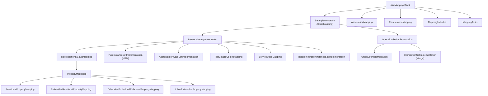
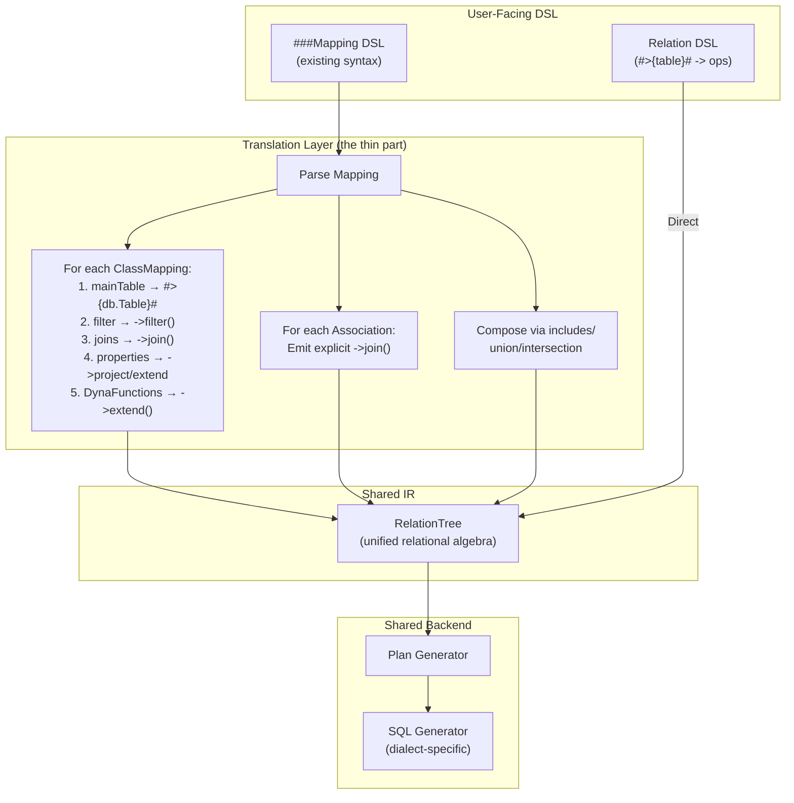

# Deep Analysis: Legend Mapping Patterns & Relational Unification Path (v2)

> Comprehensive research into ALL mapping patterns across `legend-engine` and `legend-pure`, with
> concrete analysis of how **every existing feature** translates to Relation operators — proving
> that Mappings can serve as a thin DSL/translation layer over the Relation pipeline.

---

## 1. Mapping Architecture Overview

Legend's Mapping system has a **two-layer architecture**:



---

## 2. ALL Mapping Types — Exhaustive List

### 2.1 Top-Level Mapping Elements

| Element | Description | Store Type |
|---|---|---|
| **ClassMapping** (SetImplementation) | Maps a class to a data source | Any |
| **AssociationMapping** | Maps an association's properties to stores | Relational, xStore |
| **EnumerationMapping** | Maps enum values between source↔target | N/A (transformer) |
| **MappingInclude** | Includes/inherits another mapping | N/A |
| **MappingTest/TestSuite** | Tests for mapping correctness | N/A |

### 2.2 SetImplementation Hierarchy (ClassMapping Types)

#### A. InstanceSetImplementation (maps a class to a concrete store)

| Type | Grammar Keyword | Description |
|---|---|---|
| **RootRelationalClassMapping** | `Relational` | Maps class to relational DB table(s) |
| **PureInstanceSetImplementation** | `Pure` | Model-to-Model mapping (source = another Pure class) |
| **RelationFunctionInstanceSetImplementation** | `Relation` | Maps class to a function returning `Relation<Any>[1]` |
| **AggregationAwareSetImplementation** | `AggregationAware` | Multi-granularity aggregate mappings with fallback |
| **FlatDataInstanceSetImplementation** | `FlatData` | Maps class to flat file (CSV, etc.) |
| **ServiceStoreClassMapping** | `ServiceStore` | Maps class to REST API service |
| **BindingTransformer-based** | Uses `Binding` | Maps via external format binding (JSON, XML, etc.) |

#### B. OperationSetImplementation (combines other SetImplementations)

| Type | Grammar Keyword | Description |
|---|---|---|
| **UnionSetImplementation** | `operation: union(set1, set2, ...)` | UNION of multiple class mappings |
| **IntersectionSetImplementation** | `operation: intersection(set1, set2, ...)` | MERGE with a lambda to resolve conflicts |

### 2.3 Property Mapping Types (within Relational ClassMappings)

| Type | Syntax Pattern | Description |
|---|---|---|
| **RelationalPropertyMapping** | `prop: [db]table.column` | Maps property to a column via relational operation |
| **EmbeddedRelationalPropertyMapping** | `prop() { ... }` | Inlines a related class's property mappings directly |
| **OtherwiseEmbeddedRelationalPropertyMapping** | `prop() { ... } Otherwise(...)` | Embedded + fallback join to another class mapping |
| **InlineEmbeddedPropertyMapping** | `prop() Inline[setImplId]` | References another existing class mapping by ID |
| **Local Mapping Property** | `+prop: Type[mult]: [db]table.col` | Creates a new property not in the original class |

---

## 3. ALL Features Supported by Relational Mappings

### 3.1 Complete Feature Reference with Examples

```
###Mapping my::Mapping
(
  // CLASS MAPPING with all features:
  *my::Person[person]: Relational   // * = root, [person] = mapping ID
  {
    ~primaryKey( [db]PersonTable.id )                    // PK override
    ~mainTable [db]PersonTable                           // Main table
    ~filter [db]ActivePersonFilter                       // Row-level filter
    ~distinct                                            // SELECT DISTINCT
    ~groupBy( [db]PersonTable.department )                // GROUP BY
    
    // --- Property Mappings (all variants) ---
    
    // (1) Simple column mapping
    firstName: [db]PersonTable.first_name,
    
    // (2) With join chain
    firmName: [db]@PersonFirm | FirmTable.name,
    
    // (3) With enum transformer
    gender: EnumerationMapping GenderMapping: [db]PersonTable.gender_code,
    
    // (4) With binding transformer (external format)
    address: Binding my::JsonBinding: [db]PersonTable.address_json,
    
    // (5) Embedded property mapping
    address() {
      street: [db]AddressTable.street,
      city: [db]AddressTable.city
    },
    
    // (6) Otherwise embedded
    address() {
      street: [db]AddressTable.street
    } Otherwise([addressMapping]: [db]@PersonAddress),
    
    // (7) Inline embedded
    address() Inline[addressMapping],
    
    // (8) Source/target mapping IDs
    firm[person, firm_mapping]: [db]@PersonFirm,
    
    // (9) Local mapping property (+ prefix)
    +fullName: String[1]: concat([db]PersonTable.first, ' ', [db]PersonTable.last),
    
    // (10) Cross-database reference
    externalId: [otherDb]ExternalTable.id,
    
    // (11) DynaFunction transforms (see §4 for full list)
    displayName: concat([db]PersonTable.first_name, ' ', [db]PersonTable.last_name),
    yearOfBirth: year([db]PersonTable.birth_date),
    ageCategory: case(
      greaterThan([db]PersonTable.age, 65), 'Senior',
      greaterThan([db]PersonTable.age, 18), 'Adult',
      'Minor'
    )
  }
)
```

### 3.2 Feature Summary Table

| Feature | Syntax | Description |
|---|---|---|
| **Root marker** | `*ClassName` | Marks as root/default mapping for a class |
| **Mapping ID** | `[id]` | Named ID for referencing in unions, etc. |
| **Default ID** | _(omitted)_ | Compiler assigns `fully_qualified_ClassName` |
| **Extends** | `extends [parentMappingId]` | Inherits from another class mapping |
| **Primary Key** | `~primaryKey(...)` | Overrides default PK |
| **Main Table** | `~mainTable [db]Table` | Specifies the primary table |
| **Filter** | `~filter [db]FilterName` | Applies a row-level filter |
| **Filter via join** | `~filter [db]@Join[db]FilterName` | Filter on a joined table |
| **Distinct** | `~distinct` | Adds DISTINCT to query |
| **GroupBy** | `~groupBy(...)` | Adds GROUP BY clause |
| **Join chains** | `@JoinName > @JoinName2` | Traverses joins between tables |
| **Join types** | `@J1 > (INNER) @J2` | Explicit join type (INNER, LEFT OUTER, RIGHT OUTER) |
| **Scope blocks** | `scope([db]schema.table) (...)` | Sets DB/schema/table context for nested mappings |
| **Enum transformer** | `EnumerationMapping EnumMapId:` | Transforms DB values to enum members |
| **Binding transformer** | `Binding my::Binding:` | Deserializes from external format |
| **Embedded** | `prop() { ... }` | Inlines sub-class mappings |
| **Otherwise** | `prop() { ... } Otherwise(...)` | Embedded with fallback |
| **Inline** | `prop() Inline[id]` | Reuses another mapping by ID |
| **Local properties** | `+prop: Type[mult]: ...` | Adds properties not in the class |
| **Source/Target IDs** | `prop[srcId, tgtId]: ...` | Explicit source/target mapping references |
| **Cross-DB refs** | `[otherDb]Table.col` | References columns across databases |
| **DynaFunction transforms** | `concat(...)`, `year(...)`, etc. | SQL function expressions (see §4) |
| **Milestoning** | Business/Processing milestoning | Temporal data support at table level |
| **Stereotypes/Tags** | `<<stereotype>>` / `{tag.value}` | Metadata on database elements |

### 3.3 Enumeration Mapping — Full Syntax

```
###Mapping my::Mapping
(
    // Single source → enum
    TradeStatus : EnumerationMapping StringStatusMapping
    {
        PENDING   : 'P',
        CONFIRMED : 'C',
        SETTLED   : 'S',
        CANCELLED : 'X'
    }

    // Multi-value collapse → one enum
    TradeStatus : EnumerationMapping LegacyMapping
    {
        PENDING   : ['P', 'PEND', 'PENDING'],   // three strings → one value
        CONFIRMED : ['C', 'CONF'],
        SETTLED   : 'S',
        CANCELLED : ['X', 'CANC', 'CANCEL']
    }

    // Integer variant
    TradeStatus : EnumerationMapping IntMapping
    {
        PENDING   : [0, 10, 20],
        CONFIRMED : 1,
        SETTLED   : 2,
        CANCELLED : [3, 4, 5]
    }
)
```

**Constraint:** all source values in a single enumeration mapping must be the same type.

### 3.4 Association Mapping Features

```
###Mapping my::Mapping
(
  // Relational Association Mapping
  my::PersonFirmAssociation: Relational
  {
    AssociationMapping
    (
      firm[person, firm]: [db]@PersonFirm,
      employees[firm, person]: [db]@PersonFirm
    )
  }
  
  // xStore Association Mapping (cross-store)
  my::PersonAddressAssociation: XStore
  {
    firm[person_relational, firm_serviceStore]: $this.firmId == $that.id,
    employees[firm_serviceStore, person_relational]: $this.id == $that.firmId
  }
)
```

### 3.5 Mapping Includes — Store Substitution

```
###Mapping my::FullMapping
(
    include my::PersonMapping [PersonDB -> FullDB]    // swap database
    include my::FirmMapping   [FirmDB   -> FullDB]    // can compose multiple
    
    // Multiple substitutions on one include
    include my::CrossMapping  [Db1 -> FullDb, Db2 -> FullDb]
)
```

### 3.6 Inheritance Mapping Patterns

**Option A — extends (same table):**
```
Person[person1] : Relational { ... }
Employee extends [person1] : Relational { employeeId : [db]T.empId }
```

**Option B — fresh mapping (different table, no extends):**
```
Animal[animal] : Relational { id: [db]AnimalTable.id }
Dog[dog] : Relational {
    ~mainTable [db]DogTable
    id: [db]@AnimalDog > [db]AnimalTable.id,  // join back for inherited cols
    breed: [db]DogTable.breed
}
```

### 3.7 Mapping Set ID Reference

| Context | Syntax | Role |
|---------|--------|------|
| Class mapping declaration | `ClassName[myId] : ...` | Assigns the ID |
| Default (omitted) | _(compiler assigns `my_model_ClassName`)_ | Auto-generated |
| Root marker | `*ClassName[myId] : ...` | Assigns ID and marks as default |
| Inline property mapping | `prop () Inline[myId]` | References the mapping to reuse |
| Otherwise fallback | `Otherwise ( [myId]:[db]@Join )` | Target mapping when embedded data absent |
| Extends | `ClassName[childId] extends [parentId] : ...` | Inherits property mappings |
| Association property | `prop [sourceId, targetId] : [db]@Join` | Disambiguates which class mappings are connected |

### 3.8 Database Object Grammar

| Object | Syntax | Description |
|---|---|---|
| **Table** | `Table T(col TYPE, ...)` | Table definition |
| **View** | `View V(...)` | View definition (precomputed relation) |
| **TabularFunction** | `TabularFunction F(...)` | Function returning table |
| **Join** | `Join J(T1.col = T2.col)` | Join definition |
| **Self-join** | `Join J(T.parent_id = {target}.id)` | `{target}` aliases the other side |
| **Filter** | `Filter F(T.col = 'X')` | Named filter predicate |
| **MultiGrainFilter** | `MultiGrainFilter F(...)` | Multi-level filter |
| **Schema** | `Schema S(Table ..., View ...)` | Schema grouping |
| **Include** | `include otherDb` | DB inheritance |

### 3.9 Join Condition Expression Language

Joins and filters use a **relational operation expression** language supporting:

| Feature | Example | Notes |
|---|---|---|
| **Equi-join** | `T1.col = T2.col` | Standard equality |
| **Multi-column** | `T1.a = T2.a and T1.b = T2.b` | `and`/`or` combinators |
| **Comparison ops** | `=`, `!=`, `<>`, `<`, `<=`, `>`, `>=` | All standard SQL comparisons |
| **Null checks** | `T.col is null`, `T.col is not null` | NULL testing |
| **Grouping** | `(cond1 or cond2) and cond3` | Parenthesized groups |
| **Functions** | `concat('prefix_', T.col) = T2.key` | DynaFunction calls |
| **in()** | `in(T.region, ['LON', 'NYC'])` | List membership |
| **Self-join** | `T.parent_id = {target}.id` | `{target}` for self-referential |

### 3.10 Relation Class Mapping (`Relation` keyword — new)

The `Relation` mapping type maps a class to a **Pure function returning `Relation<Any>[1]`**
rather than a database table. This is a newer addition to Legend, distinct from `Relational`.

```pure
###Pure
function my::personRelation(): Relation<(FIRSTNAME:String, AGE:Integer)>[1]
{
    #>{my::db.PersonTable}#
      ->filter(r | $r.active == true)
      ->project(~[FIRSTNAME: r | $r.first_name, AGE: r | $r.age])
}

###Mapping
Mapping my::PersonMapping
(
    *Person[person]: Relation
    {
        ~func my::personRelation__Relation_1_   // zero-arg function returning Relation
        firstName : FIRSTNAME,                   // property : COLUMN_NAME
        age       : AGE
    }
)
```

**Key constraints:**
- `~func` is required, must be the first line, must reference a named zero-arg function
- Property mappings are **column-name-only** — no DynaFunction expressions (transforms go in the `~func` body)
- Only primitive properties supported (no joins, no embedded, no complex navigation)
- The `~func` function body can contain any Relation-producing expression (including `#SQL`, store accessors, etc.)

| | `Relational` | `Relation` |
|---|---|---|
| Data source | `###Relational` database table / view / join | Any Pure function returning `Relation<Any>[1]` |
| Source declaration | `~mainTable [db]Table` | `~func my::fn__Relation_1_` |
| Store dependency | Requires a `Database` definition | None — store-agnostic |
| Property mapping | Column expression `[db]Table.column` + DynaFunctions | Bare column name `COLUMN` only |
| Complex expressions | Join traversal, DynaFunction transforms | Not supported — transforms go in `~func` body |
| Non-primitive properties | Supported via joins | Not supported |

> [!NOTE]
> The existence of `Relation` class mapping is evidence that the Legend team is **already
> building the bridge** between mappings and Relations upstream. It validates our thesis
> that mappings can desugar to Relation operations.

### 3.11 Graph Fetch Trees — Object Graph Selection

Graph Fetch Trees define which properties (and sub-properties) to fetch from an object graph.
They are used with `graphFetch()` and `graphFetchChecked()` queries and are relevant to
understanding the **object construction gap** between Mappings and Relations.

```pure
// Basic: fetch Person with firstName and firm.legalName
#{
    Person {
        firstName,
        firm {
            legalName
        }
    }
}#

// With aliases
#{Person { 'displayName': firstName }}#

// With subtype narrowing
#{Person { firm->subType(@Incorporation) { legalName } }}#

// With qualified property parameters
#{Product { synonymsByType(ProductSynonymType.CUSIP) { value } }}#
```

**Graph Fetch execution modes:**

| Mode | Function | Behaviour |
|---|---|---|
| Root only, checked | `->checked()` | Validate root objects, return `Checked<T>` |
| Tree, fail on error | `->graphFetch(tree)` | Fetch tree, fail on first error |
| Tree, checked | `->graphFetchChecked(tree)` | Fetch tree, return defects in `Checked<T>` |
| Unexpanded variants | `->graphFetchUnexpanded(tree)` | Tree without constraint expansion |

**Mapping→Relation implication:** Graph Fetch requires multi-query orchestration to
construct deep object trees. Each level of the tree can be a separate Relation query,
with the orchestrator assembling the results. This is an **orchestration concern above
the Relation algebra**, not a gap in the algebra itself.

---

## 4. DynaFunction Transforms — The Underdocumented Power Feature

> [!IMPORTANT]
> Relational property mapping RHS is **not limited to column references**. It accepts full
> DynaFunction expressions — enabling SQL-level transforms directly in the mapping. This is
> barely documented anywhere but is critical to the unification analysis.

### 4.1 What the Grammar Actually Accepts

The ANTLR parser (`RelationalParser.g4` / `RelationalGraphBuilder.java`) parses the property
mapping RHS as a `joinColWithDbOrConstant`, which resolves to one of:

1. **Column reference** → `[db]Table.column` → `TableAliasColumn`
2. **Join chain + column** → `[db]@Join > [db]Table.column` → `RelationalOperationElementWithJoin`
3. **Constant** → `'string'` or `42` → `Literal`
4. **DynaFunction** → `functionName(args...)` → `DynaFunction` (any of the 68+ functions below)
5. **Nested** — args to DynaFunctions can themselves be columns, constants, or other DynaFunctions

### 4.2 Complete DynaFunction Registry

Extracted from the H2 SQL generation backend (`h2Extension1_4_200.pure`). These are all
available as property mapping transforms:

| Category | Functions |
|---|---|
| **String** | `concat`, `substring`, `length`, `position`, `indexOf`, `trim`, `upper`, `lower`, `matches`, `reverseString`, `splitPart`, `char`, `joinStrings` |
| **Numeric** | `round`, `parseFloat`, `parseInteger`, `parseDecimal` |
| **Date/Time** | `now`, `today`, `year`, `month`, `monthNumber`, `monthName`, `dayOfMonth`, `dayOfWeek`, `dayOfWeekNumber`, `dayOfYear`, `weekOfYear`, `quarter`, `quarterNumber`, `hour`, `minute`, `second`, `datePart`, `dateDiff`, `adjust`, `parseDate`, `toTimestamp`, `convertDate`, `convertDateTime`, `convertTimeZone` |
| **Date Math** | `firstDayOfMonth`, `firstDayOfQuarter`, `firstDayOfYear`, `firstDayOfWeek`, `firstDayOfThisMonth`, `firstDayOfThisQuarter`, `firstDayOfThisYear`, `mostRecentDayOfWeek`, `previousDayOfWeek` |
| **Type Conversion** | `toString`, `toDecimal`, `toFloat`, `convertVarchar128` |
| **Boolean/Logic** | `booland`, `boolor`, `isNumeric`, `isAlphaNumeric` |
| **Encoding** | `encodeBase64`, `decodeBase64`, `md5`, `sha1`, `sha256`, `generateGuid` |
| **Semi-structured** | `extractFromSemiStructured`, `parseJson` |
| **Comparison** | `equal`, `notEqual`, `greaterThan`, `lessThan`, `greaterThanEqual`, `lessThanEqual`, `isNull`, `isNotNull`, `in` |
| **Similarity** | `jaroWinklerSimilarity`, `levenshteinDistance` |
| **Aggregate** | `count`, `sum`, `average`, `min`, `max`, `stdDevSample`, `stdDevPopulation` |

### 4.3 Transform Examples in Property Mappings

```pure
Person : Relational
{
    // String transforms
    fullName: concat([db]PersonTable.first_name, ' ', [db]PersonTable.last_name),
    initials: concat(substring([db]PersonTable.first_name, 0, 1), 
                     substring([db]PersonTable.last_name, 0, 1)),
    email: concat(lower([db]PersonTable.first_name), '@company.com'),
    
    // Date transforms
    yearOfBirth: year([db]PersonTable.birth_date),
    quarter: quarter([db]PersonTable.trade_date),
    
    // Type conversions
    ageAsString: toString([db]PersonTable.age),
    
    // Via Views (precomputed — the alternative pattern)
    // Define in ###Relational:
    //   View PersonView (
    //     fullName: concat(PersonTable.first_name, ' ', PersonTable.last_name),
    //     ... 
    //   )
    // Then map:  fullName: [db]PersonView.fullName
}
```

### 4.4 Three Places Transforms Can Live

| Place | Syntax | When to Use |
|---|---|---|
| **Property mapping RHS** | `prop: concat([db]T.a, [db]T.b)` | Mapping-level, per-property |
| **Database View** | `View V (col: concat(T.a, T.b))` | Schema-level, reusable across mappings |
| **Local property (+)** | `+prop: Type[m]: concat([db]T.a, [db]T.b)` | XStore join keys, internal use |

---

## 5. Relation/TDS Pipeline — The Target Architecture

### 5.1 How the Relation Pipeline Works

```pure
// Direct Relation approach (no Mapping needed)
#>{my::db.PersonTable}#                    // RelationStoreAccessor: direct table access
  ->filter(r | $r.active == true)          // Filter rows  
  ->extend(~fullName: r | $r.first + ' ' + $r.last)  // Add column
  ->join(
    #>{my::db.FirmTable}#,                 // Second relation
    JoinType.INNER,                         // Join type
    {a, b | $a.firm_id == $b.id}           // Join predicate
  )
  ->groupBy(~department, ~[count: r | $r.id : y | $y->count()])  // Aggregate
  ->sort(~department->ascending())          // Sort
  ->limit(100)                             // Limit
  ->from(^Runtime(...))                    // Execute against runtime
```

### 5.2 Relation Operators Available

| Operator | SQL Equivalent | Description |
|---|---|---|
| `->filter(pred)` | `WHERE` | Row-level filtering |
| `->project(cols)` | `SELECT` | Column projection |
| `->extend(~col: expr)` | `SELECT ..., expr AS col` | Add derived columns |
| `->join(rel, type, pred)` | `JOIN` | Join two relations |
| `->groupBy(cols, aggs)` | `GROUP BY` | Aggregation |
| `->sort(col->asc/desc)` | `ORDER BY` | Sorting |
| `->limit(n)` | `LIMIT` | Row limiting |
| `->distinct()` | `DISTINCT` | Deduplicate |
| `->drop(n)` | `OFFSET` | Skip rows |
| `->slice(start, end)` | `LIMIT/OFFSET` | Range selection |
| `->rename(old, new)` | `AS` | Column rename |
| `->select(cols)` | `SELECT` | Column selection |
| `->concatenate(rel)` | `UNION ALL` | Vertical union |

---

## 6. Comprehensive Feature Translation: Mapping → Relation

> [!IMPORTANT]
> This section is the core of the doc. For **every** existing mapping feature, we show the exact
> Relation equivalent and assess translation difficulty. The goal: prove that `###Mapping` can
> be a thin DSL that compiles/desugars to Relation operator trees.

### 6.1 Class-Level Features → Relation

| Mapping Feature | Mapping Syntax | Relation Equivalent | Difficulty |
|---|---|---|---|
| **Main table** | `~mainTable [db]PersonTable` | `#>{db.PersonTable}#` | 🟢 Trivial |
| **Primary key** | `~primaryKey([db]T.id)` | Column metadata / `->select(~id)` | 🟢 Trivial |
| **Filter** | `~filter [db]ActiveFilter` | `->filter(r \| <filter predicate>)` | 🟢 Easy |
| **Filter via join** | `~filter [db]@J1[db]Filter` | `->join(...) ->filter(...)` | 🟡 Medium |
| **Distinct** | `~distinct` | `->distinct()` | 🟢 Trivial |
| **GroupBy** | `~groupBy([db]T.dept)` | `->groupBy(~dept, ~aggs)` | 🟢 Easy |
| **Root marker (*)** | `*Person[id]` | Query routing metadata (not a data operation) | 🟢 Metadata |
| **Mapping ID** | `[person]` | Named variable / function reference | 🟢 Metadata |
| **Extends** | `extends [parentId]` | Compose: parent Relation expression + extend with child columns | 🟡 Medium |

### 6.2 Property Mapping → Relation Column

| Mapping Feature | Mapping Syntax | Relation Equivalent | Difficulty |
|---|---|---|---|
| **Simple column** | `firstName: [db]T.first_name` | `->project(~firstName: r \| $r.first_name)` or `->rename(~first_name, ~firstName)` | 🟢 Trivial |
| **Join + column** | `firmName: [db]@PF \| FirmT.name` | `->join(#>{db.FirmT}#, INNER, {a,b \| ...}) ->project(~firmName: r \| $r.name)` | 🟢 Easy |
| **Multi-hop join** | `city: [db]@PF > @FC \| CityT.name` | `->join(...) ->join(...) ->project(...)` | 🟡 Medium |
| **DynaFunction** | `fullName: concat([db]T.first, ' ', [db]T.last)` | `->extend(~fullName: r \| $r.first + ' ' + $r.last)` | 🟢 Easy |
| **Year extract** | `birthYear: year([db]T.birth_date)` | `->extend(~birthYear: r \| $r.birth_date->year())` | 🟢 Easy |
| **Enum transformer** | `EnumerationMapping M: [db]T.code` | `->extend(~status: r \| case($r.code, 'P', 'PENDING', ...))` | 🟡 Medium |
| **Multi-value enum** | `PENDING: ['P', 'PEND']` | `->extend(~status: r \| if(in($r.code, ['P','PEND']), 'PENDING', ...))` | 🟡 Medium |
| **Binding transformer** | `Binding my::B: [db]T.json` | Post-processing: extract column, deserialize | 🔴 Hard |
| **Cross-DB ref** | `[otherDb]T.col` | Multi-source: `#>{otherDb.T}#` + cross-join | 🟡 Medium |

### 6.3 Complex Property Mappings → Relation

| Mapping Feature | Mapping Syntax | Relation Equivalent | Difficulty |
|---|---|---|---|
| **Embedded** | `address() { street: [db]T.street, city: [db]T.city }` | `->project(~[address_street: r\|$r.street, address_city: r\|$r.city])` + unflatten post-processing | 🟡 Medium |
| **Otherwise embedded** | `address() { ... } Otherwise([id]:[db]@J)` | `->extend(coalesce logic)` + embedded fallback to `->join()` | 🟡 Medium |
| **Inline embedded** | `address() Inline[addrMapping]` | Inline the referenced mapping's Relation expression | 🟡 Medium |
| **~primaryKey in embedded** | `~primaryKey ([db]T.legalName)` | `->distinct()` on the embedded columns | 🟢 Easy |

### 6.4 Structural Features → Relation

| Mapping Feature | Mapping Syntax | Relation Equivalent | Difficulty |
|---|---|---|---|
| **Union mapping** | `operation: union(set1, set2)` | `rel1->concatenate(rel2)` | 🟢 Easy |
| **Merge/Intersection** | `operation: intersection(s1, s2)` | `rel1->join(rel2, ...) + merge lambda` | 🟡 Medium |
| **Mapping include** | `include my::OtherMapping` | Compose: import other mapping's Relation expressions | 🟢 Easy |
| **Store substitution** | `include M [Db1 -> Db2]` | Replace `#>{Db1.T}#` with `#>{Db2.T}#` in included expressions | 🟡 Medium |
| **Association mapping** | `[db]@PersonFirmJoin` | Explicit `->join(otherRel, type, pred)` | 🟢 Easy |
| **XStore mapping** | `$this.firmId == $that.id` | Cross-source join — federated execution layer | 🔴 Hard |
| **Inheritance (extends)** | `Child extends [parent]` | `parentRel->extend(~childProp: ...)` | 🟡 Medium |
| **Inheritance (fresh)** | Separate mapping with joins | `#>{childTable}# ->join(parentTable, ...)` | 🟢 Easy |

### 6.5 DynaFunction Transforms → Relation extend()

Every DynaFunction used in a property mapping RHS maps to a `->extend()` expression:

| Mapping DynaFunction | Relation `->extend()` Equivalent | SQL Output |
|---|---|---|
| `concat(T.a, ' ', T.b)` | `->extend(~x: r \| $r.a + ' ' + $r.b)` | `CONCAT(a, ' ', b)` |
| `year(T.date)` | `->extend(~x: r \| $r.date->year())` | `YEAR(date)` |
| `substring(T.col, 0, 3)` | `->extend(~x: r \| $r.col->substring(0, 3))` | `SUBSTRING(col, 0, 3)` |
| `round(T.amount)` | `->extend(~x: r \| $r.amount->round())` | `ROUND(amount)` |
| `today()` | `->extend(~x: r \| today())` | `CURRENT_DATE()` |
| `toString(T.num)` | `->extend(~x: r \| $r.num->toString())` | `CAST(num AS VARCHAR)` |
| `in(T.col, [1, 2])` | `->filter(r \| $r.col->in([1, 2]))` | `col IN (1, 2)` |
| `isNull(T.col)` | `->filter(r \| $r.col->isNull())` | `col IS NULL` |

### 6.6 Database Objects → Relation

| DB Object | Relation Equivalent | Difficulty |
|---|---|---|
| **Table** | `#>{db.Table}#` — direct Relation access | 🟢 Trivial |
| **View** | Named function returning `Relation<...>[1]` — the `~func` pattern | 🟢 Easy |
| **Join** | `->join(otherRel, joinType, predicate)` | 🟢 Easy |
| **Self-join (`{target}`)** | `->join(#>{db.SameTable}#, type, {a, b \| $a.parent_id == $b.id})` | 🟢 Easy |
| **Filter** | `->filter(predicate)` | 🟢 Trivial |
| **Schema** | Part of table path: `#>{db.schema.Table}#` | 🟢 Trivial |
| **Include** | Database composition — resolved at compilation | 🟢 Metadata |

---

## 7. The Translation Layer Architecture

### 7.1 How Mapping DSL Becomes Relation Operations



### 7.2 Translation Pseudocode for a ClassMapping

```
translateClassMapping(cm: RootRelationalClassMapping) -> Relation:
    // 1. Start with main table
    rel = #>{cm.mainTable.database.cm.mainTable.table}#
    
    // 2. Apply filter
    if cm.filter:
        pred = translateDynaFunction(cm.filter.operation)
        if cm.filter.joinPath:
            rel = rel->join(translateJoinPath(cm.filter.joinPath))
        rel = rel->filter(pred)
    
    // 3. Process property mappings
    for pm in cm.propertyMappings:
        match pm:
            RelationalPropertyMapping:
                if pm.relationalOpElement is TableAliasColumn:
                    // Simple column → project/rename
                    rel = rel->project(~{pm.property.name}: r | $r.{column})
                    
                if pm.relationalOpElement is RelationalOpElementWithJoin:
                    // Join + column → join then project
                    joinedRel = translateJoinChain(pm.joinTreeNode)
                    rel = rel->join(joinedRel, ...)
                                ->project(~{pm.property.name}: r | $r.{column})
                    
                if pm.relationalOpElement is DynaFunction:
                    // Transform → extend
                    expr = translateDynaFunction(pm.relationalOpElement)
                    rel = rel->extend(~{pm.property.name}: r | expr)
                    
                if pm.transformer (EnumerationMapping):
                    // Enum → case/extend
                    rel = rel->extend(~{pm.property.name}: r | 
                        case($r.{column}, enumMappingToCaseExpr(pm.transformer)))
            
            EmbeddedRelationalPropertyMapping:
                // Flatten sub-properties with naming convention
                for subPm in pm.propertyMappings:
                    rel = translatePropertyMapping(rel, subPm, prefix=pm.property.name + '_')
                    
            InlineEmbeddedPropertyMapping:
                // Import the referenced mapping's Relation expression
                inlinedRel = translateClassMapping(lookupMapping(pm.inlineSetId))
                rel = rel->join(inlinedRel, ...)
    
    // 4. Apply distinct
    if cm.distinct: rel = rel->distinct()
    
    // 5. Apply groupBy
    if cm.groupBy:
        rel = rel->groupBy(translateGroupBy(cm.groupBy))
    
    return rel
```

### 7.3 What Each Layer Is Responsible For

| Layer | Responsibilities |
|---|---|
| **Mapping DSL** | Human-friendly syntax: class→table, property→column, implicit joins, enum transforms |
| **Translation layer** | Desugars to Relation ops: table access, explicit joins, project/extend/filter |
| **Relation IR** | Algebraic tree: composable, optimizable, store-agnostic |
| **Plan Generator** | Converts Relation tree → execution plan |
| **SQL Generator** | Dialect-specific SQL from plan (H2, Postgres, Snowflake, etc.) |

---

## 8. Gap Analysis: What's Hard

### 8.1 Features That Translate Cleanly (80% of real usage)

✅ Simple property → column mapping
✅ Join-based properties (single and multi-hop)
✅ All 68+ DynaFunction transforms
✅ Filters (including join-path filters)
✅ Distinct / GroupBy
✅ Union / concatenate
✅ Association mappings → explicit joins
✅ Enumeration mappings → case expressions
✅ Local properties → extend
✅ Store substitution → swap table accessor
✅ Inheritance (both extends and fresh-mapping patterns)
✅ Scope blocks → just scoping context for table refs
✅ Database Views → named Relation-producing functions

### 8.2 Features Requiring Non-Trivial Handling (20%)

| Feature | Challenge | Proposed Solution |
|---|---|---|
| **Embedded mappings** | Relations produce flat rows; embedded mappings construct nested objects | Column-naming convention + unflatten post-processing layer |
| **Otherwise embedded** | Conditional nesting with fallback | `coalesce()` on embedded columns + fallback join |
| **Object graph construction** | Mappings produce typed objects with nested properties; Relations produce flat TDS | Post-processing layer: flat columns → object hydration |
| **Graph Fetch execution** | Deep object tree fetching with batching | Multi-query orchestrator emitting multiple Relation queries |
| **AggregationAware routing** | Auto-selects best aggregate mapping based on query shape | Query analyzer macro that selects the right Relation expression |
| **Binding transformer** | JSON/XML deserialization from columns | Post-processing step, not pure relational |
| **xStore mapping** | Cross-store joins with different runtimes | Federation layer: execute each store's Relation, join in-memory |
| **M2M (Pure) mappings** | Source is another Pure class, not a store | Out of scope for relational unification |
| **Milestoning** | Auto-appended temporal predicates | Auto-inject `->filter()` with milestoning conditions |

### 8.3 The Object Construction Gap

> [!IMPORTANT]
> The fundamental gap between Mappings and Relations is **not** about transforms or joins —
> those all translate cleanly. The gap is about **object construction**: mappings produce
> typed domain objects with nested properties (Person with Firm with Address), while Relations
> produce flat tabular rows. The translation layer needs an **unflatten/hydration** post-processing
> step that takes flat Relation results and constructs object graphs.

This is a **presentation-layer concern**, not a relational algebra concern. The actual data
fetching and computation is identical in both paths.

---

## 9. Summary: Feature Inventory

| Category | Count | Items |
|---|---|---|
| **SetImplementation types** | 8 | RootRelational, PureInstance (M2M), Relation, AggregationAware, FlatData, ServiceStore, Union, Intersection/Merge |
| **Property Mapping types** | 5 | Relational, Embedded, OtherwiseEmbedded, InlineEmbedded, LocalMappingProperty |
| **Association mapping types** | 2 | Relational, xStore |
| **Mapping-level features** | 6 | Includes, Store substitution, EnumerationMapping, Tests/TestSuites, Root marker, Mapping ID |
| **ClassMapping features** | 9 | PrimaryKey, MainTable, Filter, Filter-via-join, Distinct, GroupBy, Extends, Scope, Store reference |
| **Property-level features** | 7 | Join chains, Join types, DynaFunction transforms, Enum transformer, Binding transformer, Source/Target IDs, Cross-DB refs |
| **DynaFunction categories** | 10 | String(13), Numeric(3), Date/Time(19), Date Math(9), Conversion(4), Boolean(4), Encoding(6), Semi-structured(2), Comparison(8), Similarity(2) |
| **Database objects** | 9 | Table, View, TabularFunction, Join, Self-join, Filter, MultiGrainFilter, Schema, Include |
| **Relation operators** | 12+ | filter, project, extend, join, groupBy, sort, limit, distinct, drop, slice, rename, select, concatenate |
| **Features that translate cleanly** | ~80% | Simple mappings, joins, transforms, filters, unions, enums, local props, views, inheritance |
| **Features requiring extra layers** | ~20% | Embedded/object construction, Graph Fetch, AggregationAware, xStore, milestoning |

---

## 10. Verdict

> [!IMPORTANT]
> **Yes, Mapping can be a thin DSL layer over Relation operators.** The vast majority (80%+) of
> mapping features translate mechanically to Relation operations. The remaining 20% requires
> additional infrastructure (object hydration, query routing, federation) — but these are
> **orchestration concerns** sitting above the Relation algebra, not gaps in the algebra itself.

**The Relation pipeline can do everything the SQL generator needs.** The Mapping DSL's value
is ergonomics — implicit joins from association definitions, property-to-column naming, enum
transforms, scope blocks for conciseness — all of which can be desugared at compile time.

**Upstream is already moving this direction.** The new `Relation` class mapping type (§3.10)
proves that the Legend team is actively building bridges between the Mapping and Relation
worlds. In this mapping type, the data source is a `Relation`-producing function rather
than a database table — exactly the intermediate representation our translation layer
would produce. The path from our architecture (§7.1) to reality is shorter than it appears.
