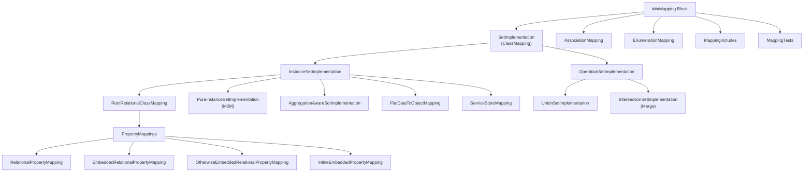
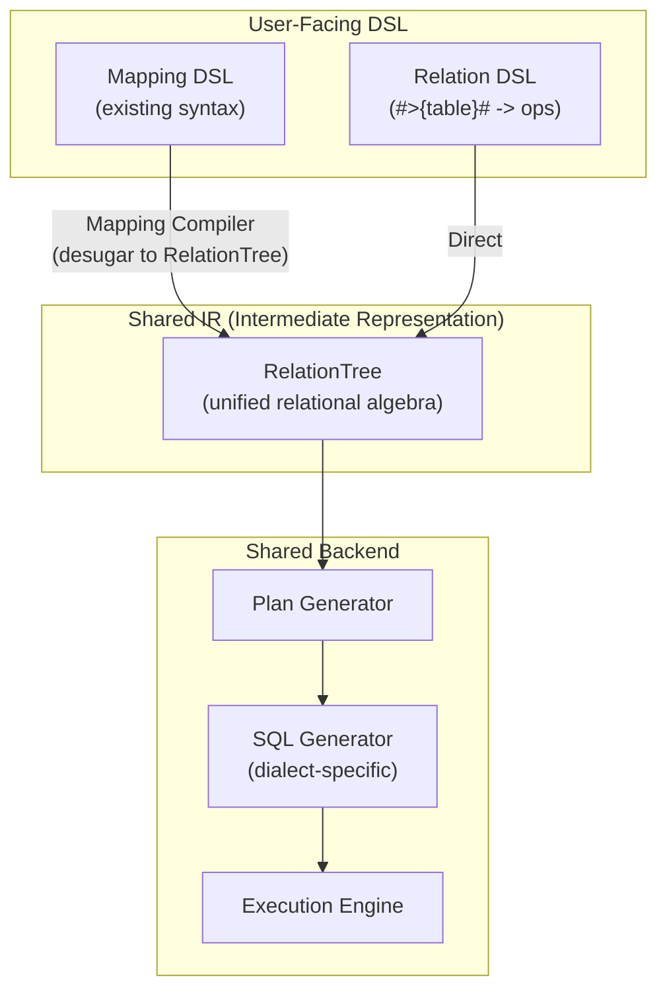

# Deep Analysis: Legend Mapping Patterns & Relational Unification Path

> Comprehensive research into ALL mapping patterns across `legend-engine` and `legend-pure`, with analysis of whether relational mappings can be unified with the Relation/TDS pipeline.

---

## 1. Mapping Architecture Overview

Legend's Mapping system has a **two-layer architecture**:



---

## 2. ALL Mapping Types — Exhaustive List

### 2.1 Top-Level Mapping Elements

| Element | Description | Store Type |
|---|---|---|
| **ClassMapping** (SetImplementation) | Maps a class to a data source | Any |
| **AssociationMapping** | Maps an association's properties to stores | Relational, xStore |
| **EnumerationMapping** | Maps enum values between source↔target | N/A (transformer) |
| **MappingInclude** | Includes/inherits another mapping | N/A |
| **MappingTest/TestSuite** | Tests for mapping correctness | N/A |

### 2.2 SetImplementation Hierarchy (ClassMapping Types)

#### A. InstanceSetImplementation (maps a class to a concrete store)

| Type | Grammar Keyword | Description |
|---|---|---|
| **RootRelationalClassMapping** | `Relational` | Maps class to relational DB table(s) |
| **PureInstanceSetImplementation** | `Pure` | Model-to-Model mapping (source = another Pure class) |
| **AggregationAwareSetImplementation** | `AggregationAware` | Multi-granularity aggregate mappings with fallback |
| **FlatDataInstanceSetImplementation** | `FlatData` | Maps class to flat file (CSV, etc.) |
| **ServiceStoreClassMapping** | `ServiceStore` | Maps class to REST API service |
| **BindingTransformer-based** | Uses `Binding` | Maps via external format binding (JSON, XML, etc.) |

#### B. OperationSetImplementation (combines other SetImplementations)

| Type | Grammar Keyword | Description |
|---|---|---|
| **UnionSetImplementation** | `operation: union(set1, set2, ...)` | UNION of multiple class mappings |
| **IntersectionSetImplementation** | `operation: intersection(set1, set2, ...)` | MERGE with a lambda to resolve conflicts |

### 2.3 Property Mapping Types (within Relational ClassMappings)

| Type | Syntax Pattern | Description |
|---|---|---|
| **RelationalPropertyMapping** | `prop: [db]table.column` | Maps property to a column via relational operation |
| **EmbeddedRelationalPropertyMapping** | `prop() { ... }` | Inlines a related class's property mappings directly |
| **OtherwiseEmbeddedRelationalPropertyMapping** | `prop() { ... } Otherwise(...)` | Embedded + fallback join to another class mapping |
| **InlineEmbeddedPropertyMapping** | `prop() Inline[setImplId]` | References another existing class mapping by ID |
| **Local Mapping Property** | `+prop: Type[mult]: [db]table.col` | Creates a new property not in the original class |

---

## 3. ALL Features Supported by Relational Mappings

### 3.1 RootRelationalClassMapping Features

```
###Mapping my::Mapping
(
  // CLASS MAPPING with all features:
  *my::Person[person]: Relational   // * = root, [person] = mapping ID
  {
    ~primaryKey( [db]PersonTable.id )                    // PK override
    ~mainTable [db]PersonTable                           // Main table
    ~filter [db]ActivePersonFilter                       // Row-level filter
    ~distinct                                            // SELECT DISTINCT
    ~groupBy( [db]PersonTable.department )                // GROUP BY
    
    // --- Property Mappings (all variants) ---
    
    // (1) Simple column mapping
    firstName: [db]PersonTable.first_name,
    
    // (2) With join chain
    firmName: [db]@PersonFirm | FirmTable.name,
    
    // (3) With enum transformer
    gender: EnumerationMapping GenderMapping: [db]PersonTable.gender_code,
    
    // (4) With binding transformer (external format)
    address: Binding my::JsonBinding: [db]PersonTable.address_json,
    
    // (5) Embedded property mapping
    address() {
      street: [db]AddressTable.street,
      city: [db]AddressTable.city
    },
    
    // (6) Otherwise embedded
    address() {
      street: [db]AddressTable.street
    } Otherwise([addressMapping]: [db]@PersonAddress),
    
    // (7) Inline embedded
    address() Inline[addressMapping],
    
    // (8) Source/target mapping IDs
    firm[person, firm_mapping]: [db]@PersonFirm,
    
    // (9) Local mapping property (+ prefix)
    +fullName: String[1]: concat([db]PersonTable.first, ' ', [db]PersonTable.last),
    
    // (10) Cross-database reference
    externalId: [otherDb]ExternalTable.id
  }
)
```

### 3.2 Feature Summary Table

| Feature | Syntax | Description |
|---|---|---|
| **Root marker** | `*ClassName` | Marks as root/default mapping for a class |
| **Mapping ID** | `[id]` | Named ID for referencing in unions, etc. |
| **Extends** | `extends [parentMappingId]` | Inherits from another class mapping |
| **Primary Key** | `~primaryKey(...)` | Overrides default PK |
| **Main Table** | `~mainTable [db]Table` | Specifies the primary table |
| **Filter** | `~filter [db]FilterName` | Applies a row-level filter |
| **Distinct** | `~distinct` | Adds DISTINCT to query |
| **GroupBy** | `~groupBy(...)` | Adds GROUP BY clause |
| **Join chains** | `@JoinName \| @JoinName2` | Traverses joins between tables |
| **Scope blocks** | `scope([db]schema.table) (...)` | Sets DB/schema/table context for nested mappings |
| **Enum transformer** | `EnumerationMapping EnumMapId:` | Transforms DB values to enum members |
| **Binding transformer** | `Binding my::Binding:` | Deserializes from external format |
| **Embedded** | `prop() { ... }` | Inlines sub-class mappings |
| **Otherwise** | `prop() { ... } Otherwise(...)` | Embedded with fallback |
| **Inline** | `prop() Inline[id]` | Reuses another mapping by ID |
| **Local properties** | `+prop: Type[mult]: ...` | Adds properties not in the class |
| **Source/Target IDs** | `prop[srcId, tgtId]: ...` | Explicit source/target mapping references |
| **Cross-DB refs** | `[otherDb]Table.col` | References columns across databases |
| **Milestoning** | Business/Processing milestoning | Temporal data support at table level |
| **Stereotypes/Tags** | `<<stereotype>>` / `{tag.value}` | Metadata on database elements |

### 3.3 Database Object Grammar

| Object | Syntax | Description |
|---|---|---|
| **Table** | `Table T(col TYPE, ...)` | Table definition |
| **View** | `View V(...)` | View definition |
| **TabularFunction** | `TabularFunction F(...)` | Function returning table |
| **Join** | `Join J(T1.col = T2.col)` | Join definition |
| **Filter** | `Filter F(T.col = 'X')` | Named filter predicate |
| **MultiGrainFilter** | `MultiGrainFilter F(...)` | Multi-level filter |
| **Schema** | `Schema S(Table ..., View ...)` | Schema grouping |
| **Include** | `include otherDb` | DB inheritance |

### 3.4 Association Mapping Features

```
###Mapping my::Mapping
(
  // Relational Association Mapping
  my::PersonFirmAssociation: Relational
  {
    AssociationMapping
    (
      firm[person, firm]: [db]@PersonFirm,
      employees[firm, person]: [db]@PersonFirm
    )
  }
  
  // xStore Association Mapping (cross-store)
  my::PersonAddressAssociation: XStore
  {
    firm[person_relational, firm_serviceStore]: $this.firmId == $that.id,
    employees[firm_serviceStore, person_relational]: $this.id == $that.firmId
  }
)
```

### 3.5 Operation Mappings (Union/Merge)

```
###Mapping my::Mapping
(
  // Union: combines multiple class mappings
  *my::Person: Operation
  {
    meta::pure::router::operations::union_OperationSetImplementation_1__SetImplementation_MANY_(person_set1, person_set2)
  }
  
  // Merge/Intersection: merges with conflict resolution
  *my::Person: Operation
  {
    meta::pure::router::operations::merge_OperationSetImplementation_1__SetImplementation_MANY_(person_set1, person_set2)
  }
)
```

### 3.6 Other Mapping Features

| Feature | Description |
|---|---|
| **M2M Mapping** (`Pure` type) | Maps between two Pure classes using lambda expressions |
| **M2M with filter** | `~filter` in Pure instance mapping |
| **AggregationAware** | Multiple aggregate views with automatic routing |
| **Mapping includes** | `include mapping my::OtherMapping` to compose |
| **Mapping tests** | Test suites with query, input data, assertions |
| **EnumerationMapping** | Maps source values → enum members |

---

## 4. Relation/TDS Pipeline — The Alternative Path

### 4.1 How the Relation Pipeline Works

The Relation/TDS pipeline is a **functional, composable** approach to querying:

```pure
// Direct Relation approach (no Mapping needed)
#>{my::db.PersonTable}#                    // RelationStoreAccessor: direct table access
  ->filter(r | $r.active == true)          // Filter rows  
  ->extend(~fullName: r | $r.first + ' ' + $r.last)  // Add column
  ->join(
    #>{my::db.FirmTable}#,                 // Second relation
    JoinType.INNER,                         // Join type
    {a, b | $a.firm_id == $b.id}           // Join predicate
  )
  ->groupBy(~department, ~[count: r | $r.id : y | $y->count()])  // Aggregate
  ->sort(~department->ascending())          // Sort
  ->limit(100)                             // Limit
  ->from(^Runtime(...))                    // Execute against runtime
```

### 4.2 Relation Operators Available

| Operator | SQL Equivalent | Description |
|---|---|---|
| `->filter(pred)` | `WHERE` | Row-level filtering |
| `->project(cols)` | `SELECT` | Column projection |
| `->extend(~col: expr)` | `SELECT ..., expr AS col` | Add derived columns |
| `->join(rel, type, pred)` | `JOIN` | Join two relations |
| `->groupBy(cols, aggs)` | `GROUP BY` | Aggregation |
| `->sort(col->asc/desc)` | `ORDER BY` | Sorting |
| `->limit(n)` | `LIMIT` | Row limiting |
| `->distinct()` | `DISTINCT` | Deduplicate |
| `->drop(n)` | `OFFSET` | Skip rows |
| `->slice(start, end)` | `LIMIT/OFFSET` | Range selection |
| `->rename(old, new)` | `AS` | Column rename |
| `->select(cols)` | `SELECT` | Column selection |
| `->concatenate(rel)` | `UNION ALL` | Vertical union |

### 4.3 Key Differences: Mapping vs Relation Pipeline

| Aspect | Mapping Pipeline | Relation Pipeline |
|---|---|---|
| **Entry point** | `ClassName.all()->from(mapping, runtime)` | `#>{db.Table}#->from(runtime)` |
| **Abstraction** | Works on domain objects/classes | Works on relations/columns directly |
| **Schema** | Class properties = typed, constrained | Columns = flat, tabular |
| **Navigation** | Object graph navigation (`$p.firm.name`) | Explicit joins |
| **Compilation** | Mapping → router → plan → SQL | Relation tree → plan → SQL |
| **Code path** | `MappingRouter` → `RelationalExecutionNodeForMapping` | `RelationExecutionNode` |
| **Joins** | Implicit via association mappings + Joins defined in DB | Explicit `->join()` calls |
| **Inheritance** | Handled via union/extends | Manual `->concatenate()` |
| **Embedding** | Embedded/Inline property mappings | Manual joins |

---

## 5. Feasibility Analysis: Can Mappings Become a DSL on Top of Relation Operators?

### 5.1 What Maps Cleanly to Relations ✅

| Mapping Feature | Relation Equivalent | Difficulty |
|---|---|---|
| Simple property → column | `->project(~prop: r \| $r.column)` | 🟢 Trivial |
| Join-based property | `->join(otherRel, ...) ->project(...)` | 🟢 Easy |
| Filter | `->filter(pred)` | 🟢 Trivial |
| Distinct | `->distinct()` | 🟢 Trivial |
| GroupBy | `->groupBy(cols, aggs)` | 🟢 Easy |
| Primary key | Just column selection | 🟢 Trivial |
| Main table | `#>{db.Table}#` starter | 🟢 Trivial |
| Enum transformer | `->extend(~prop: r \| case(...))` | 🟡 Medium |
| Union mapping | `->concatenate()` | 🟢 Easy |
| Cross-DB reference | Multiple `#>{db.Table}#` + join | 🟡 Medium |
| Local mapping property | `->extend(~newProp: expr)` | 🟢 Easy |
| Scope blocks | Just scoping context for `#>{db.schema.Table}#` | 🟢 Trivial |

### 5.2 What Is Hard but Possible 🟡

| Mapping Feature | Challenge | Approach |
|---|---|---|
| **Embedded mappings** | Nested object graph construction from flat relations | Relation produces flat result; a post-processing layer reconstitutes objects. Requires column-naming convention + unflatten step |
| **Otherwise embedded** | Conditional nesting with fallback | `->join()` + `->extend()` with coalesce logic, then unflatten |
| **Inline embedded** | Referencing another mapping by ID | Composition: inline the referenced Relation expression |
| **Association mapping** | Implicit joins via model associations | Compile associations to explicit `->join()` with the defined join predicate |
| **xStore mapping** | Cross-store joins with different runtimes | Requires federation layer: execute each store's Relation separately, then join in-memory or via a federated node |
| **Extends/inheritance** | Mapping inheritance chains | Compose: include parent mapping's Relations via `->concatenate()` + dedup |
| **Milestoning** | Auto-appended temporal predicates | `->filter()` with milestoning conditions auto-appended by compiler |
| **Binding transformer** | JSON/XML deserialization from columns | Post-processing step, not pure relational |

### 5.3 What Is Fundamentally Different 🔴

| Mapping Feature | Why It's Hard | Assessment |
|---|---|---|
| **Object graph construction** | Mappings produce typed objects with nested properties; Relations produce flat TDS rows | This is the **core gap**. Graph Fetch queries navigate object trees — Relations don't have this concept |
| **AggregationAware routing** | Auto-selects best aggregate mapping based on query shape | Requires a query analyzer/router — could work as a macro that selects the right Relation expression |
| **M2M (Pure) mappings** | Source is another Pure class, not a store | Fundamentally not about relational stores — out of scope |
| **Multiple/nested class mappings** | A Mapping can have many class mappings interacting | Need a composition mechanism to wire Relations together |
| **Graph Fetch execution** | Deep object tree fetching with batching | Requires multi-query orchestration, not one Relation expression |

### 5.4 Proposed Architecture for Unification



> **Key Insight**: The Mapping DSL can be treated as **syntactic sugar** that compiles down to Relation operations. The compiler would:
> 
> 1. Parse the Mapping as today
> 2. For each ClassMapping, generate equivalent Relation expressions (table access + joins + filters + projections)
> 3. For property mappings navigating joins, generate explicit `->join()` chains
> 4. For embedded mappings, generate flat projections with column-naming that allows post-processing object assembly
> 5. Feed the resulting Relation tree into the **same** plan generator and SQL generator

### 5.5 What Would Need to Change

| Component | Current State | Required Change |
|---|---|---|
| **Mapping Compiler** | Produces `SetImplementation` AST directly used by router | Add a **lowering pass** that converts `SetImplementation` → `Relation` expression trees |
| **Router** | Maps query to `SetImplementation`, decorates AST | Would instead select the right `Relation` expression to compose |
| **Plan Generator** | Has separate paths for Mapping vs Relation | **Unify** to one path consuming Relation trees |
| **Object assembly** | Baked into execution node for mappings | Extract as a **post-processing layer** on flat TDS results |
| **Graph Fetch** | Multi-step execution with batching | Could remain as an orchestrator emitting multiple Relation queries |
| **Association resolution** | Implicit from mapping + DB joins | Compiler emits explicit `->join()` from association + join definitions |

### 5.6 Verdict

> [!IMPORTANT]
> **Yes, there is a real path** to making relational mappings a DSL on top of Relation operators, but it requires significant refactoring of the compilation pipeline.

**The 80/20 path:**
1. **Simple property mappings** (column access, joins, filters) → map 1:1 to Relation ops. This covers ~80% of real-world usage.
2. **Embedded/inline mappings** → can be desugared to join + flat projection + unflatten.
3. **Union/merge** → direct `->concatenate()` / merge Relation ops.
4. **Association mappings** → compile to explicit `->join()`.

**The remaining 20% (harder):**
1. **Graph Fetch** with deep object trees → needs multi-Relation orchestration layer above.
2. **AggregationAware** → needs query-shape analyzer to pick right Relation.
3. **xStore** → needs federation/cross-store join layer.
4. **Object construction** from flat TDS → needs unflatten/hydration post-processing.

**What stays the same:**
- The SQL generation backend is already shared in concept.
- The TDS/Relation type system already supports all needed column types.
- The execution engine already handles both paths.

**Benefits of unification:**
- Single code path for SQL optimization
- Mappings become testable as Relation expressions
- Users can mix Mapping sugar with raw Relation ops
- Simpler mental model: everything is Relations under the hood
- Easier to add new optimizations (they apply to both paths)

---

## 6. Summary: Complete Mapping Feature Inventory

| Category | Count | Items |
|---|---|---|
| **SetImplementation types** | 7 | RootRelational, PureInstance (M2M), AggregationAware, FlatData, ServiceStore, Union, Intersection/Merge |
| **Property Mapping types** | 5 | Relational, Embedded, OtherwiseEmbedded, InlineEmbedded, LocalMappingProperty |
| **Association mapping types** | 2 | Relational, xStore |
| **Mapping-level features** | 5 | Includes, EnumerationMapping, Tests/TestSuites, Root marker, Mapping ID |
| **ClassMapping features** | 8 | PrimaryKey, MainTable, Filter, Distinct, GroupBy, Extends, Scope, Store reference |
| **Property-level features** | 6 | Join chains, Enum transformer, Binding transformer, Source/Target IDs, Cross-DB refs, Scope |
| **Database objects** | 7 | Table, View, Schema, Join, Filter, MultiGrainFilter, TabularFunction |
| **Database features** | 4 | Milestoning (business/processing), Include, Stereotypes, TaggedValues |
| **Relation operators** | 12+ | filter, project, extend, join, groupBy, sort, limit, distinct, drop, slice, rename, concatenate |
